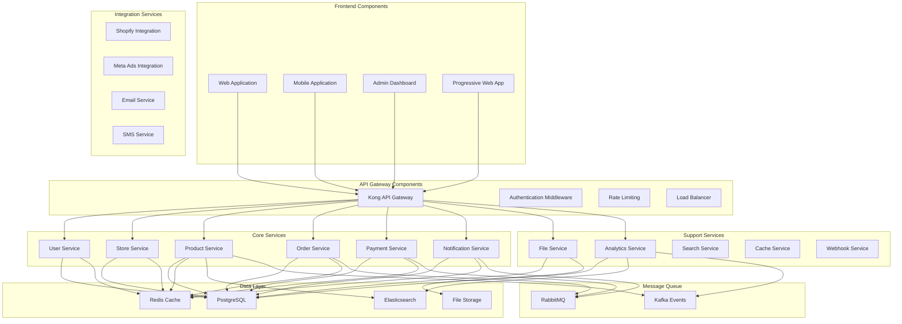

# مكونات النظام - مشروع Saler

## نظرة عامة

مشروع Saler مبني على معمارية الخدمات المصغرة (Microservices Architecture) حيث كل خدمة مسؤولة عن مجال عمل محدد ومترابطة مع بقية الخدمات من خلال واجهات برمجة التطبيقات والاتصال عبر الرسائل.

## مخطط المكونات



## مكونات الخدمات الأساسية

### 1. خدمة المستخدمين (User Service)

#### المسؤوليات
- إدارة حسابات المستخدمين
- المصادقة والتخويل
- إدارة الجلسات
- إدارة الأذونات والصلاحيات

#### الهيكل الداخلي
```javascript
// User Service Structure
class UserService {
  constructor() {
    this.userRepository = new UserRepository();
    this.sessionRepository = new SessionRepository();
    this.passwordHasher = new PasswordHasher();
    this.jwtHandler = new JWTHandler();
    this.cache = new CacheManager();
  }

  // Core Methods
  async authenticateUser(credentials) {
    // 1. Validate credentials
    const user = await this.userRepository.findByEmail(credentials.email);
    if (!user) throw new AuthenticationError('Invalid credentials');

    // 2. Check password
    const isValidPassword = await this.passwordHasher.verify(
      credentials.password, 
      user.password_hash
    );
    if (!isValidPassword) throw new AuthenticationError('Invalid credentials');

    // 3. Generate tokens
    const accessToken = this.jwtHandler.generateAccessToken(user);
    const refreshToken = this.jwtHandler.generateRefreshToken(user);

    // 4. Create session
    const session = await this.sessionRepository.create({
      user_id: user.id,
      access_token: accessToken,
      refresh_token: refreshToken,
      expires_at: new Date(Date.now() + 24 * 60 * 60 * 1000) // 24 hours
    });

    // 5. Cache user data
    await this.cache.set(`user:${user.id}`, user, 300);

    return {
      user: this.sanitizeUser(user),
      accessToken,
      refreshToken,
      session
    };
  }

  async createUser(userData) {
    // 1. Validate user data
    await this.validateUserData(userData);

    // 2. Check if email exists
    const existingUser = await this.userRepository.findByEmail(userData.email);
    if (existingUser) {
      throw new ValidationError('Email already exists');
    }

    // 3. Hash password
    const hashedPassword = await this.passwordHasher.hash(userData.password);

    // 4. Create user
    const user = await this.userRepository.create({
      ...userData,
      password_hash: hashedPassword,
      email_verified: false,
      status: 'active',
      created_at: new Date()
    });

    // 5. Send verification email
    await this.sendVerificationEmail(user);

    // 6. Clear cache
    await this.cache.delete(`users:email:${userData.email}`);

    return this.sanitizeUser(user);
  }
}
```

#### قاعدة البيانات
```sql
-- User Service Database Schema
CREATE TABLE users (
    id UUID PRIMARY KEY DEFAULT gen_random_uuid(),
    email VARCHAR(255) UNIQUE NOT NULL,
    password_hash VARCHAR(255) NOT NULL,
    first_name VARCHAR(100) NOT NULL,
    last_name VARCHAR(100) NOT NULL,
    phone VARCHAR(20),
    avatar_url TEXT,
    email_verified BOOLEAN DEFAULT FALSE,
    phone_verified BOOLEAN DEFAULT FALSE,
    two_factor_enabled BOOLEAN DEFAULT FALSE,
    status VARCHAR(20) DEFAULT 'active',
    last_login_at TIMESTAMP WITH TIME ZONE,
    login_count INTEGER DEFAULT 0,
    created_at TIMESTAMP WITH TIME ZONE DEFAULT NOW(),
    updated_at TIMESTAMP WITH TIME ZONE DEFAULT NOW()
);

CREATE TABLE user_sessions (
    id UUID PRIMARY KEY DEFAULT gen_random_uuid(),
    user_id UUID NOT NULL REFERENCES users(id) ON DELETE CASCADE,
    access_token VARCHAR(255) NOT NULL,
    refresh_token VARCHAR(255),
    ip_address INET,
    user_agent TEXT,
    expires_at TIMESTAMP WITH TIME ZONE NOT NULL,
    created_at TIMESTAMP WITH TIME ZONE DEFAULT NOW()
);

CREATE INDEX idx_users_email ON users(email);
CREATE INDEX idx_users_status ON users(status);
CREATE INDEX idx_user_sessions_user_id ON user_sessions(user_id);
CREATE INDEX idx_user_sessions_token ON user_sessions(access_token);
```

### 2. خدمة المتاجر (Store Service)

#### المسؤوليات
- إدارة متاجر المستخدمين
- إعدادات المتجر
- إدارة النطاقات
- قوالب التصميم

#### الهيكل الداخلي
```javascript
class StoreService {
  constructor() {
    this.storeRepository = new StoreRepository();
    this.domainRepository = new DomainRepository();
    this.settingsRepository = new StoreSettingsRepository();
    this.cache = new CacheManager();
  }

  async createStore(storeData, ownerId) {
    // 1. Validate store data
    await this.validateStoreData(storeData);

    // 2. Check if handle is available
    const existingStore = await this.storeRepository.findByHandle(storeData.handle);
    if (existingStore) {
      throw new ValidationError('Store handle already exists');
    }

    // 3. Create store transaction
    const transaction = await this.storeRepository.startTransaction();
    
    try {
      // Create store
      const store = await this.storeRepository.create({
        ...storeData,
        owner_id: ownerId,
        status: 'active',
        created_at: new Date()
      }, { transaction });

      // Create default settings
      await this.createDefaultSettings(store.id, transaction);

      // Create default domain
      await this.domainRepository.create({
        store_id: store.id,
        domain: `${storeData.handle}.saler.com`,
        ssl_enabled: true,
        is_primary: true,
        status: 'active'
      }, { transaction });

      await transaction.commit();

      // Clear cache
      await this.cache.delete(`stores:owner:${ownerId}`);

      return store;
    } catch (error) {
      await transaction.rollback();
      throw error;
    }
  }

  async createDefaultSettings(storeId, transaction) {
    const defaultSettings = {
      general: {
        currency: 'SAR',
        language: 'ar',
        timezone: 'Asia/Riyadh',
        country: 'SA'
      },
      shipping: {
        methods: [
          {
            name: 'standard',
            title: 'التوصيل العادي',
            price: 25.00,
            estimated_days: '3-5'
          }
        ],
        free_shipping_threshold: 200.00
      },
      payments: {
        methods: ['cod', 'bank_transfer', 'credit_card'],
        gateways: ['mada', 'stc_pay']
      },
      notifications: {
        email: true,
        sms: false,
        new_order: true,
        low_stock: true
      }
    };

    for (const [category, settings] of Object.entries(defaultSettings)) {
      for (const [key, value] of Object.entries(settings)) {
        await this.settingsRepository.create({
          store_id: storeId,
          category,
          key,
          value,
          is_public: false
        }, { transaction });
      }
    }
  }

  async updateStoreSettings(storeId, category, settings) {
    const transaction = await this.settingsRepository.startTransaction();
    
    try {
      for (const [key, value] of Object.entries(settings)) {
        await this.settingsRepository.upsert({
          store_id: storeId,
          category,
          key,
          value,
          updated_at: new Date()
        }, { transaction });
      }

      await transaction.commit();

      // Clear cache
      await this.cache.delete(`store:${storeId}:settings:${category}`);

      return { success: true };
    } catch (error) {
      await transaction.rollback();
      throw error;
    }
  }
}
```

### 3. خدمة المنتجات (Product Service)

#### المسؤوليات
- إدارة المنتجات والخصائص
- إدارة الفئات والوسوم
- إدارة المخزون
- البحث والتصفية

#### الهيكل الداخلي
```javascript
class ProductService {
  constructor() {
    this.productRepository = new ProductRepository();
    this.categoryRepository = new CategoryRepository();
    this.inventoryRepository = new InventoryRepository();
    this.searchEngine = new ElasticsearchClient();
    this.cache = new CacheManager();
  }

  async createProduct(productData, storeId) {
    // 1. Validate product data
    await this.validateProductData(productData);

    // 2. Check SKU uniqueness
    const existingProduct = await this.productRepository.findBySKU(productData.sku);
    if (existingProduct) {
      throw new ValidationError('SKU already exists');
    }

    // 3. Create product transaction
    const transaction = await this.productRepository.startTransaction();
    
    try {
      // Create product
      const product = await this.productRepository.create({
        ...productData,
        store_id: storeId,
        status: 'draft',
        created_at: new Date()
      }, { transaction });

      // Create variants if provided
      if (productData.variants && productData.variants.length > 0) {
        for (const variant of productData.variants) {
          await this.createProductVariant(product.id, variant, transaction);
        }
      }

      // Create inventory records
      await this.createInventoryRecords(product, transaction);

      await transaction.commit();

      // Index in search engine
      await this.searchEngine.indexProduct(product);

      // Clear cache
      await this.cache.delete(`products:store:${storeId}`);

      return product;
    } catch (error) {
      await transaction.rollback();
      throw error;
    }
  }

  async searchProducts(searchParams) {
    const {
      storeId,
      query,
      category,
      priceMin,
      priceMax,
      tags,
      sortBy = 'created_at',
      sortOrder = 'desc',
      page = 1,
      limit = 20
    } = searchParams;

    // Build search query
    const esQuery = {
      index: 'products',
      body: {
        query: {
          bool: {
            must: [
              { term: { store_id: storeId } },
              { term: { status: 'active' } }
            ]
          }
        },
        sort: [
          { [sortBy]: { order: sortOrder } }
        ],
        from: (page - 1) * limit,
        size: limit
      }
    };

    // Add filters
    if (query) {
      esQuery.body.query.bool.must.push({
        multi_match: {
          query,
          fields: ['title^3', 'description^2', 'sku', 'tags'],
          type: 'best_fields',
          operator: 'and'
        }
      });
    }

    if (category) {
      esQuery.body.query.bool.filter.push({
        term: { 'categories.id': category }
      });
    }

    if (priceMin !== undefined || priceMax !== undefined) {
      const priceRange = {};
      if (priceMin !== undefined) priceRange.gte = priceMin;
      if (priceMax !== undefined) priceRange.lte = priceMax;
      
      esQuery.body.query.bool.filter.push({
        range: { price: priceRange }
      });
    }

    if (tags && tags.length > 0) {
      esQuery.body.query.bool.filter.push({
        terms: { tags }
      });
    }

    // Execute search
    const results = await this.searchEngine.search(esQuery);

    // Format results
    return {
      products: results.hits.hits.map(hit => ({
        id: hit._source.id,
        ...hit._source,
        score: hit._score
      })),
      total: results.hits.total.value,
      page,
      limit,
      totalPages: Math.ceil(results.hits.total.value / limit)
    };
  }

  async updateInventory(productId, variantId, quantity, reason) {
    const transaction = await this.inventoryRepository.startTransaction();
    
    try {
      // Get current inventory
      const inventoryItem = await this.inventoryRepository.findByProductAndVariant(
        productId, 
        variantId
      );

      if (!inventoryItem) {
        throw new NotFoundError('Inventory item not found');
      }

      const previousQuantity = inventoryItem.quantity_on_hand;
      const newQuantity = Math.max(0, previousQuantity + quantity);

      // Update inventory
      await this.inventoryRepository.update(inventoryItem.id, {
        quantity_on_hand: newQuantity,
        updated_at: new Date()
      }, { transaction });

      // Create transaction record
      await this.inventoryRepository.createTransaction({
        inventory_item_id: inventoryItem.id,
        type: quantity > 0 ? 'restock' : 'adjustment',
        quantity_change: quantity,
        previous_quantity: previousQuantity,
        new_quantity: newQuantity,
        reason,
        created_at: new Date()
      }, { transaction });

      await transaction.commit();

      // Check for low stock alert
      if (newQuantity <= inventoryItem.low_stock_threshold) {
        await this.triggerLowStockAlert(productId, variantId, newQuantity);
      }

      return {
        productId,
        variantId,
        previousQuantity,
        newQuantity,
        change: quantity
      };
    } catch (error) {
      await transaction.rollback();
      throw error;
    }
  }
}
```

### 4. خدمة الطلبات (Order Service)

#### المسؤوليات
- معالجة الطلبات
- إدارة حالات الطلبات
- تتبع الطلبات
- حساب الضرائب والخصومات

#### الهيكل الداخلي
```javascript
class OrderService {
  constructor() {
    this.orderRepository = new OrderRepository();
    this.orderItemRepository = new OrderItemRepository();
    this.inventoryRepository = new InventoryRepository();
    this.paymentService = new PaymentService();
    this.notificationService = new NotificationService();
    this.cache = new CacheManager();
  }

  async createOrder(orderData) {
    // 1. Validate order data
    await this.validateOrderData(orderData);

    // 2. Validate inventory availability
    await this.validateInventoryAvailability(orderData.items);

    // 3. Create order transaction
    const transaction = await this.orderRepository.startTransaction();
    
    try {
      // Generate order number
      const orderNumber = await this.generateOrderNumber();

      // Create order
      const order = await this.orderRepository.create({
        ...orderData,
        order_number: orderNumber,
        status: 'pending',
        payment_status: 'pending',
        fulfillment_status: 'unfulfilled',
        created_at: new Date()
      }, { transaction });

      // Create order items
      let subtotal = 0;
      for (const item of orderData.items) {
        // Get product details
        const product = await this.productRepository.findById(item.product_id);
        if (!product) {
          throw new ValidationError(`Product not found: ${item.product_id}`);
        }

        const itemTotal = item.quantity * item.price;
        subtotal += itemTotal;

        await this.orderItemRepository.create({
          order_id: order.id,
          product_id: item.product_id,
          variant_id: item.variant_id,
          title: product.title,
          sku: product.sku,
          quantity: item.quantity,
          price: item.price,
          total_price: itemTotal,
          properties: item.properties || {}
        }, { transaction });

        // Reserve inventory
        await this.reserveInventory(item.product_id, item.variant_id, item.quantity, transaction);
      }

      // Calculate totals
      const shippingCost = await this.calculateShippingCost(orderData.shipping_method, subtotal);
      const taxAmount = await this.calculateTaxAmount(subtotal + shippingCost, orderData.shipping_address);
      const discountAmount = orderData.discount_amount || 0;
      const totalAmount = subtotal + shippingCost + taxAmount - discountAmount;

      // Update order totals
      await this.orderRepository.update(order.id, {
        subtotal,
        shipping_cost: shippingCost,
        tax_amount: taxAmount,
        discount_amount: discountAmount,
        total_amount: totalAmount,
        updated_at: new Date()
      }, { transaction });

      await transaction.commit();

      // Send order confirmation
      await this.notificationService.sendOrderConfirmation(order);

      // Publish order created event
      await this.eventPublisher.publish('order.created', {
        orderId: order.id,
        customerId: order.customer_id,
        totalAmount: totalAmount
      });

      // Clear cache
      await this.cache.delete(`orders:customer:${order.customer_id}`);

      return order;
    } catch (error) {
      await transaction.rollback();
      throw error;
    }
  }

  async updateOrderStatus(orderId, newStatus, notes, userId) {
    const transaction = await this.orderRepository.startTransaction();
    
    try {
      const order = await this.orderRepository.findById(orderId);
      if (!order) {
        throw new NotFoundError('Order not found');
      }

      const previousStatus = order.status;

      // Update order status
      await this.orderRepository.update(orderId, {
        status: newStatus,
        updated_at: new Date()
      }, { transaction });

      // Create status history record
      await this.orderStatusRepository.create({
        order_id: orderId,
        status: newStatus,
        previous_status: previousStatus,
        changed_by: userId,
        notes,
        created_at: new Date()
      }, { transaction });

      // Handle status-specific actions
      await this.handleStatusChange(order, previousStatus, newStatus, transaction);

      await transaction.commit();

      // Send status notification
      await this.notificationService.sendOrderStatusUpdate(order, newStatus);

      // Publish event
      await this.eventPublisher.publish('order.status_changed', {
        orderId,
        previousStatus,
        newStatus,
        customerId: order.customer_id
      });

      return { success: true, orderId, newStatus };
    } catch (error) {
      await transaction.rollback();
      throw error;
    }
  }

  async handleStatusChange(order, previousStatus, newStatus, transaction) {
    switch (newStatus) {
      case 'confirmed':
        // Payment processing
        break;
        
      case 'processing':
        // Begin fulfillment process
        break;
        
      case 'shipped':
        // Update fulfillment status
        await this.orderRepository.update(order.id, {
          fulfillment_status: 'fulfilled',
          tracking_number: order.tracking_number
        }, { transaction });
        
        // Release reserved inventory
        await this.releaseInventory(order.id, transaction);
        break;
        
      case 'cancelled':
        // Return inventory to stock
        await this.returnInventoryToStock(order.id, transaction);
        
        // Process refund if payment was made
        if (order.payment_status === 'paid') {
          await this.paymentService.processRefund(order.id);
        }
        break;
    }
  }
}
```

### 5. خدمة المدفوعات (Payment Service)

#### المسؤوليات
- معالجة المدفوعات
- إدارة طرق الدفع
- الاستردادات
- إدارة المعاملات

#### الهيكل الداخلي
```javascript
class PaymentService {
  constructor() {
    this.paymentRepository = new PaymentRepository();
    this.transactionRepository = new TransactionRepository();
    this.gatewayHandlers = {
      stripe: new StripeGateway(),
      paypal: new PayPalGateway(),
      mada: new MadaGateway(),
      stc_pay: new STCPayGateway()
    };
    this.cache = new CacheManager();
  }

  async processPayment(paymentData) {
    // 1. Validate payment data
    await this.validatePaymentData(paymentData);

    // 2. Create payment record
    const payment = await this.paymentRepository.create({
      ...paymentData,
      status: 'pending',
      created_at: new Date()
    });

    try {
      // 3. Get gateway handler
      const gateway = this.gatewayHandlers[paymentData.gateway];
      if (!gateway) {
        throw new ValidationError(`Unsupported payment gateway: ${paymentData.gateway}`);
      }

      // 4. Process payment through gateway
      const result = await gateway.processPayment({
        amount: paymentData.amount,
        currency: paymentData.currency,
        order_id: paymentData.order_id,
        customer_info: paymentData.customer_info,
        payment_method: paymentData.payment_method
      });

      // 5. Update payment record
      await this.paymentRepository.update(payment.id, {
        status: result.success ? 'completed' : 'failed',
        gateway_transaction_id: result.transaction_id,
        processed_at: new Date(),
        failure_reason: result.failure_reason,
        metadata: result.metadata
      });

      // 6. Create transaction record
      await this.transactionRepository.create({
        payment_id: payment.id,
        type: 'payment',
        amount: paymentData.amount,
        gateway: paymentData.gateway,
        gateway_transaction_id: result.transaction_id,
        status: result.success ? 'completed' : 'failed',
        gateway_response: result.response,
        created_at: new Date()
      });

      if (result.success) {
        // Update order payment status
        await this.orderRepository.update(paymentData.order_id, {
          payment_status: 'paid',
          updated_at: new Date()
        });

        // Send payment confirmation
        await this.notificationService.sendPaymentConfirmation(paymentData.order_id);
      }

      return {
        paymentId: payment.id,
        success: result.success,
        transactionId: result.transaction_id,
        message: result.message
      };
    } catch (error) {
      // Update payment as failed
      await this.paymentRepository.update(payment.id, {
        status: 'failed',
        failure_reason: error.message,
        processed_at: new Date()
      });

      throw error;
    }
  }

  async processRefund(paymentId, refundData) {
    const payment = await this.paymentRepository.findById(paymentId);
    if (!payment) {
      throw new NotFoundError('Payment not found');
    }

    if (payment.status !== 'completed') {
      throw new ValidationError('Cannot refund uncompleted payment');
    }

    const refund = await this.paymentRepository.create({
      order_id: payment.order_id,
      payment_method: payment.payment_method,
      gateway: payment.gateway,
      amount: refundData.amount || payment.amount,
      currency: payment.currency,
      status: 'pending',
      refund_reason: refundData.reason,
      created_at: new Date()
    });

    try {
      const gateway = this.gatewayHandlers[payment.gateway];
      const result = await gateway.processRefund({
        transaction_id: payment.gateway_transaction_id,
        amount: refund.amount,
        reason: refundData.reason
      });

      await this.paymentRepository.update(refund.id, {
        status: result.success ? 'completed' : 'failed',
        gateway_transaction_id: result.refund_transaction_id,
        processed_at: new Date(),
        failure_reason: result.failure_reason
      });

      // Create transaction record
      await this.transactionRepository.create({
        payment_id: payment.id,
        type: 'refund',
        amount: refund.amount,
        gateway: payment.gateway,
        gateway_transaction_id: result.refund_transaction_id,
        status: result.success ? 'completed' : 'failed',
        gateway_response: result.response,
        created_at: new Date()
      });

      if (result.success) {
        // Update order payment status
        await this.orderRepository.update(payment.order_id, {
          payment_status: 'refunded',
          updated_at: new Date()
        });
      }

      return {
        refundId: refund.id,
        success: result.success,
        transactionId: result.refund_transaction_id
      };
    } catch (error) {
      await this.paymentRepository.update(refund.id, {
        status: 'failed',
        failure_reason: error.message
      });
      throw error;
    }
  }
}
```

## مكونات الخدمات المساعدة

### 1. خدمة الملفات (File Service)

```javascript
class FileService {
  constructor() {
    this.fileRepository = new FileRepository();
    this.storageProvider = new MinIOProvider();
    this.imageProcessor = new ImageProcessor();
    this.cache = new CacheManager();
  }

  async uploadFile(fileData) {
    // 1. Validate file
    await this.validateFile(fileData);

    // 2. Generate unique filename
    const filename = this.generateUniqueFilename(fileData.original_name);

    // 3. Upload to storage
    const fileUrl = await this.storageProvider.upload(
      filename,
      fileData.buffer,
      fileData.mime_type
    );

    // 4. Create file record
    const file = await this.fileRepository.create({
      original_name: fileData.original_name,
      filename,
      file_path: fileUrl,
      file_size: fileData.size,
      mime_type: fileData.mime_type,
      width: fileData.width,
      height: fileData.height,
      uploaded_by: fileData.uploaded_by,
      is_public: fileData.is_public || false,
      created_at: new Date()
    });

    // 5. Generate thumbnails if image
    if (fileData.mime_type.startsWith('image/')) {
      await this.generateThumbnails(file);
    }

    // 6. Clear cache
    await this.cache.delete(`files:user:${fileData.uploaded_by}`);

    return file;
  }

  async generateThumbnails(file) {
    const sizes = [
      { name: 'thumbnail', width: 150, height: 150 },
      { name: 'small', width: 300, height: 300 },
      { name: 'medium', width: 600, height: 600 },
      { name: 'large', width: 1200, height: 1200 }
    ];

    for (const size of sizes) {
      const thumbnailBuffer = await this.imageProcessor.resize(
        file.file_path,
        size.width,
        size.height
      );

      const thumbnailFilename = `${file.filename}_${size.name}`;
      const thumbnailUrl = await this.storageProvider.upload(
        thumbnailFilename,
        thumbnailBuffer,
        file.mime_type
      );

      await this.fileRepository.create({
        original_name: file.original_name,
        filename: thumbnailFilename,
        file_path: thumbnailUrl,
        file_size: thumbnailBuffer.length,
        mime_type: file.mime_type,
        width: size.width,
        height: size.height,
        parent_file_id: file.id,
        is_public: file.is_public,
        created_at: new Date()
      });
    }
  }
}
```

### 2. خدمة التحليلات (Analytics Service)

```javascript
class AnalyticsService {
  constructor() {
    this.eventRepository = new AnalyticsEventRepository();
    this.aggregationService = new AggregationService();
    this.cache = new CacheManager();
  }

  async trackEvent(eventData) {
    // 1. Validate event data
    await this.validateEventData(eventData);

    // 2. Create event record
    const event = await this.eventRepository.create({
      ...eventData,
      created_at: new Date()
    });

    // 3. Update real-time aggregations
    await this.updateRealtimeAggregations(event);

    // 4. Publish to Kafka for batch processing
    await this.publishToKafka(event);

    return event;
  }

  async getSalesReport(params) {
    const cacheKey = `sales_report:${JSON.stringify(params)}`;
    
    // Check cache first
    const cached = await this.cache.get(cacheKey);
    if (cached) {
      return JSON.parse(cached);
    }

    // Generate report
    const report = await this.aggregationService.generateSalesReport(params);

    // Cache for 1 hour
    await this.cache.set(cacheKey, JSON.stringify(report), 3600);

    return report;
  }
}
```

هذا الهيكل يوفر نظاماً قوياً ومفصولاً حيث كل خدمة مسؤولة عن مجال عمل محدد مع إمكانية التطوير والصيانة المستقلة.

---

**آخر تحديث**: 2 نوفمبر 2025