# تدفق البيانات - مشروع Saler

## نظرة عامة

تدفق البيانات في مشروع Saler مصمم ليكون فعالاً وآمناً ومنظماً. يشمل التدفق معالجة البيانات من لحظة إدخالها حتى عرضها للمستخدم، مع ضمان سلامة البيانات والأداء المحسن.

## مخطط تدفق البيانات العام

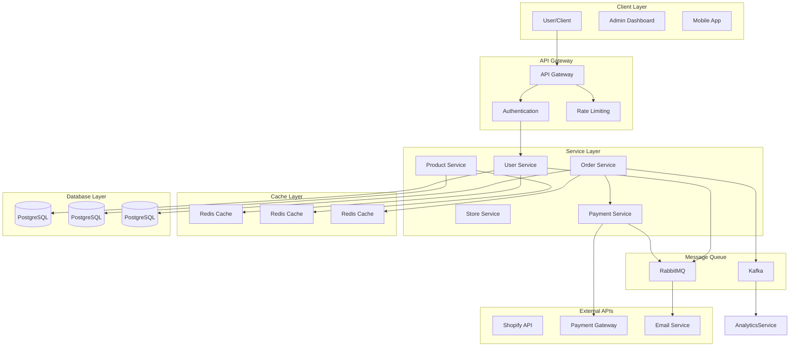

## تدفق البيانات للمعاملات

### 1. تدفق تسجيل المستخدم

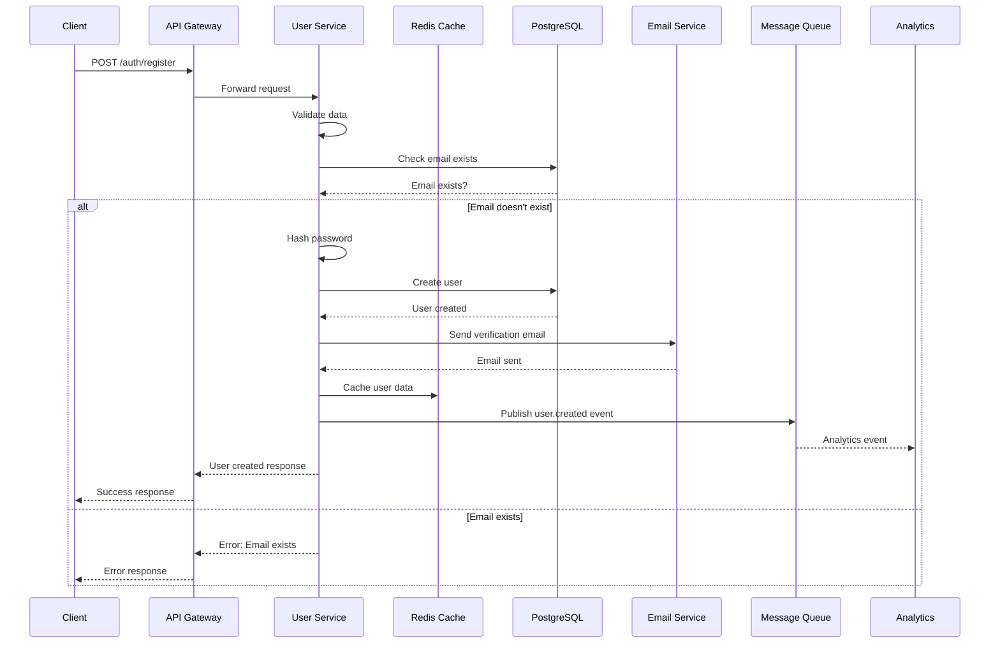

### 2. تدفق إنشاء المنتج

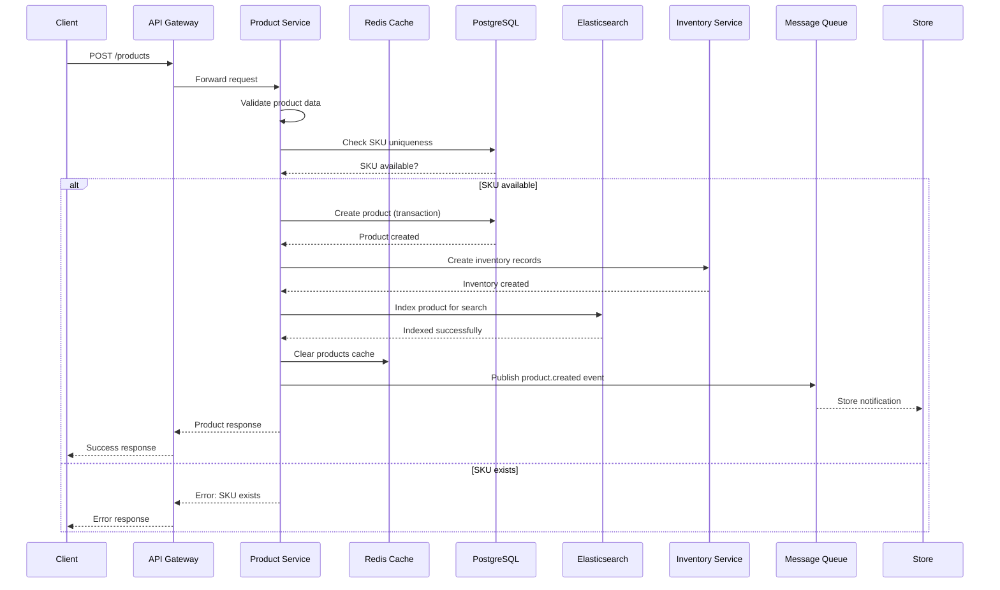

### 3. تدفق معالجة الطلب

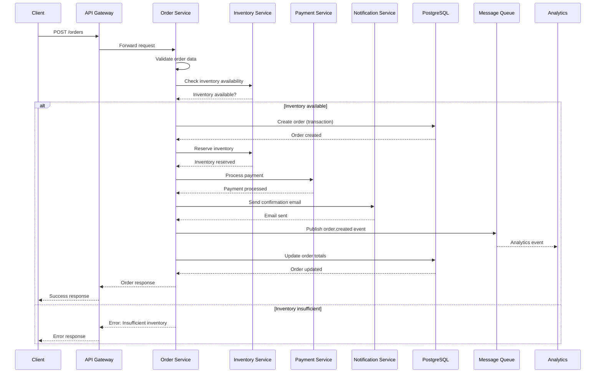

## تدفق البيانات للقراءة

### 1. تدفق جلب المنتجات

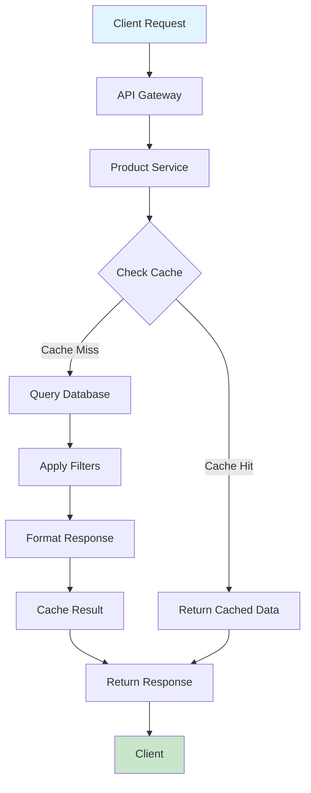

### 2. تدفق البحث المتقدم

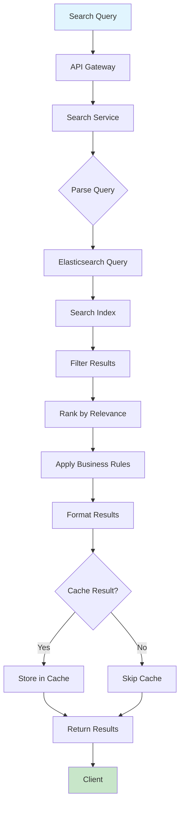

## تدفق البيانات للتحديث

### 1. تدفق تحديث المخزون

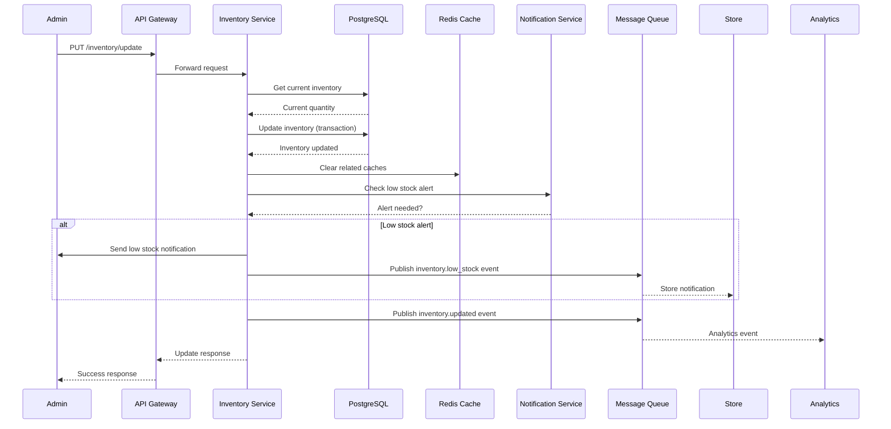

## تدفق البيانات للتحليلات

### 1. تدفق جمع الأحداث

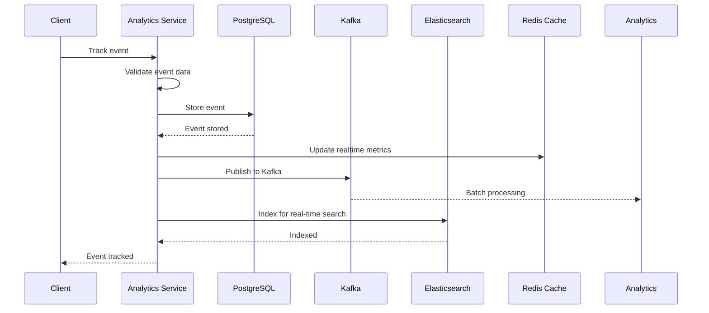

### 2. تدفق إنشاء التقارير

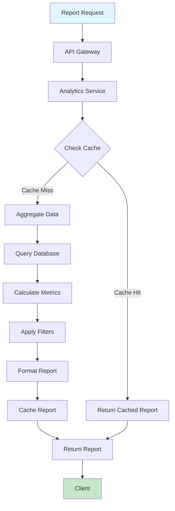

## تدفق البيانات للمدفوعات

### 1. تدفق معالجة الدفع

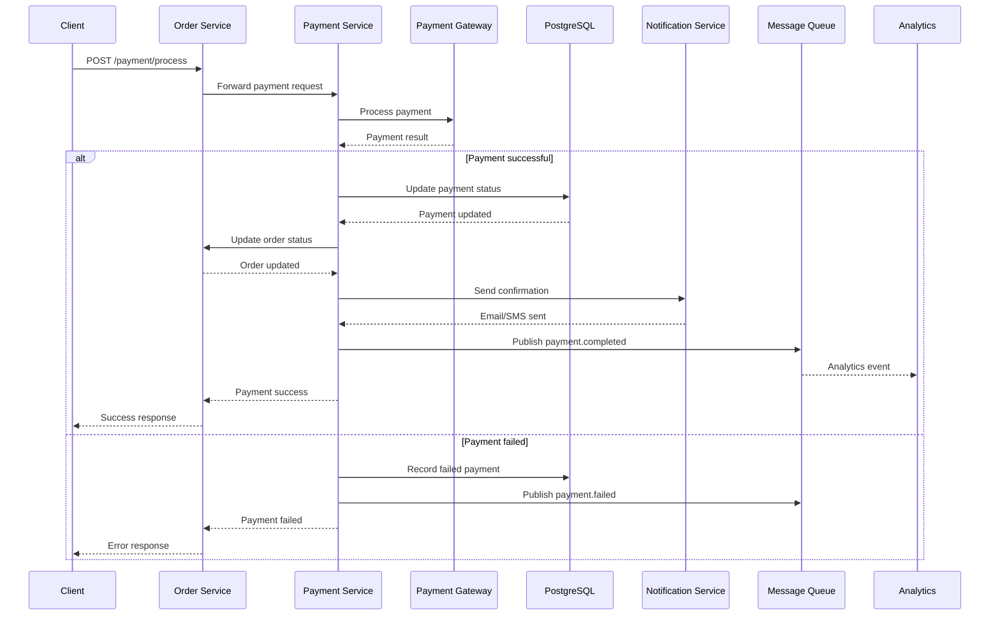

## تدفق البيانات للملفات

### 1. تدفق رفع الملفات

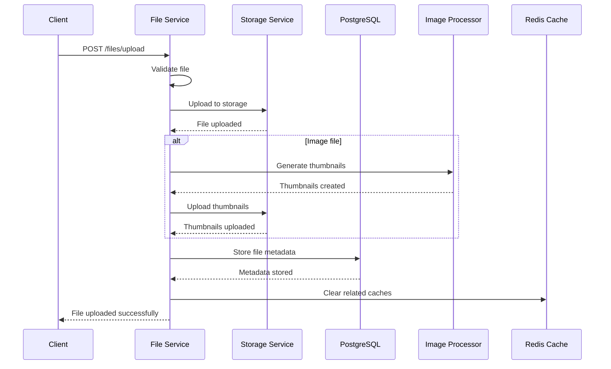

## تدفق البيانات للأمان

### 1. تدفق المصادقة

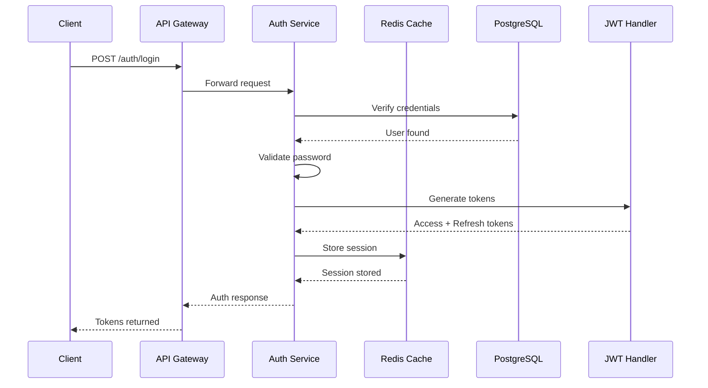

### 2. تدفق تخويل الطلبات

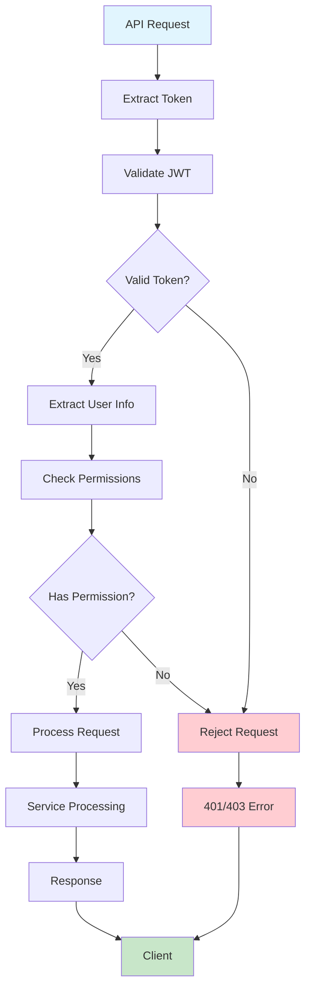

## تدفق البيانات للإشعارات

### 1. تدفق إشعارات الطلبات

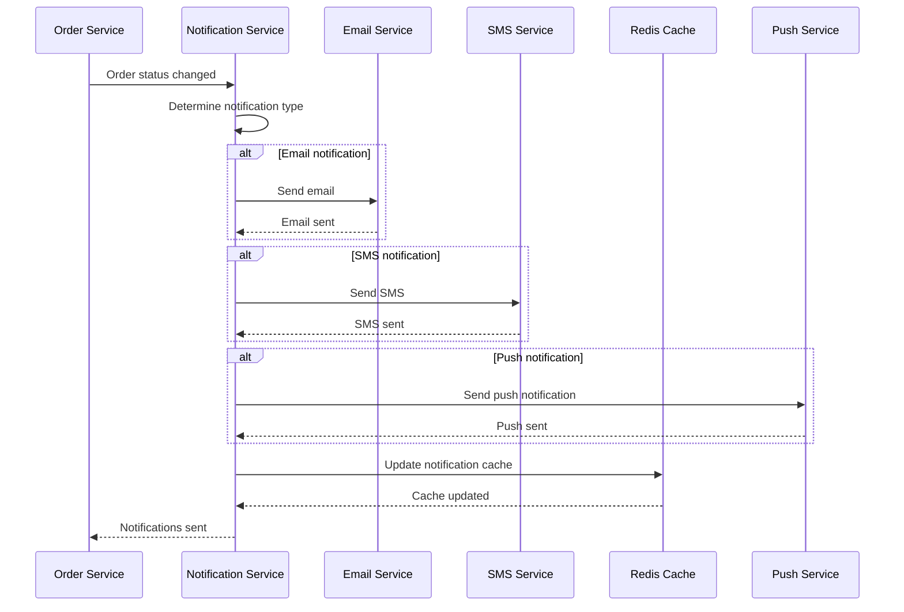

## تدفق البيانات للويب هوكس

### 1. تدفق معالجة الويب هوك

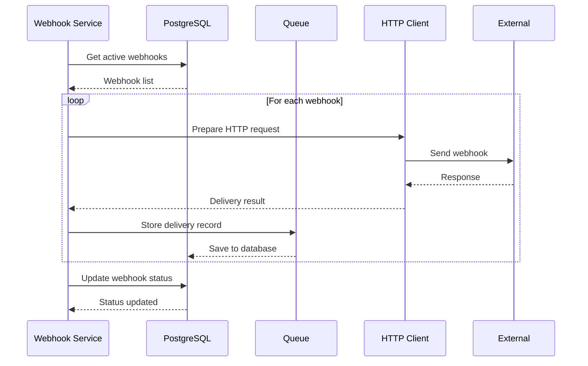

## تحسينات تدفق البيانات

### 1. استراتيجيات التخزين المؤقت

```javascript
// Cache Strategy Implementation
class CacheStrategy {
  // Write-through cache
  async writeThrough(key, data, service) {
    // Write to cache first
    await this.cache.set(key, data, 300);
    
    // Write to database
    await service.save(data);
  }

  // Read-through cache
  async readThrough(key, service) {
    // Try cache first
    let data = await this.cache.get(key);
    
    if (!data) {
      // Miss - get from service
      data = await service.find(key);
      
      // Cache the result
      if (data) {
        await this.cache.set(key, data, 300);
      }
    }
    
    return data;
  }

  // Write-behind cache
  async writeBehind(key, data) {
    // Write to cache immediately
    await this.cache.set(key, data, 300);
    
    // Queue for database write
    await this.queue.add('database-write', {
      key,
      data,
      operation: 'write'
    });
  }
}
```

### 2. معالجة البيانات المجمعة

```javascript
// Data Aggregation Pipeline
class DataAggregator {
  constructor() {
    this.aggregators = new Map();
  }

  async aggregate(dataType, data) {
    const aggregator = this.aggregators.get(dataType);
    if (!aggregator) {
      throw new Error(`No aggregator found for ${dataType}`);
    }

    return await aggregator.process(data);
  }

  registerAggregator(dataType, aggregator) {
    this.aggregators.set(dataType, aggregator);
  }
}

// Real-time aggregator
class RealtimeAggregator {
  constructor() {
    this.counters = new Map();
  }

  async process(event) {
    const key = `${event.userId}:${event.eventType}`;
    
    if (!this.counters.has(key)) {
      this.counters.set(key, 0);
    }
    
    this.counters.set(key, this.counters.get(key) + 1);
    
    // Update in database every 100 events
    if (this.counters.get(key) % 100 === 0) {
      await this.flushToDatabase(key, this.counters.get(key));
    }
  }

  async flushToDatabase(key, value) {
    await this.database.increment(key, value);
    this.counters.set(key, 0);
  }
}
```

هذا التصميم يضمن تدفق البيانات بكفاءة عالية مع ضمان سلامة البيانات والأمان والأداء المحسن.

---

**آخر تحديث**: 2 نوفمبر 2025