# معمارية النظام - مشروع Saler

## نظرة عامة

معمارية مشروع Saler مصممة لتكون قابلة للتوسع، مرنة، وموثوقة. تعتمد المعمارية على مبادئ الـ Microservices مع طبقات واضحة للفصل بين المسؤوليات وضمان الاستقلالية في التطوير والصيانة.

### المبادئ الأساسية

- **الفصل بين المسؤوليات (Separation of Concerns)**: تقسيم النظام إلى مكونات مستقلة
- **التوسع الأفقي (Horizontal Scaling)**: إمكانية زيادة الموارد حسب الحاجة
- **المرونة (Resilience)**: التعامل مع الأخطاء واسترداد الخدمة
- **الأمان المدمج (Security by Design)**: حماية البيانات من البداية
- **الأداء المحسن (Performance Optimized)**: استجابة سريعة وفعالة

## معمارية النظام العامة

### المخطط الكامل

```mermaid
graph TB
    subgraph "Client Layer"
        Web[Web Application]
        Mobile[Mobile App]
        Admin[Admin Dashboard]
        API_Client[API Clients]
    end
    
    subgraph "CDN & Load Balancer"
        CloudFlare[CloudFlare CDN]
        ALB[Application Load Balancer]
    end
    
    subgraph "API Gateway Layer"
        Gateway[Kong Gateway]
        Auth[JWT Authentication]
        RateLimit[Rate Limiting]
        CORS[CORS Handler]
    end
    
    subgraph "Application Services"
        UserSvc[User Service]
        StoreSvc[Store Service]
        ProductSvc[Product Service]
        OrderSvc[Order Service]
        PaymentSvc[Payment Service]
        NotificationSvc[Notification Service]
        FileSvc[File Service]
        AnalyticsSvc[Analytics Service]
    end
    
    subgraph "Data Layer"
        PostgreSQL[(PostgreSQL Cluster)]
        Redis[(Redis Cluster)]
        Elastic[(Elasticsearch)]
        MinIO[(MinIO Storage)]
    end
    
    subgraph "Message Queue"
        RabbitMQ[RabbitMQ]
        Kafka[Apache Kafka]
    end
    
    subgraph "Monitoring & Logging"
        Prometheus[Prometheus]
        Grafana[Grafana]
        ELK[ELK Stack]
        Sentry[Sentry Error Tracking]
    end
    
    subgraph "External Services"
        Shopify[Shopify API]
        MetaAds[Meta Ads API]
        PaymentGate[Payment Gateways]
        Email[Email Services]
        SMS[SMS Services]
    end
    
    %% Connections
    Web --> CloudFlare
    Mobile --> CloudFlare
    Admin --> CloudFlare
    API_Client --> CloudFlare
    
    CloudFlare --> ALB
    ALB --> Gateway
    
    Gateway --> Auth
    Gateway --> RateLimit
    Gateway --> UserSvc
    Gateway --> StoreSvc
    Gateway --> ProductSvc
    Gateway --> OrderSvc
    Gateway --> PaymentSvc
    Gateway --> NotificationSvc
    Gateway --> FileSvc
    Gateway --> AnalyticsSvc
    
    UserSvc --> PostgreSQL
    StoreSvc --> PostgreSQL
    ProductSvc --> PostgreSQL
    OrderSvc --> PostgreSQL
    PaymentSvc --> PostgreSQL
    NotificationSvc --> PostgreSQL
    FileSvc --> PostgreSQL
    AnalyticsSvc --> PostgreSQL
    
    UserSvc --> Redis
    StoreSvc --> Redis
    ProductSvc --> Redis
    OrderSvc --> Redis
    PaymentSvc --> Redis
    NotificationSvc --> Redis
    FileSvc --> Redis
    AnalyticsSvc --> Redis
    
    ProductSvc --> Elastic
    AnalyticsSvc --> Elastic
    
    FileSvc --> MinIO
    
    OrderSvc --> RabbitMQ
    PaymentSvc --> RabbitMQ
    NotificationSvc --> RabbitMQ
    
    AnalyticsSvc --> Kafka
    
    UserSvc --> Prometheus
    StoreSvc --> Prometheus
    ProductSvc --> Prometheus
    OrderSvc --> Prometheus
    PaymentSvc --> Prometheus
    NotificationSvc --> Prometheus
    FileSvc --> Prometheus
    AnalyticsSvc --> Prometheus
    
    ProductSvc --> Shopify
    PaymentSvc --> MetaAds
    PaymentSvc --> PaymentGate
    NotificationSvc --> Email
    NotificationSvc --> SMS
```



## طبقات المعمارية

### 1. طبقة العميل (Client Layer)

#### تطبيقات الويب
- **React.js**: واجهة المستخدم الرئيسية
- **Next.js**: تحسين الأداء مع SSR
- **TypeScript**: أمان نوع البيانات
- **PWA**: إمكانيات التطبيق المحمول

#### التطبيقات المحمولة
- **React Native**: تطوير مشترك بين المنصات
- **Native Modules**: للوصول لميزات الجهاز
- **Offline Support**: العمل دون اتصال

#### لوحة الإدارة
- **Admin Dashboard**: إدارة المتاجر
- **Analytics Views**: تحليلات مفصلة
- **Configuration Tools**: أدوات الإعداد

### 2. طبقة CDN وLoad Balancer

#### CDN (CloudFlare)
```javascript
// إعدادات CloudFlare
const cloudflareConfig = {
  caching: {
    static: '1 year',
    api: 'no-cache',
    pages: '1 week'
  },
  compression: 'gzip, brotli',
  minification: 'js, css, html',
  security: {
    ddosProtection: true,
    ssl: 'full',
    hsts: true
  }
};
```

#### Load Balancer
```yaml
# AWS Application Load Balancer
apiVersion: v1
kind: Service
metadata:
  name: saler-alb
spec:
  type: LoadBalancer
  ports:
    - port: 80
      targetPort: 3000
      protocol: TCP
    - port: 443
      targetPort: 3000
      protocol: TCP
  selector:
    app: saler-api
```

### 3. طبقة API Gateway

#### Kong Gateway
```yaml
# Kong Configuration
services:
  - name: saler-api
    url: http://saler-api:3000
    plugins:
      - name: jwt
        config:
          secret_is_base64: false
          key_claim_name: iss
      - name: rate-limiting
        config:
          minute: 1000
          hour: 10000
      - name: cors
        config:
          origins:
            - "https://saler.com"
            - "https://admin.saler.com"
```

#### Authentication Middleware
```javascript
// JWT Authentication
const authenticateToken = (req, res, next) => {
  const authHeader = req.headers['authorization'];
  const token = authHeader && authHeader.split(' ')[1];

  if (!token) {
    return res.status(401).json({ error: 'Access token required' });
  }

  jwt.verify(token, process.env.JWT_SECRET, (err, user) => {
    if (err) {
      return res.status(403).json({ error: 'Invalid token' });
    }
    req.user = user;
    next();
  });
};
```

### 4. طبقة الخدمات (Services Layer)

#### هيكل الخدمة

```
services/
├── user-service/
│   ├── src/
│   │   ├── controllers/
│   │   ├── services/
│   │   ├── models/
│   │   ├── routes/
│   │   ├── middleware/
│   │   ├── utils/
│   │   └── index.js
│   ├── tests/
│   ├── Dockerfile
│   ├── package.json
│   └── README.md
```

#### Service Template
```javascript
// Base Service Structure
class BaseService {
  constructor(database, cache, logger) {
    this.db = database;
    this.cache = cache;
    this.logger = logger;
  }

  async findById(id) {
    try {
      // Cache lookup first
      const cached = await this.cache.get(`service:${this.constructor.name}:${id}`);
      if (cached) {
        return JSON.parse(cached);
      }

      // Database query
      const result = await this.db.findById(id);
      
      // Cache result
      if (result) {
        await this.cache.set(
          `service:${this.constructor.name}:${id}`,
          JSON.stringify(result),
          300 // 5 minutes
        );
      }

      return result;
    } catch (error) {
      this.logger.error('Service error:', error);
      throw error;
    }
  }
}

// User Service Example
class UserService extends BaseService {
  async createUser(userData) {
    const transaction = await this.db.startTransaction();
    
    try {
      const user = await this.db.users.create({
        ...userData,
        created_at: new Date()
      }, { transaction });

      await transaction.commit();
      return user;
    } catch (error) {
      await transaction.rollback();
      throw error;
    }
  }
}
```

### 5. طبقة البيانات (Data Layer)

#### PostgreSQL Cluster
```yaml
# PostgreSQL Master-Slave Setup
version: '3.8'
services:
  postgres-master:
    image: postgres:14
    environment:
      POSTGRES_DB: saler
      POSTGRES_USER: ${DB_USER}
      POSTGRES_PASSWORD: ${DB_PASSWORD}
    ports:
      - "5432:5432"
    volumes:
      - postgres_master_data:/var/lib/postgresql/data
      - ./backups:/backups
    command: |
      postgres
      -c max_connections=200
      -c shared_buffers=256MB
      -c effective_cache_size=1GB
      -c wal_level=replica
      -c max_wal_senders=3

  postgres-slave:
    image: postgres:14
    environment:
      POSTGRES_MASTER_SERVICE: postgres-master
    ports:
      - "5433:5432"
    volumes:
      - postgres_slave_data:/var/lib/postgresql/data
    command: |
      bash -c "
        until pg_basebackup -h postgres-master -U ${DB_USER} -D /var/lib/postgresql/data -Fp -Xs -P -R;
        do
          echo 'Waiting for master...'
          sleep 1s
        done
        echo 'Backup done, starting replica...'
        postgres
      "
    depends_on:
      - postgres-master

volumes:
  postgres_master_data:
  postgres_slave_data:
```

#### Redis Cluster
```yaml
# Redis Cluster Configuration
version: '3.8'
services:
  redis-master:
    image: redis:7-alpine
    command: redis-server --appendonly yes --maxmemory 512mb --maxmemory-policy allkeys-lru
    ports:
      - "6379:6379"
    volumes:
      - redis_master_data:/data

  redis-replica:
    image: redis:7-alpine
    command: redis-server --appendonly yes --slaveof redis-master 6379 --maxmemory 512mb --maxmemory-policy allkeys-lru
    ports:
      - "6380:6379"
    volumes:
      - redis_replica_data:/data
    depends_on:
      - redis-master

volumes:
  redis_master_data:
  redis_replica_data:
```

### 6. طبقة Message Queue

#### RabbitMQ Configuration
```yaml
# RabbitMQ Setup
version: '3.8'
services:
  rabbitmq:
    image: rabbitmq:3.10-management
    environment:
      RABBITMQ_DEFAULT_USER: ${RABBITMQ_USER}
      RABBITMQ_DEFAULT_PASS: ${RABBITMQ_PASSWORD}
    ports:
      - "5672:5672"
      - "15672:15672"  # Management UI
    volumes:
      - rabbitmq_data:/var/lib/rabbitmq

volumes:
  rabbitmq_data:
```

#### Message Handler Template
```javascript
// RabbitMQ Message Handler
class MessageHandler {
  constructor(channel, queueName) {
    this.channel = channel;
    this.queueName = queueName;
  }

  async setupQueue() {
    await this.channel.assertQueue(this.queueName, {
      durable: true,
      arguments: {
        'x-message-ttl': 300000 // 5 minutes
      }
    });

    this.channel.prefetch(1); // Process one message at a time
  }

  async startConsuming(handler) {
    await this.setupQueue();
    
    this.channel.consume(this.queueName, async (msg) => {
      try {
        const data = JSON.parse(msg.content.toString());
        await handler(data);
        
        this.channel.ack(msg);
      } catch (error) {
        console.error('Message processing error:', error);
        this.channel.nack(msg, false, false); // Move to dead letter queue
      }
    });
  }

  async publish(message, options = {}) {
    return this.channel.sendToQueue(this.queueName, 
      Buffer.from(JSON.stringify(message)),
      {
        persistent: true,
        ...options
      }
    );
  }
}

// Usage Example
const orderHandler = new MessageHandler(channel, 'order.created');
await orderHandler.startConsuming(async (orderData) => {
  // Process order creation
  console.log('Processing order:', orderData);
});
```

### 7. طبقة المراقبة (Monitoring Layer)

#### Prometheus Configuration
```yaml
# prometheus.yml
global:
  scrape_interval: 15s
  evaluation_interval: 15s

rule_files:
  - "alert_rules.yml"

alerting:
  alertmanagers:
    - static_configs:
        - targets:
          - alertmanager:9093

scrape_configs:
  - job_name: 'saler-api'
    static_configs:
      - targets: ['saler-api:3000']
    metrics_path: '/metrics'
    scrape_interval: 5s

  - job_name: 'postgres'
    static_configs:
      - targets: ['postgres-exporter:9187']

  - job_name: 'redis'
    static_configs:
      - targets: ['redis-exporter:9121']
```

#### Grafana Dashboard
```json
{
  "dashboard": {
    "title": "Saler API Monitoring",
    "panels": [
      {
        "title": "Request Rate",
        "type": "graph",
        "targets": [
          {
            "expr": "rate(http_requests_total[5m])",
            "legendFormat": "{{method}} {{status}}"
          }
        ]
      },
      {
        "title": "Response Time",
        "type": "graph",
        "targets": [
          {
            "expr": "histogram_quantile(0.95, rate(http_request_duration_seconds_bucket[5m]))",
            "legendFormat": "95th percentile"
          }
        ]
      }
    ]
  }
}
```

## أنماط التصميم

### 1. Repository Pattern
```javascript
// Generic Repository
class Repository {
  constructor(model, db, cache) {
    this.model = model;
    this.db = db;
    this.cache = cache;
  }

  async findById(id) {
    const cacheKey = `${this.model.tableName}:${id}`;
    
    // Try cache first
    const cached = await this.cache.get(cacheKey);
    if (cached) return JSON.parse(cached);

    // Query database
    const result = await this.db[this.model.tableName].findUnique({
      where: { id }
    });

    // Cache result
    if (result) {
      await this.cache.set(cacheKey, JSON.stringify(result), 300);
    }

    return result;
  }

  async findMany(criteria = {}, options = {}) {
    const { skip = 0, take = 20, orderBy = 'createdAt desc' } = options;
    const cacheKey = `${this.model.tableName}:${JSON.stringify(criteria)}:${skip}:${take}`;

    const cached = await this.cache.get(cacheKey);
    if (cached) return JSON.parse(cached);

    const result = await this.db[this.model.tableName].findMany({
      where: criteria,
      skip,
      take,
      orderBy: orderBy.split(' ').reduce((acc, part) => {
        const [field, direction] = part.split(':');
        acc[field] = direction;
        return acc;
      }, {})
    });

    await this.cache.set(cacheKey, JSON.stringify(result), 60);
    return result;
  }
}

// Specific Repository
class UserRepository extends Repository {
  constructor(db, cache) {
    super(User, db, cache);
  }

  async findByEmail(email) {
    return this.db.users.findUnique({
      where: { email }
    });
  }

  async findByRole(role) {
    return this.db.users.findMany({
      where: { role },
      orderBy: { createdAt: 'desc' }
    });
  }
}
```

### 2. Service Layer Pattern
```javascript
// Business Logic Service
class UserService {
  constructor(userRepository, passwordHasher, emailService, cache) {
    this.users = userRepository;
    this.passwordHasher = passwordHasher;
    this.emailService = emailService;
    this.cache = cache;
  }

  async createUser(userData) {
    // Validation
    await this.validateUserData(userData);

    // Check if user exists
    const existingUser = await this.users.findByEmail(userData.email);
    if (existingUser) {
      throw new Error('User already exists');
    }

    // Hash password
    const hashedPassword = await this.passwordHasher.hash(userData.password);

    // Create user
    const user = await this.users.create({
      ...userData,
      password: hashedPassword,
      email_verified: false,
      created_at: new Date()
    });

    // Clear user cache
    await this.cache.delete(`users:${userData.email}`);

    // Send welcome email
    await this.emailService.sendWelcomeEmail(user);

    return user;
  }

  async authenticateUser(email, password) {
    const user = await this.users.findByEmail(email);
    if (!user) {
      throw new Error('Invalid credentials');
    }

    const isValidPassword = await this.passwordHasher.compare(password, user.password);
    if (!isValidPassword) {
      throw new Error('Invalid credentials');
    }

    // Update last login
    await this.users.update(user.id, {
      last_login_at: new Date(),
      login_count: user.login_count + 1
    });

    return user;
  }

  async validateUserData(userData) {
    // Add validation logic
    if (!userData.email || !userData.password) {
      throw new Error('Email and password are required');
    }

    if (userData.password.length < 8) {
      throw new Error('Password must be at least 8 characters');
    }
  }
}
```

### 3. Event-Driven Architecture
```javascript
// Event Publisher
class EventPublisher {
  constructor(channel) {
    this.channel = channel;
  }

  async publish(eventName, data) {
    const message = {
      eventName,
      data,
      timestamp: new Date(),
      id: generateId()
    };

    await this.channel.sendToQueue('events', 
      Buffer.from(JSON.stringify(message)),
      { persistent: true }
    );
  }
}

// Event Handler
class EventHandler {
  constructor(channel, handlers) {
    this.channel = channel;
    this.handlers = handlers;
  }

  async start() {
    await this.channel.assertQueue('events', { durable: true });
    
    this.channel.consume('events', async (msg) => {
      try {
        const { eventName, data } = JSON.parse(msg.content.toString());
        
        const handler = this.handlers[eventName];
        if (handler) {
          await handler(data);
        } else {
          console.warn(`No handler for event: ${eventName}`);
        }

        this.channel.ack(msg);
      } catch (error) {
        console.error('Event handling error:', error);
        this.channel.nack(msg, false, false);
      }
    });
  }
}

// Usage
const eventPublisher = new EventPublisher(channel);

eventPublisher.publish('user.created', {
  userId: 'uuid',
  email: 'user@example.com'
});

// Event Handlers
const eventHandlers = {
  'user.created': async (userData) => {
    // Send welcome email
    await emailService.sendWelcomeEmail(userData);
    
    // Create default store
    await storeService.createDefaultStore(userData.userId);
  },
  
  'order.created': async (orderData) => {
    // Update inventory
    await inventoryService.reserveItems(orderData.items);
    
    // Send confirmation
    await notificationService.sendOrderConfirmation(orderData);
  }
};
```

## الأمان في المعمارية

### 1. Security Layers
```javascript
// Security Middleware Stack
const securityMiddleware = [
  helmet(),                    // Security headers
  cors(options),               // CORS handling
  rateLimit({                 // Rate limiting
    windowMs: 15 * 60 * 1000, // 15 minutes
    max: 100                  // limit each IP to 100 requests per windowMs
  }),
  compression(),              // Response compression
  authenticateToken,          // JWT authentication
  validateInput,              // Input validation
  sanitizeInput,              // Input sanitization
  logRequest                  // Request logging
];
```

### 2. Data Protection
```javascript
// Encryption Service
class EncryptionService {
  constructor() {
    this.algorithm = 'aes-256-gcm';
    this.key = process.env.ENCRYPTION_KEY;
  }

  encrypt(data) {
    const iv = crypto.randomBytes(16);
    const cipher = crypto.createCipher(this.algorithm, this.key, iv);
    
    let encrypted = cipher.update(JSON.stringify(data), 'utf8', 'hex');
    encrypted += cipher.final('hex');
    
    const authTag = cipher.getAuthTag();
    
    return {
      encrypted,
      iv: iv.toString('hex'),
      authTag: authTag.toString('hex')
    };
  }

  decrypt(encryptedData) {
    const decipher = crypto.createDecipher(
      this.algorithm, 
      this.key, 
      Buffer.from(encryptedData.iv, 'hex')
    );
    
    decipher.setAuthTag(Buffer.from(encryptedData.authTag, 'hex'));
    
    let decrypted = decipher.update(encryptedData.encrypted, 'hex', 'utf8');
    decrypted += decipher.final('utf8');
    
    return JSON.parse(decrypted);
  }
}
```

هذه المعمارية تضمن نظاماً قوياً وقابلاً للتوسع مع الأمان والأداء المحسن.

---

**آخر تحديث**: 2 نوفمبر 2025