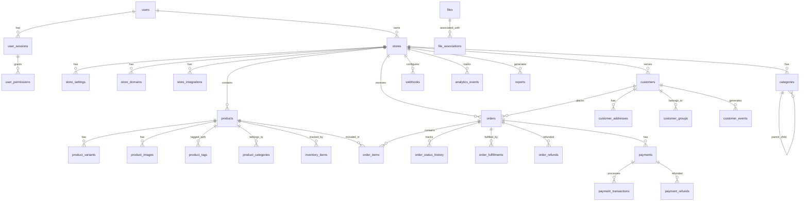

# مخطط قاعدة البيانات - مشروع Saler

## نظرة عامة

قاعدة البيانات الخاصة بمشروع Saler مصممة لإدارة المتاجر الإلكترونية بكفاءة عالية. تم استخدام PostgreSQL كقاعدة بيانات رئيسية لما توفره من موثوقية وأداء ممتاز في التعامل مع البيانات المعقدة.

### الخصائص الرئيسية

- **PostgreSQL 14+**: قاعدة البيانات الرئيسية
- **ACID Compliance**: ضمان سلامة البيانات
- **JSON Support**: دعم البيانات المهيكلة
- **Full-Text Search**: بحث نصي متقدم
- **Partitioning**: تقسيم الجداول الكبيرة
- **Indexing**: فهرسة متقدمة للأداء

### هيكل قاعدة البيانات



## الجداول الأساسية

### 1. إدارة المستخدمين

#### جدول `users`
```sql
CREATE TABLE users (
    id UUID PRIMARY KEY DEFAULT gen_random_uuid(),
    email VARCHAR(255) UNIQUE NOT NULL,
    password_hash VARCHAR(255) NOT NULL,
    first_name VARCHAR(100) NOT NULL,
    last_name VARCHAR(100) NOT NULL,
    phone VARCHAR(20),
    avatar_url TEXT,
    email_verified BOOLEAN DEFAULT FALSE,
    phone_verified BOOLEAN DEFAULT FALSE,
    two_factor_enabled BOOLEAN DEFAULT FALSE,
    two_factor_secret VARCHAR(32),
    status VARCHAR(20) DEFAULT 'active' CHECK (status IN ('active', 'inactive', 'suspended', 'deleted')),
    last_login_at TIMESTAMP WITH TIME ZONE,
    login_count INTEGER DEFAULT 0,
    failed_login_attempts INTEGER DEFAULT 0,
    locked_until TIMESTAMP WITH TIME ZONE,
    password_reset_token VARCHAR(255),
    password_reset_expires TIMESTAMP WITH TIME ZONE,
    email_verification_token VARCHAR(255),
    email_verification_expires TIMESTAMP WITH TIME ZONE,
    created_at TIMESTAMP WITH TIME ZONE DEFAULT NOW(),
    updated_at TIMESTAMP WITH TIME ZONE DEFAULT NOW()
);

-- فهارس الأداء
CREATE INDEX idx_users_email ON users(email);
CREATE INDEX idx_users_status ON users(status);
CREATE INDEX idx_users_created_at ON users(created_at);
CREATE INDEX idx_users_last_login ON users(last_login_at);
```

#### جدول `user_sessions`
```sql
CREATE TABLE user_sessions (
    id UUID PRIMARY KEY DEFAULT gen_random_uuid(),
    user_id UUID NOT NULL REFERENCES users(id) ON DELETE CASCADE,
    session_token VARCHAR(255) UNIQUE NOT NULL,
    refresh_token VARCHAR(255) UNIQUE,
    ip_address INET,
    user_agent TEXT,
    device_type VARCHAR(50),
    browser VARCHAR(50),
    os VARCHAR(50),
    is_active BOOLEAN DEFAULT TRUE,
    expires_at TIMESTAMP WITH TIME ZONE NOT NULL,
    created_at TIMESTAMP WITH TIME ZONE DEFAULT NOW(),
    updated_at TIMESTAMP WITH TIME ZONE DEFAULT NOW()
);

CREATE INDEX idx_user_sessions_user_id ON user_sessions(user_id);
CREATE INDEX idx_user_sessions_token ON user_sessions(session_token);
CREATE INDEX idx_user_sessions_expires ON user_sessions(expires_at);
CREATE INDEX idx_user_sessions_active ON user_sessions(is_active);
```

#### جدول `user_permissions`
```sql
CREATE TABLE user_permissions (
    id UUID PRIMARY KEY DEFAULT gen_random_uuid(),
    user_id UUID NOT NULL REFERENCES users(id) ON DELETE CASCADE,
    resource VARCHAR(100) NOT NULL, -- 'products', 'orders', 'customers', إلخ
    action VARCHAR(50) NOT NULL, -- 'read', 'write', 'delete', 'manage'
    granted_by UUID REFERENCES users(id),
    granted_at TIMESTAMP WITH TIME ZONE DEFAULT NOW(),
    expires_at TIMESTAMP WITH TIME ZONE,
    created_at TIMESTAMP WITH TIME ZONE DEFAULT NOW(),
    
    UNIQUE(user_id, resource, action)
);

CREATE INDEX idx_user_permissions_user_id ON user_permissions(user_id);
CREATE INDEX idx_user_permissions_resource ON user_permissions(resource);
```

### 2. إدارة المتاجر

#### جدول `stores`
```sql
CREATE TABLE stores (
    id UUID PRIMARY KEY DEFAULT gen_random_uuid(),
    owner_id UUID NOT NULL REFERENCES users(id) ON DELETE CASCADE,
    name VARCHAR(255) NOT NULL,
    handle VARCHAR(100) UNIQUE NOT NULL,
    description TEXT,
    logo_url TEXT,
    favicon_url TEXT,
    currency VARCHAR(3) DEFAULT 'SAR' CHECK (currency IN ('SAR', 'USD', 'EUR', 'AED')),
    language VARCHAR(5) DEFAULT 'ar' CHECK (language IN ('ar', 'en')),
    timezone VARCHAR(50) DEFAULT 'Asia/Riyadh',
    country VARCHAR(2) DEFAULT 'SA',
    address JSONB, -- {"street": "", "city": "", "postal_code": "", "country": ""}
    contact_info JSONB, -- {"email": "", "phone": "", "whatsapp": ""}
    business_info JSONB, -- {"tax_number": "", "commercial_register": ""}
    status VARCHAR(20) DEFAULT 'active' CHECK (status IN ('active', 'inactive', 'suspended', 'deleted')),
    theme_settings JSONB, -- إعدادات التصميم المخصصة
    is_published BOOLEAN DEFAULT FALSE,
    published_at TIMESTAMP WITH TIME ZONE,
    plan_type VARCHAR(20) DEFAULT 'basic' CHECK (plan_type IN ('basic', 'premium', 'enterprise')),
    plan_expires_at TIMESTAMP WITH TIME ZONE,
    created_at TIMESTAMP WITH TIME ZONE DEFAULT NOW(),
    updated_at TIMESTAMP WITH TIME ZONE DEFAULT NOW()
);

CREATE INDEX idx_stores_owner_id ON stores(owner_id);
CREATE INDEX idx_stores_handle ON stores(handle);
CREATE INDEX idx_stores_status ON stores(status);
CREATE INDEX idx_stores_plan_type ON stores(plan_type);
CREATE INDEX idx_stores_created_at ON stores(created_at);
```

#### جدول `store_settings`
```sql
CREATE TABLE store_settings (
    id UUID PRIMARY KEY DEFAULT gen_random_uuid(),
    store_id UUID NOT NULL REFERENCES stores(id) ON DELETE CASCADE,
    category VARCHAR(50) NOT NULL, -- 'general', 'shipping', 'payments', 'notifications'
    key VARCHAR(100) NOT NULL,
    value JSONB,
    description TEXT,
    is_public BOOLEAN DEFAULT FALSE, -- يمكن عرضه للعملاء
    created_at TIMESTAMP WITH TIME ZONE DEFAULT NOW(),
    updated_at TIMESTAMP WITH TIME ZONE DEFAULT NOW(),
    
    UNIQUE(store_id, category, key)
);

CREATE INDEX idx_store_settings_store_id ON store_settings(store_id);
CREATE INDEX idx_store_settings_category ON store_settings(category);
```

#### جدول `store_domains`
```sql
CREATE TABLE store_domains (
    id UUID PRIMARY KEY DEFAULT gen_random_uuid(),
    store_id UUID NOT NULL REFERENCES stores(id) ON DELETE CASCADE,
    domain VARCHAR(255) UNIQUE NOT NULL,
    ssl_enabled BOOLEAN DEFAULT FALSE,
    is_primary BOOLEAN DEFAULT FALSE,
    status VARCHAR(20) DEFAULT 'active' CHECK (status IN ('active', 'pending', 'disabled')),
    verified_at TIMESTAMP WITH TIME ZONE,
    created_at TIMESTAMP WITH TIME ZONE DEFAULT NOW(),
    updated_at TIMESTAMP WITH TIME ZONE DEFAULT NOW()
);

CREATE INDEX idx_store_domains_store_id ON store_domains(store_id);
CREATE INDEX idx_store_domains_domain ON store_domains(domain);
```

### 3. إدارة المنتجات

#### جدول `products`
```sql
CREATE TABLE products (
    id UUID PRIMARY KEY DEFAULT gen_random_uuid(),
    store_id UUID NOT NULL REFERENCES stores(id) ON DELETE CASCADE,
    title VARCHAR(255) NOT NULL,
    handle VARCHAR(255) UNIQUE NOT NULL, -- لرابط المنتج
    description TEXT,
    short_description TEXT,
    sku VARCHAR(100),
    barcode VARCHAR(100),
    price DECIMAL(10,2) NOT NULL DEFAULT 0.00,
    compare_at_price DECIMAL(10,2),
    cost_per_item DECIMAL(10,2),
    track_inventory BOOLEAN DEFAULT TRUE,
    continue_selling_when_out_of_stock BOOLEAN DEFAULT FALSE,
    weight DECIMAL(8,3), -- بالكيلوجرام
    length DECIMAL(8,2), -- بالسنتيمتر
    width DECIMAL(8,2),
    height DECIMAL(8,2),
    status VARCHAR(20) DEFAULT 'draft' CHECK (status IN ('draft', 'active', 'archived', 'deleted')),
    published_at TIMESTAMP WITH TIME ZONE,
    featured BOOLEAN DEFAULT FALSE,
    requires_shipping BOOLEAN DEFAULT TRUE,
    taxable BOOLEAN DEFAULT TRUE,
    seo_title VARCHAR(255),
    seo_description TEXT,
    meta_keywords TEXT,
    created_at TIMESTAMP WITH TIME ZONE DEFAULT NOW(),
    updated_at TIMESTAMP WITH TIME ZONE DEFAULT NOW()
);

CREATE INDEX idx_products_store_id ON products(store_id);
CREATE INDEX idx_products_status ON products(status);
CREATE INDEX idx_products_handle ON products(handle);
CREATE INDEX idx_products_sku ON products(sku);
CREATE INDEX idx_products_featured ON products(featured);
CREATE INDEX idx_products_price ON products(price);
CREATE INDEX idx_products_created_at ON products(created_at);
CREATE INDEX idx_products_title_gin ON products USING gin(to_tsvector('arabic', title));
```

#### جدول `product_variants`
```sql
CREATE TABLE product_variants (
    id UUID PRIMARY KEY DEFAULT gen_random_uuid(),
    product_id UUID NOT NULL REFERENCES products(id) ON DELETE CASCADE,
    title VARCHAR(255) NOT NULL,
    sku VARCHAR(100) UNIQUE,
    barcode VARCHAR(100),
    price DECIMAL(10,2) NOT NULL DEFAULT 0.00,
    compare_at_price DECIMAL(10,2),
    cost_per_item DECIMAL(10,2),
    track_inventory BOOLEAN DEFAULT TRUE,
    inventory_quantity INTEGER DEFAULT 0,
    weight DECIMAL(8,3),
    length DECIMAL(8,2),
    width DECIMAL(8,2),
    height DECIMAL(8,2),
    requires_shipping BOOLEAN DEFAULT TRUE,
    taxable BOOLEAN DEFAULT TRUE,
    position INTEGER DEFAULT 0,
    created_at TIMESTAMP WITH TIME ZONE DEFAULT NOW(),
    updated_at TIMESTAMP WITH TIME ZONE DEFAULT NOW()
);

CREATE INDEX idx_product_variants_product_id ON product_variants(product_id);
CREATE INDEX idx_product_variants_sku ON product_variants(sku);
CREATE INDEX idx_product_variants_position ON product_variants(position);
```

#### جدول `product_images`
```sql
CREATE TABLE product_images (
    id UUID PRIMARY KEY DEFAULT gen_random_uuid(),
    product_id UUID NOT NULL REFERENCES products(id) ON DELETE CASCADE,
    file_id UUID NOT NULL REFERENCES files(id) ON DELETE CASCADE,
    alt_text TEXT,
    position INTEGER DEFAULT 0,
    is_primary BOOLEAN DEFAULT FALSE,
    width INTEGER,
    height INTEGER,
    file_size INTEGER,
    mime_type VARCHAR(100),
    created_at TIMESTAMP WITH TIME ZONE DEFAULT NOW(),
    updated_at TIMESTAMP WITH TIME ZONE DEFAULT NOW()
);

CREATE INDEX idx_product_images_product_id ON product_images(product_id);
CREATE INDEX idx_product_images_position ON product_images(position);
CREATE INDEX idx_product_images_primary ON product_images(is_primary);
```

#### جدول `categories`
```sql
CREATE TABLE categories (
    id UUID PRIMARY KEY DEFAULT gen_random_uuid(),
    store_id UUID NOT NULL REFERENCES stores(id) ON DELETE CASCADE,
    name VARCHAR(255) NOT NULL,
    handle VARCHAR(255) NOT NULL,
    description TEXT,
    parent_id UUID REFERENCES categories(id) ON DELETE SET NULL,
    image_url TEXT,
    sort_order INTEGER DEFAULT 0,
    status VARCHAR(20) DEFAULT 'active' CHECK (status IN ('active', 'inactive', 'deleted')),
    seo_title VARCHAR(255),
    seo_description TEXT,
    created_at TIMESTAMP WITH TIME ZONE DEFAULT NOW(),
    updated_at TIMESTAMP WITH TIME ZONE DEFAULT NOW(),
    
    UNIQUE(store_id, handle)
);

CREATE INDEX idx_categories_store_id ON categories(store_id);
CREATE INDEX idx_categories_parent_id ON categories(parent_id);
CREATE INDEX idx_categories_status ON categories(status);
CREATE INDEX idx_categories_sort_order ON categories(sort_order);
```

#### جدول `product_categories`
```sql
CREATE TABLE product_categories (
    id UUID PRIMARY KEY DEFAULT gen_random_uuid(),
    product_id UUID NOT NULL REFERENCES products(id) ON DELETE CASCADE,
    category_id UUID NOT NULL REFERENCES categories(id) ON DELETE CASCADE,
    is_primary BOOLEAN DEFAULT FALSE,
    created_at TIMESTAMP WITH TIME ZONE DEFAULT NOW(),
    
    UNIQUE(product_id, category_id)
);

CREATE INDEX idx_product_categories_product_id ON product_categories(product_id);
CREATE INDEX idx_product_categories_category_id ON product_categories(category_id);
CREATE INDEX idx_product_categories_primary ON product_categories(is_primary);
```

### 4. إدارة العملاء

#### جدول `customers`
```sql
CREATE TABLE customers (
    id UUID PRIMARY KEY DEFAULT gen_random_uuid(),
    store_id UUID NOT NULL REFERENCES stores(id) ON DELETE CASCADE,
    email VARCHAR(255) UNIQUE NOT NULL,
    first_name VARCHAR(100) NOT NULL,
    last_name VARCHAR(100) NOT NULL,
    phone VARCHAR(20),
    avatar_url TEXT,
    company VARCHAR(255),
    tax_number VARCHAR(100),
    marketing_consent BOOLEAN DEFAULT FALSE,
    email_consent BOOLEAN DEFAULT FALSE,
    sms_consent BOOLEAN DEFAULT FALSE,
    tags TEXT[], -- مصفوفة من الوسوم
    notes TEXT,
    total_spent DECIMAL(12,2) DEFAULT 0.00,
    orders_count INTEGER DEFAULT 0,
    average_order_value DECIMAL(10,2) DEFAULT 0.00,
    last_order_at TIMESTAMP WITH TIME ZONE,
    status VARCHAR(20) DEFAULT 'active' CHECK (status IN ('active', 'inactive', 'blocked', 'deleted')),
    created_at TIMESTAMP WITH TIME ZONE DEFAULT NOW(),
    updated_at TIMESTAMP WITH TIME ZONE DEFAULT NOW()
);

CREATE INDEX idx_customers_store_id ON customers(store_id);
CREATE INDEX idx_customers_email ON customers(email);
CREATE INDEX idx_customers_status ON customers(status);
CREATE INDEX idx_customers_total_spent ON customers(total_spent);
CREATE INDEX idx_customers_created_at ON customers(created_at);
CREATE INDEX idx_customers_tags ON customers USING gin(tags);
```

#### جدول `customer_addresses`
```sql
CREATE TABLE customer_addresses (
    id UUID PRIMARY KEY DEFAULT gen_random_uuid(),
    customer_id UUID NOT NULL REFERENCES customers(id) ON DELETE CASCADE,
    first_name VARCHAR(100) NOT NULL,
    last_name VARCHAR(100) NOT NULL,
    company VARCHAR(255),
    address_line_1 VARCHAR(255) NOT NULL,
    address_line_2 VARCHAR(255),
    city VARCHAR(100) NOT NULL,
    state VARCHAR(100),
    postal_code VARCHAR(20),
    country VARCHAR(2) NOT NULL DEFAULT 'SA',
    phone VARCHAR(20),
    is_default_billing BOOLEAN DEFAULT FALSE,
    is_default_shipping BOOLEAN DEFAULT FALSE,
    address_type VARCHAR(20) DEFAULT 'both' CHECK (address_type IN ('billing', 'shipping', 'both')),
    created_at TIMESTAMP WITH TIME ZONE DEFAULT NOW(),
    updated_at TIMESTAMP WITH TIME ZONE DEFAULT NOW()
);

CREATE INDEX idx_customer_addresses_customer_id ON customer_addresses(customer_id);
CREATE INDEX idx_customer_addresses_default_billing ON customer_addresses(is_default_billing);
CREATE INDEX idx_customer_addresses_default_shipping ON customer_addresses(is_default_shipping);
```

#### جدول `customer_groups`
```sql
CREATE TABLE customer_groups (
    id UUID PRIMARY KEY DEFAULT gen_random_uuid(),
    store_id UUID NOT NULL REFERENCES stores(id) ON DELETE CASCADE,
    name VARCHAR(255) NOT NULL,
    description TEXT,
    rules JSONB, -- قواعد تحديد العضوية
    discount_percentage DECIMAL(5,2) DEFAULT 0.00,
    is_automatic BOOLEAN DEFAULT FALSE,
    status VARCHAR(20) DEFAULT 'active' CHECK (status IN ('active', 'inactive')),
    created_at TIMESTAMP WITH TIME ZONE DEFAULT NOW(),
    updated_at TIMESTAMP WITH TIME ZONE DEFAULT NOW()
);

CREATE INDEX idx_customer_groups_store_id ON customer_groups(store_id);
CREATE INDEX idx_customer_groups_status ON customer_groups(status);
```

#### جدول `customer_group_members`
```sql
CREATE TABLE customer_group_members (
    id UUID PRIMARY KEY DEFAULT gen_random_uuid(),
    customer_id UUID NOT NULL REFERENCES customers(id) ON DELETE CASCADE,
    group_id UUID NOT NULL REFERENCES customer_groups(id) ON DELETE CASCADE,
    added_at TIMESTAMP WITH TIME ZONE DEFAULT NOW(),
    
    UNIQUE(customer_id, group_id)
);

CREATE INDEX idx_customer_group_members_customer_id ON customer_group_members(customer_id);
CREATE INDEX idx_customer_group_members_group_id ON customer_group_members(group_id);
```

### 5. إدارة الطلبات

#### جدول `orders`
```sql
CREATE TABLE orders (
    id UUID PRIMARY KEY DEFAULT gen_random_uuid(),
    store_id UUID NOT NULL REFERENCES stores(id) ON DELETE CASCADE,
    customer_id UUID REFERENCES customers(id) ON DELETE SET NULL,
    order_number VARCHAR(50) UNIQUE NOT NULL,
    email VARCHAR(255) NOT NULL,
    phone VARCHAR(20),
    currency VARCHAR(3) NOT NULL DEFAULT 'SAR',
    subtotal DECIMAL(10,2) NOT NULL DEFAULT 0.00,
    shipping_cost DECIMAL(10,2) DEFAULT 0.00,
    tax_amount DECIMAL(10,2) DEFAULT 0.00,
    discount_amount DECIMAL(10,2) DEFAULT 0.00,
    total_amount DECIMAL(10,2) NOT NULL DEFAULT 0.00,
    status VARCHAR(20) DEFAULT 'pending' CHECK (status IN ('pending', 'confirmed', 'processing', 'shipped', 'delivered', 'cancelled', 'refunded', 'partially_refunded')),
    payment_status VARCHAR(20) DEFAULT 'pending' CHECK (payment_status IN ('pending', 'paid', 'partially_paid', 'refunded', 'voided')),
    fulfillment_status VARCHAR(20) DEFAULT 'unfulfilled' CHECK (fulfillment_status IN ('unfulfilled', 'partial', 'fulfilled')),
    shipping_method VARCHAR(100),
    shipping_tracking_number VARCHAR(255),
    shipping_carrier VARCHAR(100),
    notes TEXT,
    tags TEXT[],
    source VARCHAR(50) DEFAULT 'website',
    created_at TIMESTAMP WITH TIME ZONE DEFAULT NOW(),
    updated_at TIMESTAMP WITH TIME ZONE DEFAULT NOW()
);

CREATE INDEX idx_orders_store_id ON orders(store_id);
CREATE INDEX idx_orders_customer_id ON orders(customer_id);
CREATE INDEX idx_orders_order_number ON orders(order_number);
CREATE INDEX idx_orders_status ON orders(status);
CREATE INDEX idx_orders_payment_status ON orders(payment_status);
CREATE INDEX idx_orders_created_at ON orders(created_at);
CREATE INDEX idx_orders_total_amount ON orders(total_amount);
```

#### جدول `order_items`
```sql
CREATE TABLE order_items (
    id UUID PRIMARY KEY DEFAULT gen_random_uuid(),
    order_id UUID NOT NULL REFERENCES orders(id) ON DELETE CASCADE,
    product_id UUID NOT NULL REFERENCES products(id),
    variant_id UUID REFERENCES product_variants(id) ON DELETE SET NULL,
    title VARCHAR(255) NOT NULL,
    sku VARCHAR(100),
    quantity INTEGER NOT NULL DEFAULT 1,
    price DECIMAL(10,2) NOT NULL,
    total_price DECIMAL(10,2) NOT NULL,
    discount_amount DECIMAL(10,2) DEFAULT 0.00,
    tax_amount DECIMAL(10,2) DEFAULT 0.00,
    properties JSONB, -- خصائص إضافية للمنتج
    created_at TIMESTAMP WITH TIME ZONE DEFAULT NOW(),
    updated_at TIMESTAMP WITH TIME ZONE DEFAULT NOW()
);

CREATE INDEX idx_order_items_order_id ON order_items(order_id);
CREATE INDEX idx_order_items_product_id ON order_items(product_id);
CREATE INDEX idx_order_items_variant_id ON order_items(variant_id);
```

#### جدول `order_status_history`
```sql
CREATE TABLE order_status_history (
    id UUID PRIMARY KEY DEFAULT gen_random_uuid(),
    order_id UUID NOT NULL REFERENCES orders(id) ON DELETE CASCADE,
    status VARCHAR(20) NOT NULL,
    previous_status VARCHAR(20),
    changed_by UUID REFERENCES users(id),
    customer_notified BOOLEAN DEFAULT FALSE,
    notes TEXT,
    created_at TIMESTAMP WITH TIME ZONE DEFAULT NOW()
);

CREATE INDEX idx_order_status_history_order_id ON order_status_history(order_id);
CREATE INDEX idx_order_status_history_status ON order_status_history(status);
CREATE INDEX idx_order_status_history_created_at ON order_status_history(created_at);
```

### 6. إدارة المدفوعات

#### جدول `payments`
```sql
CREATE TABLE payments (
    id UUID PRIMARY KEY DEFAULT gen_random_uuid(),
    order_id UUID NOT NULL REFERENCES orders(id) ON DELETE CASCADE,
    amount DECIMAL(10,2) NOT NULL,
    currency VARCHAR(3) NOT NULL DEFAULT 'SAR',
    payment_method VARCHAR(50) NOT NULL, -- 'credit_card', 'bank_transfer', 'cash_on_delivery', 'paypal'
    gateway VARCHAR(50), -- 'stripe', 'paypal', 'mada', 'stc_pay'
    gateway_transaction_id VARCHAR(255),
    reference_number VARCHAR(255),
    status VARCHAR(20) DEFAULT 'pending' CHECK (status IN ('pending', 'processing', 'completed', 'failed', 'cancelled', 'refunded')),
    processed_at TIMESTAMP WITH TIME ZONE,
    refunded_amount DECIMAL(10,2) DEFAULT 0.00,
    failure_reason TEXT,
    metadata JSONB, -- بيانات إضافية من بوابة الدفع
    created_at TIMESTAMP WITH TIME ZONE DEFAULT NOW(),
    updated_at TIMESTAMP WITH TIME ZONE DEFAULT NOW()
);

CREATE INDEX idx_payments_order_id ON payments(order_id);
CREATE INDEX idx_payments_status ON payments(status);
CREATE INDEX idx_payments_gateway ON payments(gateway);
CREATE INDEX idx_payments_created_at ON payments(created_at);
```

#### جدول `payment_transactions`
```sql
CREATE TABLE payment_transactions (
    id UUID PRIMARY KEY DEFAULT gen_random_uuid(),
    payment_id UUID NOT NULL REFERENCES payments(id) ON DELETE CASCADE,
    transaction_type VARCHAR(20) NOT NULL CHECK (transaction_type IN ('authorization', 'capture', 'refund', 'void')),
    amount DECIMAL(10,2) NOT NULL,
    currency VARCHAR(3) NOT NULL DEFAULT 'SAR',
    gateway_transaction_id VARCHAR(255),
    gateway_response JSONB,
    status VARCHAR(20) DEFAULT 'pending' CHECK (status IN ('pending', 'completed', 'failed')),
    processed_at TIMESTAMP WITH TIME ZONE,
    created_at TIMESTAMP WITH TIME ZONE DEFAULT NOW()
);

CREATE INDEX idx_payment_transactions_payment_id ON payment_transactions(payment_id);
CREATE INDEX idx_payment_transactions_type ON payment_transactions(transaction_type);
CREATE INDEX idx_payment_transactions_status ON payment_transactions(status);
```

### 7. إدارة المخزون

#### جدول `inventory_items`
```sql
CREATE TABLE inventory_items (
    id UUID PRIMARY KEY DEFAULT gen_random_uuid(),
    product_id UUID NOT NULL REFERENCES products(id) ON DELETE CASCADE,
    variant_id UUID REFERENCES product_variants(id) ON DELETE CASCADE,
    location_id UUID, -- معرف الموقع (يمكن أن يكون warehouse أو متجر)
    quantity_on_hand INTEGER DEFAULT 0,
    quantity_reserved INTEGER DEFAULT 0,
    quantity_available INTEGER GENERATED ALWAYS AS (quantity_on_hand - quantity_reserved) STORED,
    low_stock_threshold INTEGER DEFAULT 5,
    restock_date DATE,
    created_at TIMESTAMP WITH TIME ZONE DEFAULT NOW(),
    updated_at TIMESTAMP WITH TIME ZONE DEFAULT NOW(),
    
    UNIQUE(product_id, variant_id, location_id)
);

CREATE INDEX idx_inventory_items_product_id ON inventory_items(product_id);
CREATE INDEX idx_inventory_items_variant_id ON inventory_items(variant_id);
CREATE INDEX idx_inventory_items_quantity_available ON inventory_items(quantity_available);
```

#### جدول `inventory_transactions`
```sql
CREATE TABLE inventory_transactions (
    id UUID PRIMARY KEY DEFAULT gen_random_uuid(),
    inventory_item_id UUID NOT NULL REFERENCES inventory_items(id) ON DELETE CASCADE,
    transaction_type VARCHAR(20) NOT NULL CHECK (transaction_type IN ('sale', 'restock', 'adjustment', 'return', 'transfer', 'damage')),
    quantity_change INTEGER NOT NULL, -- موجب للإضافة، سالب للطرح
    previous_quantity INTEGER NOT NULL,
    new_quantity INTEGER NOT NULL,
    reference_type VARCHAR(50), -- 'order', 'manual', 'adjustment'
    reference_id UUID,
    notes TEXT,
    created_by UUID REFERENCES users(id),
    created_at TIMESTAMP WITH TIME ZONE DEFAULT NOW()
);

CREATE INDEX idx_inventory_transactions_item_id ON inventory_transactions(inventory_item_id);
CREATE INDEX idx_inventory_transactions_type ON inventory_transactions(transaction_type);
CREATE INDEX idx_inventory_transactions_created_at ON inventory_transactions(created_at);
```

### 8. إدارة الملفات

#### جدول `files`
```sql
CREATE TABLE files (
    id UUID PRIMARY KEY DEFAULT gen_random_uuid(),
    store_id UUID REFERENCES stores(id) ON DELETE CASCADE,
    original_name VARCHAR(255) NOT NULL,
    filename VARCHAR(255) NOT NULL,
    file_path TEXT NOT NULL,
    file_size INTEGER NOT NULL,
    mime_type VARCHAR(100) NOT NULL,
    width INTEGER,
    height INTEGER,
    thumbnail_path TEXT,
    alt_text TEXT,
    uploaded_by UUID REFERENCES users(id),
    is_public BOOLEAN DEFAULT FALSE,
    created_at TIMESTAMP WITH TIME ZONE DEFAULT NOW(),
    updated_at TIMESTAMP WITH TIME ZONE DEFAULT NOW()
);

CREATE INDEX idx_files_store_id ON files(store_id);
CREATE INDEX idx_files_mime_type ON files(mime_type);
CREATE INDEX idx_files_created_at ON files(created_at);
CREATE INDEX idx_files_size ON files(file_size);
```

### 9. Webhooks

#### جدول `webhooks`
```sql
CREATE TABLE webhooks (
    id UUID PRIMARY KEY DEFAULT gen_random_uuid(),
    store_id UUID NOT NULL REFERENCES stores(id) ON DELETE CASCADE,
    name VARCHAR(255) NOT NULL,
    url TEXT NOT NULL,
    events TEXT[] NOT NULL, -- ['order.created', 'product.updated']
    secret VARCHAR(255) NOT NULL,
    is_active BOOLEAN DEFAULT TRUE,
    headers JSONB, -- headers إضافية للطلب
    retry_config JSONB, -- إعدادات إعادة المحاولة
    created_by UUID REFERENCES users(id),
    last_triggered_at TIMESTAMP WITH TIME ZONE,
    failure_count INTEGER DEFAULT 0,
    created_at TIMESTAMP WITH TIME ZONE DEFAULT NOW(),
    updated_at TIMESTAMP WITH TIME ZONE DEFAULT NOW()
);

CREATE INDEX idx_webhooks_store_id ON webhooks(store_id);
CREATE INDEX idx_webhooks_active ON webhooks(is_active);
CREATE INDEX idx_webhooks_events ON webhooks USING gin(events);
```

#### جدول `webhook_deliveries`
```sql
CREATE TABLE webhook_deliveries (
    id UUID PRIMARY KEY DEFAULT gen_random_uuid(),
    webhook_id UUID NOT NULL REFERENCES webhooks(id) ON DELETE CASCADE,
    event VARCHAR(50) NOT NULL,
    payload JSONB NOT NULL,
    request_headers JSONB,
    response_status INTEGER,
    response_headers JSONB,
    response_body TEXT,
    attempt_number INTEGER DEFAULT 1,
    status VARCHAR(20) DEFAULT 'pending' CHECK (status IN ('pending', 'success', 'failed', 'timeout')),
    delivered_at TIMESTAMP WITH TIME ZONE,
    created_at TIMESTAMP WITH TIME ZONE DEFAULT NOW()
);

CREATE INDEX idx_webhook_deliveries_webhook_id ON webhook_deliveries(webhook_id);
CREATE INDEX idx_webhook_deliveries_status ON webhook_deliveries(status);
CREATE INDEX idx_webhook_deliveries_created_at ON webhook_deliveries(created_at);
```

### 10. التحليلات والتقارير

#### جدول `analytics_events`
```sql
CREATE TABLE analytics_events (
    id UUID PRIMARY KEY DEFAULT gen_random_uuid(),
    store_id UUID NOT NULL REFERENCES stores(id) ON DELETE CASCADE,
    event_name VARCHAR(100) NOT NULL,
    event_type VARCHAR(50) NOT NULL, -- 'page_view', 'product_view', 'add_to_cart', 'purchase'
    user_id UUID REFERENCES customers(id),
    session_id VARCHAR(255),
    page_url TEXT,
    referrer TEXT,
    user_agent TEXT,
    ip_address INET,
    properties JSONB, -- بيانات إضافية عن الحدث
    revenue DECIMAL(10,2),
    created_at TIMESTAMP WITH TIME ZONE DEFAULT NOW()
);

CREATE INDEX idx_analytics_events_store_id ON analytics_events(store_id);
CREATE INDEX idx_analytics_events_event_name ON analytics_events(event_name);
CREATE INDEX idx_analytics_events_event_type ON analytics_events(event_type);
CREATE INDEX idx_analytics_events_user_id ON analytics_events(user_id);
CREATE INDEX idx_analytics_events_created_at ON analytics_events(created_at);
CREATE INDEX idx_analytics_events_properties ON analytics_events USING gin(properties);
```

##_views والمخازن المتقدمة

### عرض محصل العملاء
```sql
CREATE VIEW customer_summary AS
SELECT 
    c.id,
    c.store_id,
    c.email,
    c.first_name,
    c.last_name,
    c.phone,
    c.total_spent,
    c.orders_count,
    c.average_order_value,
    c.last_order_at,
    c.status,
    COUNT(DISTINCT o.id) FILTER (WHERE o.created_at >= CURRENT_DATE - INTERVAL '30 days') as orders_last_30_days,
    COALESCE(SUM(o.total_amount) FILTER (WHERE o.created_at >= CURRENT_DATE - INTERVAL '30 days'), 0) as revenue_last_30_days
FROM customers c
LEFT JOIN orders o ON c.id = o.customer_id
GROUP BY c.id, c.store_id, c.email, c.first_name, c.last_name, c.phone, 
         c.total_spent, c.orders_count, c.average_order_value, c.last_order_at, c.status;
```

### عرض إحصائيات الطلبات
```sql
CREATE VIEW order_statistics AS
SELECT 
    store_id,
    DATE_TRUNC('day', created_at) as order_date,
    COUNT(*) as total_orders,
    COUNT(*) FILTER (WHERE status = 'completed') as completed_orders,
    COUNT(*) FILTER (WHERE status = 'cancelled') as cancelled_orders,
    SUM(total_amount) as total_revenue,
    AVG(total_amount) as average_order_value,
    SUM(shipping_cost) as total_shipping,
    SUM(tax_amount) as total_tax
FROM orders
GROUP BY store_id, DATE_TRUNC('day', created_at)
ORDER BY store_id, order_date DESC;
```

## الوظائف المساعدة

### حساب إجمالي المبلغ
```sql
CREATE OR REPLACE FUNCTION calculate_order_total(order_uuid UUID)
RETURNS DECIMAL AS $$
DECLARE
    subtotal_amount DECIMAL;
    shipping_amount DECIMAL;
    tax_amount DECIMAL;
    discount_amount DECIMAL;
    total_amount DECIMAL;
BEGIN
    -- حساب المجموع الفرعي
    SELECT COALESCE(SUM(quantity * price), 0)
    INTO subtotal_amount
    FROM order_items
    WHERE order_id = order_uuid;
    
    -- جلب بيانات الطلب
    SELECT shipping_cost, tax_amount, discount_amount
    INTO shipping_amount, tax_amount, discount_amount
    FROM orders
    WHERE id = order_uuid;
    
    -- حساب الإجمالي
    total_amount := subtotal_amount + COALESCE(shipping_amount, 0) + COALESCE(tax_amount, 0) - COALESCE(discount_amount, 0);
    
    RETURN total_amount;
END;
$$ LANGUAGE plpgsql;
```

### تحديث إحصائيات العميل
```sql
CREATE OR REPLACE FUNCTION update_customer_stats(customer_uuid UUID)
RETURNS VOID AS $$
DECLARE
    total_spent_val DECIMAL;
    orders_count_val INTEGER;
    avg_order_val DECIMAL;
    last_order_val TIMESTAMP WITH TIME ZONE;
BEGIN
    -- حساب الإحصائيات
    SELECT 
        COALESCE(SUM(total_amount), 0),
        COUNT(*),
        COALESCE(AVG(total_amount), 0),
        MAX(created_at)
    INTO total_spent_val, orders_count_val, avg_order_val, last_order_val
    FROM orders
    WHERE customer_id = customer_uuid
    AND status IN ('completed', 'delivered');
    
    -- تحديث جدول العملاء
    UPDATE customers SET
        total_spent = total_spent_val,
        orders_count = orders_count_val,
        average_order_value = avg_order_val,
        last_order_at = last_order_val,
        updated_at = NOW()
    WHERE id = customer_uuid;
END;
$$ LANGUAGE plpgsql;
```

هذا المخطط يوفر أساساً قوياً لإدارة المتاجر الإلكترونية بكفاءة عالية مع ضمان سلامة البيانات والأداء الممتاز.

---

**آخر تحديث**: 2 نوفمبر 2025