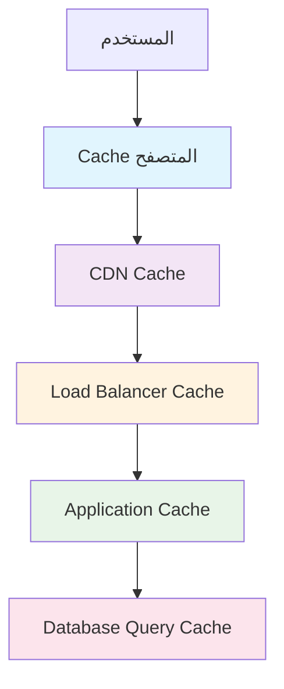

# استراتيجيات الذاكرة المؤقتة - Caching Strategies

## نظرة عامة

هذا الدليل يوضح استراتيجيات الذاكرة المؤقتة (Caching) الشاملة لتطبيق Saler، من الذاكرة المؤقتة على مستوى التطبيق إلى الذاكرة المؤقتة الموزعة، مع التركيز على تحسين الأداء وتقليل العبء على الخادم وقاعدة البيانات.

## محتويات الدليل

1. [أنواع الذاكرة المؤقتة](#أنواع-الذاكرة-المؤقتة)
2. [تخطيط استراتيجية Cache](#تخطيط-استراتيجية-cache)
3. [Cache على مستوى التطبيق](#cache-على-مستوى-التطبيق)
4. [Cache على مستوى قاعدة البيانات](#cache-على-مستوى-قاعدة-البيانات)
5. [Cache على مستوى الشبكة](#cache-على-مستوى-الشبكة)
6. [Redis كحل Cache موزع](#redis-كحل-cache-موزع)
7. [Cache للعملاء والمتصفح](#cache-للمتصفح-والعملاء)
8. [تطهير وإدارة Cache](#تطهير-وإدارة-cache)
9. [مراقبة أداء Cache](#مراقبة-أداء-cache)
10. [أفضل الممارسات](#أفضل-الممارسات)

## أنواع الذاكرة المؤقتة

### طبقات Cache



### مقارنات استراتيجيات Cache

| نوع Cache | السرعة | السعة | التكلفة | التعقيد | الاستخدام المثالي |
|-----------|-------|-------|---------|---------|-------------------|
| Browser Cache | ⚡⚡⚡ | منخفض | مجانٍ | بسيط | الموارد الثابتة |
| CDN Cache | ⚡⚡⚡ | متوسط | منخفض | بسيط | المحتوى العالمي |
| Application Cache | ⚡⚡ | متوسط | متوسط | متوسط | البيانات الديناميكية |
| Database Cache | ⚡ | عالي | متوسط | متوسط | الاستعلامات المعقدة |
| Redis Cache | ⚡⚡ | عالي | متوسط | متوسط | البيانات المشتركة |

## تخطيط استراتيجية Cache

### خريطة بيانات التطبيق

```python
# cache_strategy.py - استراتيجية Cache

from enum import Enum
from typing import Dict, List, Optional, Any
from datetime import timedelta
import json

class CacheLevel(Enum):
    """مستويات الذاكرة المؤقتة"""
    BROWSER = "browser"
    CDN = "cdn"
    APPLICATION = "application"
    DATABASE = "database"
    REDIS = "redis"

class DataType(Enum):
    """أنواع البيانات"""
    STATIC_CONTENT = "static_content"      # CSS, JS, صور
    USER_SESSION = "user_session"          # جلسات المستخدمين
    PRODUCT_DATA = "product_data"          # بيانات المنتجات
    ANALYTICS_DATA = "analytics_data"      # البيانات التحليلية
    API_RESPONSE = "api_response"          # استجابات API
    QUERY_RESULT = "query_result"          # نتائج الاستعلامات

class CacheStrategy:
    """إستراتيجية الذاكرة المؤقتة"""
    
    def __init__(self):
        self.strategies = self._define_strategies()
        self.ttl_config = self._define_ttl_config()
        self.invalidation_rules = self._define_invalidation_rules()
    
    def _define_strategies(self) -> Dict[DataType, Dict[CacheLevel, Dict]]:
        """تعريف استراتيجيات Cache لكل نوع بيانات"""
        return {
            DataType.STATIC_CONTENT: {
                CacheLevel.BROWSER: {
                    'enabled': True,
                    'max_age': 31536000,  # سنة واحدة
                    'vary_headers': ['Accept-Encoding']
                },
                CacheLevel.CDN: {
                    'enabled': True,
                    'max_age': 31536000,
                    'purge_on_update': True
                }
            },
            
            DataType.PRODUCT_DATA: {
                CacheLevel.APPLICATION: {
                    'enabled': True,
                    'max_age': 1800,  # 30 دقيقة
                    'cache_key_pattern': 'product:{id}',
                    'serializer': 'json'
                },
                CacheLevel.REDIS: {
                    'enabled': True,
                    'max_age': 3600,  # ساعة واحدة
                    'cache_key_pattern': 'redis:product:{id}',
                    'serializer': 'pickle'
                }
            },
            
            DataType.USER_SESSION: {
                CacheLevel.REDIS: {
                    'enabled': True,
                    'max_age': 86400,  # 24 ساعة
                    'cache_key_pattern': 'session:{session_id}',
                    'serializer': 'pickle',
                    'persistent': True
                }
            },
            
            DataType.API_RESPONSE: {
                CacheLevel.APPLICATION: {
                    'enabled': True,
                    'max_age': 300,  # 5 دقائق
                    'cache_key_pattern': 'api:{method}:{path}:{params_hash}',
                    'serializer': 'json'
                }
            },
            
            DataType.QUERY_RESULT: {
                CacheLevel.DATABASE: {
                    'enabled': True,
                    'max_age': 900,  # 15 دقيقة
                    'query_hash_pattern': 'query:{hash}'
                },
                CacheLevel.REDIS: {
                    'enabled': True,
                    'max_age': 1800,  # 30 دقيقة
                    'cache_key_pattern': 'query:{hash}',
                    'serializer': 'pickle'
                }
            }
        }
    
    def _define_ttl_config(self) -> Dict[DataType, Dict[CacheLevel, int]]:
        """تعريف أوقات انتهاء الصلاحية"""
        return {
            DataType.STATIC_CONTENT: {
                CacheLevel.BROWSER: 31536000,
                CacheLevel.CDN: 31536000
            },
            DataType.PRODUCT_DATA: {
                CacheLevel.APPLICATION: 1800,
                CacheLevel.REDIS: 3600
            },
            DataType.USER_SESSION: {
                CacheLevel.REDIS: 86400
            },
            DataType.API_RESPONSE: {
                CacheLevel.APPLICATION: 300
            },
            DataType.QUERY_RESULT: {
                CacheLevel.DATABASE: 900,
                CacheLevel.REDIS: 1800
            }
        }
    
    def _define_invalidation_rules(self) -> Dict[str, List[str]]:
        """قواعد إبطال Cache"""
        return {
            # إبطال cache المنتجات عند تحديث المنتج
            'product_update': [
                'product:{product_id}',
                'redis:product:{product_id}',
                'query:products_by_store:{store_id}'
            ],
            
            # إبطال cache المستخدم عند تحديث الملف الشخصي
            'user_update': [
                'user:{user_id}',
                'session:{session_id}',
                'user_preferences:{user_id}'
            ],
            
            # إبطال cache الطلبات عند إنشاء طلب جديد
            'order_create': [
                'order:{order_id}',
                'user_orders:{user_id}',
                'store_orders:{store_id}',
                'analytics:orders_24h'
            ]
        }
    
    def get_cache_config(self, data_type: DataType, cache_level: CacheLevel) -> Optional[Dict]:
        """الحصول على إعدادات Cache"""
        return self.strategies.get(data_type, {}).get(cache_level)
    
    def get_ttl(self, data_type: DataType, cache_level: CacheLevel) -> Optional[int]:
        """الحصول على وقت انتهاء الصلاحية"""
        return self.ttl_config.get(data_type, {}).get(cache_level)
    
    def get_invalidation_keys(self, action: str, **params) -> List[str]:
        """الحصول على مفاتيح Cache للإبطال"""
        pattern_list = self.invalidation_rules.get(action, [])
        
        invalidation_keys = []
        for pattern in pattern_list:
            try:
                # استبدال المعاملات في النمط
                key = pattern.format(**params)
                invalidation_keys.append(key)
            except KeyError:
                continue
        
        return invalidation_keys
    
    def should_cache(self, data_type: DataType, cache_level: CacheLevel) -> bool:
        """فحص ما إذا كان يجب تخزين البيانات في Cache"""
        config = self.get_cache_config(data_type, cache_level)
        return config and config.get('enabled', False)

# استخدام استراتيجية Cache
cache_strategy = CacheStrategy()

def get_cache_key(data_type: DataType, cache_level: CacheLevel, **params) -> str:
    """إنشاء مفتاح Cache"""
    config = cache_strategy.get_cache_config(data_type, cache_level)
    if not config:
        return ""
    
    pattern = config.get('cache_key_pattern', '{data_type}:{cache_level}')
    
    # إضافة المعاملات
    cache_key = pattern.format(
        data_type=data_type.value,
        cache_level=cache_level.value,
        **params
    )
    
    # إضافة hash للوضوح
    import hashlib
    key_hash = hashlib.md5(cache_key.encode()).hexdigest()[:8]
    
    return f"{cache_key}:{key_hash}"
```

## Cache على مستوى التطبيق

### تطبيق Cache في Django

```python
# django_cache.py - Cache في Django

from django.core.cache import cache
from django.core.cache.backends.redis import RedisCache
from django.conf import settings
from django.db import transaction
from django.db.models import Q
from functools import wraps
import hashlib
import json
from typing import Any, Optional, Callable
import logging

logger = logging.getLogger(__name__)

class AppCacheManager:
    """مدير Cache على مستوى التطبيق"""
    
    def __init__(self):
        self.cache = cache
        self.default_timeout = 3600  # ساعة واحدة
        self.serializer = 'pickle'  # أو 'json'
    
    def get_cache_key(self, prefix: str, **kwargs) -> str:
        """إنشاء مفتاح Cache"""
        # ترتيب المعاملات لضمان مفتاح ثابت
        sorted_items = sorted(kwargs.items())
        key_data = f"{prefix}:" + ":".join([f"{k}={v}" for k, v in sorted_items])
        
        # إنشاء hash للمفتاح الطويل
        if len(key_data) > 200:
            key_hash = hashlib.md5(key_data.encode()).hexdigest()
            return f"{prefix}:{key_hash}"
        
        return key_data
    
    def get(self, key: str, default=None, version: Optional[int] = None) -> Any:
        """جلب قيمة من Cache"""
        try:
            return self.cache.get(key, default=default, version=version)
        except Exception as e:
            logger.error(f"خطأ في جلب Cache {key}: {e}")
            return default
    
    def set(self, key: str, value: Any, timeout: Optional[int] = None, version: Optional[int] = None) -> bool:
        """حفظ قيمة في Cache"""
        try:
            timeout = timeout or self.default_timeout
            return self.cache.set(key, value, timeout=timeout, version=version)
        except Exception as e:
            logger.error(f"خطأ في حفظ Cache {key}: {e}")
            return False
    
    def delete(self, key: str, version: Optional[int] = None) -> bool:
        """حذف مفتاح من Cache"""
        try:
            return self.cache.delete(key, version=version)
        except Exception as e:
            logger.error(f"خطأ في حذف Cache {key}: {e}")
            return False
    
    def delete_pattern(self, pattern: str) -> int:
        """حذف مفاتيح بنمط"""
        try:
            if hasattr(self.cache, 'delete_pattern'):
                return self.cache.delete_pattern(pattern)
            else:
                # تنفيذ يدوي للبترن باستخدام scan
                keys = self.cache.keys(pattern)
                if keys:
                    return self.cache.delete_many(keys)
                return 0
        except Exception as e:
            logger.error(f"خطأ في حذف نمط Cache {pattern}: {e}")
            return 0
    
    def clear(self) -> bool:
        """مسح جميع بيانات Cache"""
        try:
            return self.cache.clear()
        except Exception as e:
            logger.error(f"خطأ في مسح Cache: {e}")
            return False
    
    def get_or_set(self, key: str, callable_func: Callable, timeout: Optional[int] = None, **kwargs) -> Any:
        """جلب من Cache أو حساب القيمة الجديدة"""
        value = self.get(key)
        
        if value is not None:
            return value
        
        # حساب القيمة الجديدة
        value = callable_func(**kwargs)
        
        if value is not None:
            self.set(key, value, timeout)
        
        return value

# decorators للـ Cache
def cache_result(timeout: int = 3600, key_prefix: str = "", key_func: Optional[Callable] = None):
    """decorator لتخزين نتائج الدوال"""
    def decorator(func):
        @wraps(func)
        def wrapper(*args, **kwargs):
            cache_manager = AppCacheManager()
            
            # إنشاء مفتاح Cache
            if key_func:
                cache_key = key_func(*args, **kwargs)
            else:
                cache_key = cache_manager.get_cache_key(
                    f"{key_prefix}:{func.__name__}",
                    args=str(args),
                    kwargs=str(sorted(kwargs.items()))
                )
            
            # محاولة جلب من Cache
            cached_result = cache_manager.get(cache_key)
            if cached_result is not None:
                logger.debug(f"Cache hit for {cache_key}")
                return cached_result
            
            # حساب القيمة الجديدة
            result = func(*args, **kwargs)
            
            # حفظ في Cache
            if result is not None:
                cache_manager.set(cache_key, result, timeout)
                logger.debug(f"Cache set for {cache_key}")
            
            return result
        
        return wrapper
    return decorator

def cache_queryset(timeout: int = 1800, key_prefix: str = "queryset"):
    """decorator لتخزين QuerySets"""
    def decorator(func):
        @wraps(func)
        def wrapper(*args, **kwargs):
            cache_manager = AppCacheManager()
            
            # إنشاء مفتاح Cache
            cache_key = cache_manager.get_cache_key(
                f"{key_prefix}:{func.__name__}",
                args=str(args),
                kwargs=str(sorted(kwargs.items()))
            )
            
            # محاولة جلب من Cache
            cached_queryset = cache_manager.get(cache_key)
            if cached_queryset is not None:
                return cached_queryset
            
            # حساب QuerySet جديد
            queryset = func(*args, **kwargs)
            
            # تحويل إلى قائمة لتجنب مشاكل الـ lazy evaluation
            if hasattr(queryset, '__iter__'):
                result = list(queryset)
            else:
                result = queryset
            
            # حفظ في Cache
            cache_manager.set(cache_key, result, timeout)
            
            return result
        
        return wrapper
    return decorator

# استخدام Cache في النماذج
from django.db import models
from django.core.cache import cache

class Product(models.Model):
    """نموذج المنتج مع Cache"""
    
    name = models.CharField(max_length=255)
    description = models.TextField()
    price = models.DecimalField(max_digits=10, decimal_places=2)
    store = models.ForeignKey('Store', on_delete=models.CASCADE)
    category = models.ForeignKey('Category', on_delete=models.CASCADE)
    is_active = models.BooleanField(default=True)
    created_at = models.DateTimeField(auto_now_add=True)
    updated_at = models.DateTimeField(auto_now=True)
    
    class Meta:
        db_table = 'products'
    
    def save(self, *args, **kwargs):
        """حفظ مع إبطال Cache"""
        super().save(*args, **kwargs)
        
        # إبطال Cache المرتبطة
        self._invalidate_cache()
    
    def _invalidate_cache(self):
        """إبطال Cache المرتبطة بالمنتج"""
        cache_manager = AppCacheManager()
        
        # مفاتيح Cache للإبطال
        cache_keys = [
            f"product:{self.id}",
            f"store_products:{self.store.id}",
            f"category_products:{self.category.id}",
            f"active_products:{self.store.id}",
            f"product_search:{hashlib.md5(str(self.name).encode()).hexdigest()[:8]}"
        ]
        
        for key in cache_keys:
            cache_manager.delete(key)
        
        logger.debug(f"تم إبطال Cache للمنتج {self.id}")
    
    @classmethod
    @cache_queryset(timeout=1800, key_prefix="products")
    def get_active_products(cls, store_id: Optional[int] = None):
        """استرجاع المنتجات النشطة مع Cache"""
        queryset = cls.objects.filter(is_active=True)
        
        if store_id:
            queryset = queryset.filter(store_id=store_id)
        
        return queryset.order_by('-created_at')
    
    @classmethod
    @cache_result(timeout=3600, key_prefix="product_stats")
    def get_product_stats(cls, store_id: int) -> dict:
        """إحصائيات المنتجات مع Cache"""
        from django.db.models import Count, Avg
        
        stats = cls.objects.filter(store_id=store_id).aggregate(
            total_products=Count('id'),
            active_products=Count('id', filter=Q(is_active=True)),
            average_price=Avg('price'),
            total_value=Count('id') * Avg('price')
        )
        
        return stats

class Store(models.Model):
    """نموذج المتجر مع Cache"""
    
    name = models.CharField(max_length=255)
    owner = models.ForeignKey('User', on_delete=models.CASCADE)
    is_active = models.BooleanField(default=True)
    settings = models.JSONField(default=dict)
    
    class Meta:
        db_table = 'stores'
    
    def save(self, *args, **kwargs):
        """حفظ مع إبطال Cache"""
        super().save(*args, **kwargs)
        
        # إبطال Cache المرتبطة بالمتجر
        self._invalidate_cache()
    
    def _invalidate_cache(self):
        """إبطال Cache المرتبطة بالمتجر"""
        cache_manager = AppCacheManager()
        
        cache_keys = [
            f"store:{self.id}",
            f"store_settings:{self.id}",
            f"user_stores:{self.owner.id}",
            f"store_stats:{self.id}"
        ]
        
        for key in cache_keys:
            cache_manager.delete(key)
    
    @classmethod
    @cache_queryset(timeout=1800, key_prefix="user_stores")
    def get_user_stores(cls, user_id: int):
        """استرجاع متاجر المستخدم مع Cache"""
        return cls.objects.filter(owner_id=user_id, is_active=True)

# Cache invalidation manager
class CacheInvalidationManager:
    """مدير إبطال Cache"""
    
    def __init__(self):
        self.cache_manager = AppCacheManager()
        self.invalidation_patterns = {
            'product_created': ['store_products:*', 'category_products:*', 'product_search:*'],
            'product_updated': ['product:*', 'store_products:*', 'category_products:*'],
            'product_deleted': ['product:*', 'store_products:*', 'category_products:*'],
            'store_updated': ['store:*', 'user_stores:*', 'store_stats:*'],
            'order_created': ['user_orders:*', 'store_orders:*', 'analytics:*']
        }
    
    def invalidate_by_pattern(self, action: str, **params):
        """إبطال Cache بنمط"""
        patterns = self.invalidation_patterns.get(action, [])
        
        for pattern in patterns:
            # استبدال المعاملات في النمط
            try:
                if params:
                    formatted_pattern = pattern.format(**params)
                else:
                    formatted_pattern = pattern
                
                # حذف المفاتيح المطابقة
                deleted_count = self.cache_manager.delete_pattern(formatted_pattern)
                logger.info(f"تم حذف {deleted_count} مفتاح بنمط: {formatted_pattern}")
                
            except KeyError as e:
                logger.warning(f"معامل مفقود في نمط {pattern}: {e}")
    
    def invalidate_user_cache(self, user_id: int):
        """إبطال Cache الخاص بالمستخدم"""
        patterns = [
            f"user:{user_id}",
            f"user_preferences:{user_id}",
            f"user_stores:{user_id}",
            f"user_orders:{user_id}",
            f"session:*user_{user_id}*"
        ]
        
        for pattern in patterns:
            self.cache_manager.delete_pattern(pattern)
    
    def invalidate_store_cache(self, store_id: int):
        """إبطال Cache الخاص بالمتجر"""
        patterns = [
            f"store:{store_id}",
            f"store_settings:{store_id}",
            f"store_products:{store_id}",
            f"store_orders:{store_id}",
            f"store_stats:{store_id}",
            f"active_products:{store_id}"
        ]
        
        for pattern in patterns:
            self.cache_manager.delete_pattern(pattern)

# استخدام مدير الإبطال
cache_invalidator = CacheInvalidationManager()

def create_product_signal_handler(sender, instance, created, **kwargs):
    """معالج إشارة إنشاء منتج"""
    if created:
        cache_invalidator.invalidate_by_pattern('product_created', store_id=instance.store.id)
    else:
        cache_invalidator.invalidate_by_pattern('product_updated', product_id=instance.id)

# ربط الإشارات
from django.db.models.signals import post_save, post_delete
post_save.connect(create_product_signal_handler, sender=Product)
post_delete.connect(create_product_signal_handler, sender=Product)
```

### تطبيق Cache في Node.js/Express

```javascript
// node_cache.js - Cache في Node.js

const NodeCache = require('node-cache');
const Redis = require('redis');
const crypto = require('crypto');
const winston = require('winston');

// إعداد Logger
const logger = winston.createLogger({
    level: 'info',
    format: winston.format.combine(
        winston.format.timestamp(),
        winston.format.json()
    ),
    transports: [
        new winston.transports.File({ filename: 'cache.log' }),
        new winston.transports.Console()
    ]
});

// مدير Cache المحلي
class LocalCacheManager {
    constructor(options = {}) {
        this.cache = new NodeCache({
            stdTTL: options.stdTTL || 3600, // ساعة واحدة
            checkperiod: options.checkperiod || 600, // فحص كل 10 دقائق
            useClones: false // تحسين الأداء
        });
        
        this.stats = {
            hits: 0,
            misses: 0,
            sets: 0,
            deletes: 0,
            errors: 0
        };
    }
    
    get(key) {
        try {
            const value = this.cache.get(key);
            if (value !== undefined) {
                this.stats.hits++;
                logger.debug(`Cache hit for key: ${key}`);
                return value;
            } else {
                this.stats.misses++;
                logger.debug(`Cache miss for key: ${key}`);
                return null;
            }
        } catch (error) {
            this.stats.errors++;
            logger.error(`Cache get error for key ${key}:`, error);
            return null;
        }
    }
    
    set(key, value, ttl = null) {
        try {
            const options = {};
            if (ttl) options.ttl = ttl;
            
            const result = this.cache.set(key, value, options.ttl);
            if (result) {
                this.stats.sets++;
                logger.debug(`Cache set for key: ${key}, ttl: ${options.ttl || 'default'}`);
            }
            return result;
        } catch (error) {
            this.stats.errors++;
            logger.error(`Cache set error for key ${key}:`, error);
            return false;
        }
    }
    
    del(key) {
        try {
            const result = this.cache.del(key);
            if (result > 0) {
                this.stats.deletes++;
                logger.debug(`Cache delete for key: ${key}`);
            }
            return result;
        } catch (error) {
            this.stats.errors++;
            logger.error(`Cache delete error for key ${key}:`, error);
            return 0;
        }
    }
    
    delPattern(pattern) {
        try {
            const keys = this.cache.keys();
            const regex = new RegExp(pattern.replace('*', '.*'));
            const matchedKeys = keys.filter(key => regex.test(key));
            
            let deletedCount = 0;
            matchedKeys.forEach(key => {
                if (this.cache.del(key) > 0) {
                    deletedCount++;
                }
            });
            
            logger.info(`Pattern ${pattern} deleted ${deletedCount} keys`);
            return deletedCount;
        } catch (error) {
            this.stats.errors++;
            logger.error(`Cache pattern delete error for ${pattern}:`, error);
            return 0;
        }
    }
    
    getStats() {
        const cacheStats = this.cache.getStats();
        return {
            ...this.stats,
            ...cacheStats,
            hit_rate: this.stats.hits / (this.stats.hits + this.stats.misses) * 100,
            error_rate: this.stats.errors / (this.stats.sets + this.stats.gets + this.stats.deletes) * 100
        };
    }
    
    clear() {
        try {
            this.cache.close();
            this.cache = new NodeCache();
            logger.info('Cache cleared successfully');
            return true;
        } catch (error) {
            this.stats.errors++;
            logger.error('Cache clear error:', error);
            return false;
        }
    }
}

// مدير Cache الموزع مع Redis
class RedisCacheManager {
    constructor(options = {}) {
        this.client = Redis.createClient({
            host: options.host || 'localhost',
            port: options.port || 6379,
            password: options.password,
            db: options.db || 0,
            retry_strategy: (options) => {
                if (options.error && options.error.code === 'ECONNREFUSED') {
                    return new Error('الخادم رفض الاتصال');
                }
                if (options.total_retry_time > 1000 * 60 * 60) {
                    return new Error('انتهت مهلة إعادة المحاولة');
                }
                if (options.attempt > 10) {
                    return undefined;
                }
                return Math.min(options.attempt * 100, 3000);
            }
        });
        
        this.stats = {
            hits: 0,
            misses: 0,
            sets: 0,
            deletes: 0,
            errors: 0
        };
        
        this.setupEventHandlers();
    }
    
    setupEventHandlers() {
        this.client.on('error', (error) => {
            this.stats.errors++;
            logger.error('Redis connection error:', error);
        });
        
        this.client.on('connect', () => {
            logger.info('Redis connected successfully');
        });
        
        this.client.on('ready', () => {
            logger.info('Redis ready for operations');
        });
    }
    
    async get(key) {
        try {
            const value = await this.client.get(key);
            if (value !== null) {
                this.stats.hits++;
                logger.debug(`Redis cache hit for key: ${key}`);
                return JSON.parse(value);
            } else {
                this.stats.misses++;
                logger.debug(`Redis cache miss for key: ${key}`);
                return null;
            }
        } catch (error) {
            this.stats.errors++;
            logger.error(`Redis cache get error for key ${key}:`, error);
            return null;
        }
    }
    
    async set(key, value, ttl = null) {
        try {
            const serializedValue = JSON.stringify(value);
            
            if (ttl) {
                await this.client.setex(key, ttl, serializedValue);
            } else {
                await this.client.set(key, serializedValue);
            }
            
            this.stats.sets++;
            logger.debug(`Redis cache set for key: ${key}, ttl: ${ttl || 'default'}`);
            return true;
        } catch (error) {
            this.stats.errors++;
            logger.error(`Redis cache set error for key ${key}:`, error);
            return false;
        }
    }
    
    async del(key) {
        try {
            const result = await this.client.del(key);
            if (result > 0) {
                this.stats.deletes++;
                logger.debug(`Redis cache delete for key: ${key}`);
            }
            return result;
        } catch (error) {
            this.stats.errors++;
            logger.error(`Redis cache delete error for key ${key}:`, error);
            return 0;
        }
    }
    
    async delPattern(pattern) {
        try {
            const keys = await this.client.keys(pattern);
            if (keys.length > 0) {
                const deletedCount = await this.client.del(...keys);
                logger.info(`Redis pattern ${pattern} deleted ${deletedCount} keys`);
                return deletedCount;
            }
            return 0;
        } catch (error) {
            this.stats.errors++;
            logger.error(`Redis cache pattern delete error for ${pattern}:`, error);
            return 0;
        }
    }
    
    async getStats() {
        try {
            const info = await this.client.info('stats');
            const stats = this.parseRedisInfo(info);
            
            return {
                ...this.stats,
                ...stats,
                hit_rate: this.stats.hits / (this.stats.hits + this.stats.misses) * 100,
                error_rate: this.stats.errors / (this.stats.sets + this.stats.hits + this.stats.misses) * 100
            };
        } catch (error) {
            this.stats.errors++;
            logger.error('Redis get stats error:', error);
            return this.stats;
        }
    }
    
    parseRedisInfo(info) {
        const stats = {};
        const lines = info.split('\n');
        
        lines.forEach(line => {
            if (line.includes(':')) {
                const [key, value] = line.split(':');
                stats[key] = value;
            }
        });
        
        return stats;
    }
    
    async flushAll() {
        try {
            await this.client.flushall();
            logger.info('Redis cache flushed successfully');
            return true;
        } catch (error) {
            this.stats.errors++;
            logger.error('Redis cache flush error:', error);
            return false;
        }
    }
}

// Cache Manager الشامل
class CacheManager {
    constructor(options = {}) {
        this.localCache = new LocalCacheManager(options.localCache || {});
        this.redisCache = new RedisCacheManager(options.redisCache || {});
        this.cacheStrategy = options.cacheStrategy || 'local-first';
        this.fallbackToRedis = options.fallbackToRedis !== false;
        this.fallbackToLocal = options.fallbackToLocal !== false;
    }
    
    generateKey(prefix, ...parts) {
        const keyParts = [prefix, ...parts];
        return keyParts.join(':');
    }
    
    async get(key) {
        // تجربة Cache المحلي أولاً
        if (this.cacheStrategy === 'local-first' || this.cacheStrategy === 'local-only') {
            let value = this.localCache.get(key);
            
            if (value !== null) {
                return value;
            }
            
            // fallback إلى Redis
            if (this.fallbackToRedis) {
                value = await this.redisCache.get(key);
                if (value !== null) {
                    // نسخ إلى Cache المحلي
                    this.localCache.set(key, value);
                    return value;
                }
            }
            
            return null;
        }
        
        // استراتيجية Redis-first
        if (this.cacheStrategy === 'redis-first' || this.cacheStrategy === 'redis-only') {
            let value = await this.redisCache.get(key);
            
            if (value !== null) {
                return value;
            }
            
            // fallback إلى Cache المحلي
            if (this.fallbackToLocal) {
                value = this.localCache.get(key);
                if (value !== null) {
                    // نسخ إلى Redis
                    await this.redisCache.set(key, value);
                    return value;
                }
            }
            
            return null;
        }
        
        return null;
    }
    
    async set(key, value, ttl = null) {
        let localSuccess = false;
        let redisSuccess = false;
        
        // حفظ في Cache المحلي
        if (this.cacheStrategy !== 'redis-only') {
            localSuccess = this.localCache.set(key, value, ttl);
        }
        
        // حفظ في Redis
        if (this.cacheStrategy !== 'local-only') {
            redisSuccess = await this.redisCache.set(key, value, ttl);
        }
        
        // التحقق من النجاح
        if (this.cacheStrategy === 'local-first' && !localSuccess && this.fallbackToRedis) {
            return redisSuccess;
        }
        
        if (this.cacheStrategy === 'redis-first' && !redisSuccess && this.fallbackToLocal) {
            return localSuccess;
        }
        
        return localSuccess || redisSuccess;
    }
    
    async del(key) {
        let localSuccess = this.localCache.del(key);
        let redisSuccess = await this.redisCache.del(key);
        
        return localSuccess > 0 || redisSuccess > 0;
    }
    
    async delPattern(pattern) {
        let localCount = this.localCache.delPattern(pattern);
        let redisCount = await this.redisCache.delPattern(pattern);
        
        return localCount + redisCount;
    }
    
    async getStats() {
        const localStats = this.localCache.getStats();
        const redisStats = await this.redisCache.getStats();
        
        return {
            local: localStats,
            redis: redisStats,
            combined: {
                hits: localStats.hits + redisStats.hits,
                misses: localStats.misses + redisStats.misses,
                sets: localStats.sets + redisStats.sets,
                deletes: localStats.deletes + redisStats.deletes,
                errors: localStats.errors + redisStats.errors,
                hit_rate: (localStats.hits + redisStats.hits) / 
                          (localStats.hits + localStats.misses + redisStats.hits + redisStats.misses) * 100
            }
        };
    }
    
    async flushAll() {
        let localSuccess = this.localCache.clear();
        let redisSuccess = await this.redisCache.flushAll();
        
        return localSuccess && redisSuccess;
    }
}

// Decorators للـ Cache
function cacheResult(options = {}) {
    return function(target, propertyName, descriptor) {
        const method = descriptor.value;
        
        descriptor.value = async function(...args) {
            const cacheKey = options.keyFunc ? 
                options.keyFunc.apply(this, args) : 
                `${target.constructor.name}:${propertyName}:${JSON.stringify(args)}`;
            
            const cacheManager = this.cacheManager || global.cacheManager;
            if (!cacheManager) {
                return method.apply(this, args);
            }
            
            // محاولة جلب من Cache
            const cachedResult = await cacheManager.get(cacheKey);
            if (cachedResult !== null && !options.forceRefresh) {
                logger.debug(`Cache hit for ${cacheKey}`);
                return cachedResult;
            }
            
            // حساب القيمة الجديدة
            const result = await method.apply(this, args);
            
            if (result !== null && result !== undefined) {
                await cacheManager.set(cacheKey, result, options.ttl);
                logger.debug(`Cache set for ${cacheKey}`);
            }
            
            return result;
        };
        
        return descriptor;
    };
}

function cacheMiddleware(options = {}) {
    return async function(req, res, next) {
        const cacheManager = req.app.get('cacheManager');
        if (!cacheManager) {
            return next();
        }
        
        // إنشاء مفتاح Cache
        const cacheKey = cacheManager.generateKey(
            'http',
            req.method,
            req.path,
            JSON.stringify(req.query),
            req.user ? req.user.id : 'anonymous'
        );
        
        // محاولة جلب من Cache للطلبات GET فقط
        if (req.method === 'GET') {
            const cachedResponse = await cacheManager.get(cacheKey);
            if (cachedResponse) {
                res.set(cachedResponse.headers);
                return res.status(cachedResponse.statusCode).send(cachedResponse.body);
            }
        }
        
        // حفظ الاستجابة الأصلية
        const originalSend = res.send;
        res.send = function(body) {
            // حفظ الاستجابة في Cache
            if (res.statusCode === 200 && req.method === 'GET') {
                const responseData = {
                    headers: res.getHeaders(),
                    statusCode: res.statusCode,
                    body: body
                };
                
                cacheManager.set(cacheKey, responseData, options.ttl);
            }
            
            return originalSend.call(this, body);
        };
        
        next();
    };
}

// استخدام Cache في Controllers
class ProductController {
    constructor() {
        this.cacheManager = global.cacheManager;
    }
    
    @cacheResult({
        ttl: 1800, // 30 دقيقة
        keyFunc: function(id) {
            return `product:${id}`;
        }
    })
    async getProduct(id) {
        // استرجاع المنتج من قاعدة البيانات
        const product = await Product.findById(id);
        return product;
    }
    
    @cacheResult({
        ttl: 3600, // ساعة واحدة
        keyFunc: function(storeId, page = 1) {
            return `store:${storeId}:products:page:${page}`;
        }
    })
    async getStoreProducts(storeId, page = 1, limit = 20) {
        // استرجاع منتجات المتجر
        const products = await Product.find({
            storeId: storeId,
            isActive: true
        })
        .limit(limit)
        .skip((page - 1) * limit)
        .sort({ createdAt: -1 });
        
        return products;
    }
    
    async createProduct(productData) {
        // إنشاء منتج جديد
        const product = await Product.create(productData);
        
        // إبطال Cache المتعلقة
        await this.invalidateRelatedCaches(product);
        
        return product;
    }
    
    async invalidateRelatedCaches(product) {
        const patterns = [
            `store:${product.storeId}:products:*`,
            `category:${product.categoryId}:products:*`,
            `product:${product.id}`,
            `store:${product.storeId}:stats`
        ];
        
        for (const pattern of patterns) {
            await this.cacheManager.delPattern(pattern);
        }
        
        logger.info(`Invalidated caches for product ${product.id}`);
    }
}

// إعداد Cache Manager
const cacheManager = new CacheManager({
    cacheStrategy: 'local-first',
    fallbackToRedis: true,
    fallbackToLocal: true,
    localCache: {
        stdTTL: 3600,
        checkperiod: 600
    },
    redisCache: {
        host: process.env.REDIS_HOST || 'localhost',
        port: process.env.REDIS_PORT || 6379,
        password: process.env.REDIS_PASSWORD
    }
});

// جعل Cache Manager متاح عالمياً
global.cacheManager = cacheManager;

module.exports = {
    CacheManager,
    LocalCacheManager,
    RedisCacheManager,
    cacheResult,
    cacheMiddleware,
    ProductController,
    cacheManager
};
```

هذا جزء من دليل استراتيجيات الذاكرة المؤقتة ويشمل:

1. **تخطيط استراتيجية Cache**: تصميم شامل لاستراتيجيات Cache المختلفة
2. **Cache على مستوى التطبيق**: تطبيق Cache في Django و Node.js
3. **إدارة Cache**: نظام شامل لإدارة وتطهير Cache
4. **Cache الموزع**: استخدام Redis كحل Cache موزع
5. **مراقبة أداء Cache**: إحصائيات وأداء Cache

الممارسات المطلوبة:
- تطبيق Cache متعدد المستويات
- إبطال Cache الذكي
- مراقبة أداء Cache باستمرار
- تحسين استراتيجيات Cache بناءً على الاستخدام
- ضمان اتساق البيانات