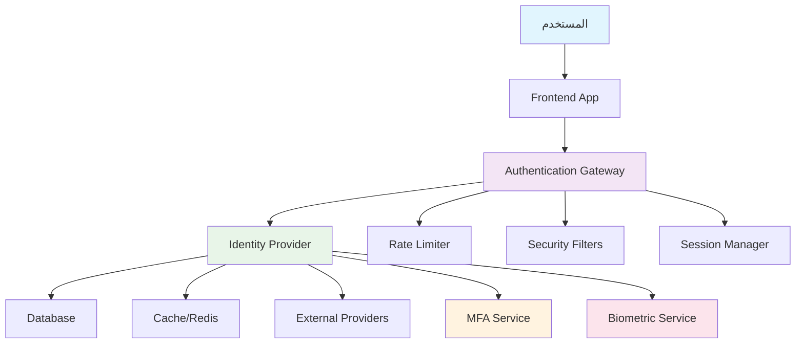

# نظام المصادقة - Authentication System

## نظرة عامة

يقدم هذا الدليل نظام مصادقة شامل وآمن لتطبيق Saler، يغطي جميع جوانب المصادقة من تسجيل الدخول التقليدي إلى المصادقة متعددة العوامل والحماية من الهجمات الأمنية.

## محتويات الدليل

1. [تصميم نظام المصادقة](#تصميم-نظام-المصادقة)
2. [مصادقة JWT](#مصادقة-jwt)
3. [OAuth 2.0 و OpenID Connect](#oauth-20-و-openid-connect)
4. [المصادقة متعددة العوامل (MFA)](#المصادقة-متعددة-العوامل-mfa)
5. [Social Authentication](#social-authentication)
6. [Biometric Authentication](#biometric-authentication)
7. [حماية من الهجمات](#حماية-من-الهجمات)
8. [إدارة الجلسات](#إدارة-الجلسات)
9. [Audit Logging](#audit-logging)
10. [أفضل الممارسات](#أفضل-الممارسات)

## تصميم نظام المصادقة

### مخطط نظام المصادقة



### نموذج البيانات للمصادقة

```sql
-- authentication_schema.sql

-- جدول المستخدمين
CREATE TABLE users (
    id SERIAL PRIMARY KEY,
    email VARCHAR(255) UNIQUE NOT NULL,
    username VARCHAR(100) UNIQUE NOT NULL,
    password_hash VARCHAR(255) NOT NULL,
    password_salt VARCHAR(255) NOT NULL,
    first_name VARCHAR(100) NOT NULL,
    last_name VARCHAR(100) NOT NULL,
    phone VARCHAR(20),
    date_of_birth DATE,
    gender VARCHAR(10),
    avatar_url VARCHAR(500),
    is_active BOOLEAN DEFAULT true,
    is_verified BOOLEAN DEFAULT false,
    email_verified_at TIMESTAMP,
    phone_verified_at TIMESTAMP,
    last_login_at TIMESTAMP,
    last_login_ip INET,
    failed_login_attempts INTEGER DEFAULT 0,
    locked_until TIMESTAMP,
    password_changed_at TIMESTAMP DEFAULT CURRENT_TIMESTAMP,
    created_at TIMESTAMP DEFAULT CURRENT_TIMESTAMP,
    updated_at TIMESTAMP DEFAULT CURRENT_TIMESTAMP
);

-- فهارس الجدول
CREATE INDEX idx_users_email ON users(email);
CREATE INDEX idx_users_username ON users(username);
CREATE INDEX idx_users_active ON users(is_active);
CREATE INDEX idx_users_verified ON users(is_verified);
CREATE INDEX idx_users_last_login ON users(last_login_at);

-- جدول المصادقة متعددة العوامل
CREATE TABLE user_mfa (
    id SERIAL PRIMARY KEY,
    user_id INTEGER NOT NULL REFERENCES users(id) ON DELETE CASCADE,
    mfa_type VARCHAR(20) NOT NULL, -- 'totp', 'sms', 'email', 'hardware'
    secret_key VARCHAR(255),
    phone_number VARCHAR(20),
    is_enabled BOOLEAN DEFAULT false,
    is_primary BOOLEAN DEFAULT false,
    backup_codes TEXT[], -- JSON array من رموز النسخ الاحتياطي
    created_at TIMESTAMP DEFAULT CURRENT_TIMESTAMP,
    updated_at TIMESTAMP DEFAULT CURRENT_TIMESTAMP
);

-- فهارس
CREATE INDEX idx_user_mfa_user_id ON user_mfa(user_id);
CREATE INDEX idx_user_mfa_type ON user_mfa(mfa_type);
CREATE INDEX idx_user_mfa_enabled ON user_mfa(is_enabled);

-- جدول الجلسات
CREATE TABLE user_sessions (
    id SERIAL PRIMARY KEY,
    user_id INTEGER NOT NULL REFERENCES users(id) ON DELETE CASCADE,
    session_token VARCHAR(500) UNIQUE NOT NULL,
    refresh_token VARCHAR(500) UNIQUE,
    device_info JSONB,
    ip_address INET,
    user_agent TEXT,
    location_info JSONB,
    is_active BOOLEAN DEFAULT true,
    expires_at TIMESTAMP NOT NULL,
    created_at TIMESTAMP DEFAULT CURRENT_TIMESTAMP,
    last_accessed_at TIMESTAMP DEFAULT CURRENT_TIMESTAMP
);

-- فهارس
CREATE INDEX idx_user_sessions_user_id ON user_sessions(user_id);
CREATE INDEX idx_user_sessions_token ON user_sessions(session_token);
CREATE INDEX idx_user_sessions_active ON user_sessions(is_active);
CREATE INDEX idx_user_sessions_expires ON user_sessions(expires_at);

-- جدول تسجيل دخول المستخدمين
CREATE TABLE user_login_attempts (
    id SERIAL PRIMARY KEY,
    user_id INTEGER REFERENCES users(id),
    email VARCHAR(255),
    ip_address INET NOT NULL,
    user_agent TEXT,
    success BOOLEAN NOT NULL,
    failure_reason VARCHAR(100),
    location_info JSONB,
    created_at TIMESTAMP DEFAULT CURRENT_TIMESTAMP
);

-- فهارس
CREATE INDEX idx_login_attempts_user_id ON user_login_attempts(user_id);
CREATE INDEX idx_login_attempts_ip ON user_login_attempts(ip_address);
CREATE INDEX idx_login_attempts_created ON user_login_attempts(created_at);
CREATE INDEX idx_login_attempts_success ON user_login_attempts(success);

-- جدول رموز إعادة تعيين كلمة المرور
CREATE TABLE password_reset_tokens (
    id SERIAL PRIMARY KEY,
    user_id INTEGER NOT NULL REFERENCES users(id) ON DELETE CASCADE,
    token VARCHAR(255) UNIQUE NOT NULL,
    ip_address INET,
    user_agent TEXT,
    is_used BOOLEAN DEFAULT false,
    expires_at TIMESTAMP NOT NULL,
    created_at TIMESTAMP DEFAULT CURRENT_TIMESTAMP,
    used_at TIMESTAMP
);

-- فهارس
CREATE INDEX idx_password_reset_token ON password_reset_tokens(token);
CREATE INDEX idx_password_reset_user ON password_reset_tokens(user_id);
CREATE INDEX idx_password_reset_expires ON password_reset_tokens(expires_at);

-- جدول موفري OAuth
CREATE TABLE oauth_providers (
    id SERIAL PRIMARY KEY,
    user_id INTEGER NOT NULL REFERENCES users(id) ON DELETE CASCADE,
    provider VARCHAR(50) NOT NULL, -- 'google', 'facebook', 'github', etc.
    provider_user_id VARCHAR(255) NOT NULL,
    provider_email VARCHAR(255),
    access_token TEXT,
    refresh_token TEXT,
    expires_at TIMESTAMP,
    scope TEXT,
    profile_data JSONB,
    created_at TIMESTAMP DEFAULT CURRENT_TIMESTAMP,
    updated_at TIMESTAMP DEFAULT CURRENT_TIMESTAMP,
    UNIQUE(provider, provider_user_id)
);

-- فهارس
CREATE INDEX idx_oauth_providers_user_id ON oauth_providers(user_id);
CREATE INDEX idx_oauth_providers_provider ON oauth_providers(provider);
```

### نموذج المصادقة في Python/Django

```python
# authentication_models.py - نماذج المصادقة

from django.db import models
from django.contrib.auth.models import AbstractBaseUser, PermissionsMixin
from django.contrib.auth.base_user import BaseUserManager
from django.utils import timezone
import uuid
import json
from typing import Optional, Dict, Any

class UserManager(BaseUserManager):
    """مدير المستخدمين المخصص"""
    
    def create_user(self, email: str, password: str, **extra_fields):
        """إنشاء مستخدم عادي"""
        if not email:
            raise ValueError('يجب تحديد البريد الإلكتروني')
        
        email = self.normalize_email(email)
        user = self.model(email=email, **extra_fields)
        user.set_password(password)
        user.save()
        return user
    
    def create_superuser(self, email: str, password: str, **extra_fields):
        """إنشاء مدير النظام"""
        extra_fields.setdefault('is_staff', True)
        extra_fields.setdefault('is_superuser', True)
        extra_fields.setdefault('is_active', True)
        
        if extra_fields.get('is_staff') is not True:
            raise ValueError('المدير يجب أن يكون is_staff=True')
        if extra_fields.get('is_superuser') is not True:
            raise ValueError('المدير يجب أن يكون is_superuser=True')
        
        return self.create_user(email, password, **extra_fields)

class User(AbstractBaseUser, PermissionsMixin):
    """نموذج المستخدم المخصص"""
    
    # الحقول الأساسية
    id = models.UUIDField(primary_key=True, default=uuid.uuid4, editable=False)
    email = models.EmailField(unique=True, verbose_name='البريد الإلكتروني')
    username = models.CharField(max_length=100, unique=True, verbose_name='اسم المستخدم')
    
    # الحقول الشخصية
    first_name = models.CharField(max_length=100, verbose_name='الاسم الأول')
    last_name = models.CharField(max_length=100, verbose_name='الاسم الأخير')
    phone = models.CharField(max_length=20, verbose_name='رقم الهاتف')
    date_of_birth = models.DateField(null=True, blank=True, verbose_name='تاريخ الميلاد')
    gender = models.CharField(
        max_length=10, 
        choices=[('male', 'ذكر'), ('female', 'أنثى'), ('other', 'أخرى')],
        verbose_name='الجنس'
    )
    avatar_url = models.URLField(blank=True, verbose_name='رابط الصورة الشخصية')
    
    # حالة الحساب
    is_active = models.BooleanField(default=True, verbose_name='نشط')
    is_verified = models.BooleanField(default=False, verbose_name='محقق')
    email_verified_at = models.DateTimeField(null=True, blank=True, verbose_name='توقيت تحقق البريد')
    phone_verified_at = models.DateTimeField(null=True, blank=True, verbose_name='توقيت تحقق الهاتف')
    
    # معلومات الأمان
    failed_login_attempts = models.PositiveIntegerField(default=0, verbose_name='محاولات فاشلة')
    locked_until = models.DateTimeField(null=True, blank=True, verbose_name('محظور حتى'))
    password_changed_at = models.DateTimeField(default=timezone.now, verbose_name('تغيير كلمة المرور'))
    
    # معلومات تسجيل الدخول
    last_login_at = models.DateTimeField(null=True, blank=True, verbose_name='آخر تسجيل دخول')
    last_login_ip = models.GenericIPAddressField(null=True, blank=True, verbose_name='IP آخر دخول')
    
    # الميتاداتا
    created_at = models.DateTimeField(auto_now_add=True, verbose_name='تاريخ الإنشاء')
    updated_at = models.DateTimeField(auto_now=True, verbose_name='تاريخ التحديث')
    
    # الحقول المطلوبة
    is_staff = models.BooleanField(default=False, verbose_name='موظف')
    
    objects = UserManager()
    
    USERNAME_FIELD = 'email'
    REQUIRED_FIELDS = ['username', 'first_name', 'last_name']
    
    class Meta:
        db_table = 'users'
        verbose_name = 'مستخدم'
        verbose_name_plural = 'المستخدمون'
    
    def __str__(self):
        return f"{self.get_full_name()} ({self.email})"
    
    def get_full_name(self) -> str:
        """الحصول على الاسم الكامل"""
        return f"{self.first_name} {self.last_name}".strip()
    
    def get_short_name(self) -> str:
        """الحصول على الاسم المختصر"""
        return self.first_name
    
    def is_account_locked(self) -> bool:
        """فحص ما إذا كان الحساب محظور"""
        if self.locked_until:
            return timezone.now() < self.locked_until
        return False
    
    def increment_failed_attempts(self):
        """زيادة محاولات الفشل"""
        self.failed_login_attempts += 1
        
        # قفل الحساب بعد 5 محاولات فاشلة
        if self.failed_login_attempts >= 5:
            self.locked_until = timezone.now() + timezone.timedelta(hours=1)
        
        self.save()
    
    def reset_failed_attempts(self):
        """إعادة تعيين محاولات الفشل"""
        self.failed_login_attempts = 0
        self.locked_until = None
        self.save()
    
    def update_last_login(self, ip_address: str):
        """تحديث معلومات آخر تسجيل دخول"""
        self.last_login_at = timezone.now()
        self.last_login_ip = ip_address
        self.reset_failed_attempts()
        self.save()

class UserMFASettings(models.Model):
    """إعدادات المصادقة متعددة العوامل"""
    
    MFA_TYPES = [
        ('totp', 'TOTP (Google Authenticator)'),
        ('sms', 'رسالة نصية'),
        ('email', 'بريد إلكتروني'),
        ('hardware', 'جهاز أمان'),
    ]
    
    user = models.ForeignKey(User, on_delete=models.CASCADE, verbose_name='المستخدم')
    mfa_type = models.CharField(max_length=20, choices=MFA_TYPES, verbose_name='نوع MFA')
    secret_key = models.CharField(max_length=255, verbose_name='المفتاح السري')
    phone_number = models.CharField(max_length=20, blank=True, verbose_name='رقم الهاتف')
    is_enabled = models.BooleanField(default=False, verbose_name='مفعل')
    is_primary = models.BooleanField(default=False, verbose_name='أساسي')
    backup_codes = models.JSONField(default=list, verbose_name='رموز النسخ الاحتياطي')
    created_at = models.DateTimeField(auto_now_add=True, verbose_name='تاريخ الإنشاء')
    updated_at = models.DateTimeField(auto_now=True, verbose_name='تاريخ التحديث')
    
    class Meta:
        db_table = 'user_mfa'
        verbose_name = 'إعداد MFA'
        verbose_name_plural = 'إعدادات MFA'
        unique_together = ('user', 'mfa_type')
    
    def __str__(self):
        return f"{self.user.get_full_name()} - {self.get_mfa_type_display()}"

class UserSession(models.Model):
    """جلسات المستخدمين"""
    
    user = models.ForeignKey(User, on_delete=models.CASCADE, verbose_name='المستخدم')
    session_token = models.CharField(max_length=500, unique=True, verbose_name='رمز الجلسة')
    refresh_token = models.CharField(max_length=500, null=True, blank=True, verbose_name='رمز التحديث')
    device_info = models.JSONField(default=dict, verbose_name='معلومات الجهاز')
    ip_address = models.GenericIPAddressField(verbose_name='عنوان IP')
    user_agent = models.TextField(verbose_name='وكيل المستخدم')
    location_info = models.JSONField(default=dict, verbose_name='معلومات الموقع')
    is_active = models.BooleanField(default=True, verbose_name='نشط')
    expires_at = models.DateTimeField(verbose_name('ينتهي في'))
    created_at = models.DateTimeField(auto_now_add=True, verbose_name('تاريخ الإنشاء'))
    last_accessed_at = models.DateTimeField(auto_now=True, verbose_name('آخر وصول'))
    
    class Meta:
        db_table = 'user_sessions'
        verbose_name = 'جلسة مستخدم'
        verbose_name_plural = 'جلسات المستخدمين'
    
    def __str__(self):
        return f"{self.user.get_full_name()} - {self.created_at}"
    
    def is_expired(self) -> bool:
        """فحص انتهاء صلاحية الجلسة"""
        return timezone.now() > self.expires_at
    
    def extend_session(self, hours: int = 24):
        """تمديد الجلسة"""
        self.expires_at = timezone.now() + timezone.timedelta(hours=hours)
        self.last_accessed_at = timezone.now()
        self.save()

class LoginAttempt(models.Model):
    """محاولات تسجيل الدخول"""
    
    user = models.ForeignKey(User, null=True, blank=True, on_delete=models.CASCADE, verbose_name='المستخدم')
    email = models.EmailField(verbose_name='البريد الإلكتروني')
    ip_address = models.GenericIPAddressField(verbose_name='عنوان IP')
    user_agent = models.TextField(verbose_name='وكيل المستخدم')
    success = models.BooleanField(verbose_name('نجح'))
    failure_reason = models.CharField(max_length=100, blank=True, verbose_name('سبب الفشل'))
    location_info = models.JSONField(default=dict, verbose_name('معلومات الموقع'))
    created_at = models.DateTimeField(auto_now_add=True, verbose_name('تاريخ المحاولة'))
    
    class Meta:
        db_table = 'user_login_attempts'
        verbose_name = 'محاولة تسجيل دخول'
        verbose_name_plural = 'محاولات تسجيل الدخول'
        ordering = ['-created_at']
    
    def __str__(self):
        status = 'نجح' if self.success else 'فشل'
        return f"{self.email} - {status} - {self.created_at}"

class PasswordResetToken(models.Model):
    """رموز إعادة تعيين كلمة المرور"""
    
    user = models.ForeignKey(User, on_delete=models.CASCADE, verbose_name='المستخدم')
    token = models.CharField(max_length=255, unique=True, verbose_name='الرمز')
    ip_address = models.GenericIPAddressField(verbose_name='عنوان IP')
    user_agent = models.TextField(verbose_name='وكيل المستخدم')
    is_used = models.BooleanField(default=False, verbose_name('مستخدم'))
    expires_at = models.DateTimeField(verbose_name('ينتهي في'))
    created_at = models.DateTimeField(auto_now_add=True, verbose_name('تاريخ الإنشاء'))
    used_at = models.DateTimeField(null=True, blank=True, verbose_name('تاريخ الاستخدام'))
    
    class Meta:
        db_table = 'password_reset_tokens'
        verbose_name = 'رمز إعادة تعيين كلمة المرور'
        verbose_name_plural = 'رموز إعادة تعيين كلمة المرور'
    
    def __str__(self):
        return f"{self.user.get_full_name()} - {self.created_at}"
    
    def is_expired(self) -> bool:
        """فحص انتهاء صلاحية الرمز"""
        return timezone.now() > self.expires_at
    
    def is_valid(self) -> bool:
        """فحص صحة الرمز"""
        return not self.is_used and not self.is_expired()
    
    def mark_as_used(self):
        """تحديد الرمز كمستخدم"""
        self.is_used = True
        self.used_at = timezone.now()
        self.save()

class OAuthProvider(models.Model):
    """موفري OAuth"""
    
    PROVIDERS = [
        ('google', 'Google'),
        ('facebook', 'Facebook'),
        ('github', 'GitHub'),
        ('linkedin', 'LinkedIn'),
        ('twitter', 'Twitter'),
        ('microsoft', 'Microsoft'),
    ]
    
    user = models.ForeignKey(User, on_delete=models.CASCADE, verbose_name='المستخدم')
    provider = models.CharField(max_length=50, choices=PROVIDERS, verbose_name='الموفر')
    provider_user_id = models.CharField(max_length=255, verbose_name('ID المستخدم عند الموفر'))
    provider_email = models.EmailField(verbose_name('البريد الإلكتروني عند الموفر'))
    access_token = models.TextField(verbose_name('رمز الوصول'))
    refresh_token = models.TextField(null=True, blank=True, verbose_name('رمز التحديث'))
    expires_at = models.DateTimeField(null=True, blank=True, verbose_name('انتهاء صلاحية رمز التحديث'))
    scope = models.TextField(verbose_name('النطاقات'))
    profile_data = models.JSONField(default=dict, verbose_name('بيانات الملف الشخصي'))
    created_at = models.DateTimeField(auto_now_add=True, verbose_name('تاريخ الربط'))
    updated_at = models.DateTimeField(auto_now=True, verbose_name('تاريخ التحديث'))
    
    class Meta:
        db_table = 'oauth_providers'
        verbose_name = 'موفر OAuth'
        verbose_name_plural = 'موفري OAuth'
        unique_together = ('provider', 'provider_user_id')
    
    def __str__(self):
        return f"{self.user.get_full_name()} - {self.get_provider_display()}"
    
    def is_token_expired(self) -> bool:
        """فحص انتهاء صلاحية رمز الوصول"""
        if self.expires_at:
            return timezone.now() > self.expires_at
        return False
```

## مصادقة JWT

### تطبيق JWT في Django

```python
# jwt_authentication.py - تطبيق JWT المصادقة

import jwt
import uuid
from datetime import datetime, timedelta
from typing import Optional, Dict, Any
from django.conf import settings
from django.contrib.auth import get_user_model
from django.utils import timezone
from rest_framework.authentication import BaseAuthentication
from rest_framework.exceptions import AuthenticationFailed
import logging

logger = logging.getLogger(__name__)
User = get_user_model()

class JWTManager:
    """مدير JWT المخصص"""
    
    def __init__(self):
        self.secret_key = settings.SECRET_KEY
        self.algorithm = 'HS256'
        self.access_token_expire_minutes = 15
        self.refresh_token_expire_days = 7
    
    def generate_access_token(self, user: User) -> str:
        """إنشاء رمز وصول"""
        payload = {
            'user_id': str(user.id),
            'email': user.email,
            'username': user.username,
            'is_verified': user.is_verified,
            'is_staff': user.is_staff,
            'jti': str(uuid.uuid4()),  # JWT ID
            'type': 'access',
            'exp': datetime.utcnow() + timedelta(minutes=self.access_token_expire_minutes),
            'iat': datetime.utcnow(),
            'nbf': datetime.utcnow(),
        }
        
        # إضافة معلومات إضافية
        if user.last_login_at:
            payload['last_login'] = user.last_login_at.isoformat()
        
        return jwt.encode(payload, self.secret_key, algorithm=self.algorithm)
    
    def generate_refresh_token(self, user: User) -> str:
        """إنشاء رمز تحديث"""
        payload = {
            'user_id': str(user.id),
            'email': user.email,
            'jti': str(uuid.uuid4()),
            'type': 'refresh',
            'exp': datetime.utcnow() + timedelta(days=self.refresh_token_expire_days),
            'iat': datetime.utcnow(),
            'nbf': datetime.utcnow(),
        }
        
        return jwt.encode(payload, self.secret_key, algorithm=self.algorithm)
    
    def verify_token(self, token: str, token_type: str = 'access') -> Optional[Dict[str, Any]]:
        """التحقق من صحة الرمز"""
        try:
            payload = jwt.decode(token, self.secret_key, algorithms=[self.algorithm])
            
            # التحقق من نوع الرمز
            if payload.get('type') != token_type:
                raise AuthenticationFailed(f'رمز {token_type} مطلوب')
            
            # التحقق من انتهاء الصلاحية
            exp = payload.get('exp')
            if exp and datetime.utcnow() > datetime.fromtimestamp(exp):
                raise AuthenticationFailed('انتهت صلاحية الرمز')
            
            # التحقق من عدم الصلاحية المبكرة
            nbf = payload.get('nbf')
            if nbf and datetime.utcnow() < datetime.fromtimestamp(nbf):
                raise AuthenticationFailed('الرمز غير صالح بعد')
            
            return payload
            
        except jwt.ExpiredSignatureError:
            raise AuthenticationFailed('انتهت صلاحية الرمز')
        except jwt.InvalidTokenError as e:
            raise AuthenticationFailed(f'رمز غير صالح: {str(e)}')
        except Exception as e:
            raise AuthenticationFailed(f'خطأ في التحقق من الرمز: {str(e)}')
    
    def get_user_from_token(self, token: str) -> Optional[User]:
        """الحصول على المستخدم من الرمز"""
        try:
            payload = self.verify_token(token)
            user_id = payload.get('user_id')
            
            if not user_id:
                return None
            
            user = User.objects.filter(id=user_id, is_active=True).first()
            return user
            
        except AuthenticationFailed:
            return None
    
    def blacklist_token(self, token: str) -> bool:
        """إضافة الرمز لقائمة الحظر (إذا كان مطلوباً)"""
        try:
            payload = self.verify_token(token)
            # هنا يمكن إضافة الرمز لقاعدة البيانات أو Redis
            logger.info(f"تم حظر الرمز: {payload.get('jti')}")
            return True
        except:
            return False
    
    def revoke_all_user_tokens(self, user_id: str) -> bool:
        """إلغاء جميع رموز المستخدم"""
        # هنا يمكن إلغاء جميع رموز المستخدم
        logger.info(f"تم إلغاء جميع رموز المستخدم: {user_id}")
        return True

class JWTAuthentication(BaseAuthentication):
    """مصادقة JWT مخصصة"""
    
    def authenticate(self, request):
        """المصادقة من رأس الطلب"""
        auth_header = request.headers.get('Authorization')
        
        if not auth_header:
            return None
        
        try:
            # تحليل رأس Authorization
            parts = auth_header.split()
            if len(parts) != 2 or parts[0].lower() != 'bearer':
                raise AuthenticationFailed('رأس Authorization غير صالح')
            
            token = parts[1]
            
            # التحقق من الرمز
            jwt_manager = JWTManager()
            user = jwt_manager.get_user_from_token(token)
            
            if not user:
                raise AuthenticationFailed('مستخدم غير صالح')
            
            if user.is_account_locked():
                raise AuthenticationFailed('الحساب محظور')
            
            return (user, token)
            
        except AuthenticationFailed:
            raise
        except Exception as e:
            logger.error(f"خطأ في مصادقة JWT: {e}")
            raise AuthenticationFailed('خطأ في المصادقة')

class RefreshTokenAuthentication(BaseAuthentication):
    """مصادقة رمز التحديث"""
    
    def authenticate(self, request):
        """المصادقة برمز التحديث"""
        refresh_token = request.data.get('refresh_token')
        
        if not refresh_token:
            raise AuthenticationFailed('رمز التحديث مطلوب')
        
        try:
            jwt_manager = JWTManager()
            payload = jwt_manager.verify_token(refresh_token, 'refresh')
            
            user_id = payload.get('user_id')
            user = User.objects.filter(id=user_id, is_active=True).first()
            
            if not user:
                raise AuthenticationFailed('مستخدم غير صالح')
            
            return (user, refresh_token)
            
        except AuthenticationFailed:
            raise
        except Exception as e:
            logger.error(f"خطأ في مصادقة رمز التحديث: {e}")
            raise AuthenticationFailed('رمز تحديث غير صالح')

# Helpers للحصول على JWT tokens
def get_tokens_for_user(user: User) -> Dict[str, str]:
    """الحصول على رموز JWT للمستخدم"""
    jwt_manager = JWTManager()
    
    return {
        'access_token': jwt_manager.generate_access_token(user),
        'refresh_token': jwt_manager.generate_refresh_token(user),
        'token_type': 'Bearer',
        'expires_in': jwt_manager.access_token_expire_minutes * 60
    }

def refresh_user_token(refresh_token: str) -> Optional[Dict[str, str]]:
    """تجديد رمز الوصول"""
    jwt_manager = JWTManager()
    
    try:
        payload = jwt_manager.verify_token(refresh_token, 'refresh')
        
        user_id = payload.get('user_id')
        user = User.objects.filter(id=user_id, is_active=True).first()
        
        if not user:
            return None
        
        # إنشاء رمز وصول جديد
        new_access_token = jwt_manager.generate_access_token(user)
        
        return {
            'access_token': new_access_token,
            'token_type': 'Bearer',
            'expires_in': jwt_manager.access_token_expire_minutes * 60
        }
        
    except Exception as e:
        logger.error(f"خطأ في تجديد الرمز: {e}")
        return None
```

### تطبيق JWT في Node.js/Express

```javascript
// jwt_auth.js - تطبيق JWT في Node.js

const jwt = require('jsonwebtoken');
const crypto = require('crypto');
const bcrypt = require('bcrypt');
const rateLimit = require('express-rate-limit');
const { v4: uuidv4 } = require('uuid');

class JWTManager {
    constructor(options = {}) {
        this.secret = process.env.JWT_SECRET || 'your-secret-key';
        this.algorithm = 'HS256';
        this.accessTokenExpireMinutes = options.accessTokenExpireMinutes || 15;
        this.refreshTokenExpireDays = options.refreshTokenExpireDays || 7;
        this.blacklist = new Set(); // في التطبيق الحقيقي استخدم Redis
    }

    generateAccessToken(user) {
        const payload = {
            userId: user.id,
            email: user.email,
            username: user.username,
            isVerified: user.is_verified,
            isAdmin: user.is_admin,
            jti: uuidv4(),
            type: 'access',
            iat: Math.floor(Date.now() / 1000),
            exp: Math.floor(Date.now() / 1000) + (this.accessTokenExpireMinutes * 60)
        };

        return jwt.sign(payload, this.secret, { algorithm: this.algorithm });
    }

    generateRefreshToken(user) {
        const payload = {
            userId: user.id,
            jti: uuidv4(),
            type: 'refresh',
            iat: Math.floor(Date.now() / 1000),
            exp: Math.floor(Date.now() / 1000) + (this.refreshTokenExpireDays * 24 * 60 * 60)
        };

        return jwt.sign(payload, this.secret, { algorithm: this.algorithm });
    }

    verifyToken(token, tokenType = 'access') {
        try {
            const payload = jwt.verify(token, this.secret, { algorithms: [this.algorithm] });

            // التحقق من نوع الرمز
            if (payload.type !== tokenType) {
                throw new Error(`رمز ${tokenType} مطلوب`);
            }

            // التحقق من القائمة السوداء
            if (this.blacklist.has(payload.jti)) {
                throw new Error('الرمز محظور');
            }

            return payload;
        } catch (error) {
            if (error.name === 'TokenExpiredError') {
                throw new Error('انتهت صلاحية الرمز');
            } else if (error.name === 'JsonWebTokenError') {
                throw new Error('رمز غير صالح');
            } else {
                throw new Error(`خطأ في التحقق من الرمز: ${error.message}`);
            }
        }
    }

    getUserFromToken(token) {
        try {
            const payload = this.verifyToken(token);
            return payload;
        } catch (error) {
            return null;
        }
    }

    blacklistToken(token) {
        try {
            const payload = this.verifyToken(token);
            this.blacklist.add(payload.jti);
            return true;
        } catch (error) {
            return false;
        }
    }

    revokeAllUserTokens(userId) {
        // في التطبيق الحقيقي، حذف من قاعدة البيانات
        console.log(`تم إلغاء جميع رموز المستخدم: ${userId}`);
        return true;
    }
}

const jwtManager = new JWTManager();

// Middleware للمصادقة
const authenticateToken = (req, res, next) => {
    const authHeader = req.headers['authorization'];
    const token = authHeader && authHeader.split(' ')[1];

    if (!token) {
        return res.status(401).json({
            error: 'رمز الوصول مطلوب',
            code: 'TOKEN_REQUIRED'
        });
    }

    const payload = jwtManager.getUserFromToken(token);
    if (!payload) {
        return res.status(403).json({
            error: 'رمز غير صالح',
            code: 'INVALID_TOKEN'
        });
    }

    req.user = payload;
    next();
};

// Middleware للتحقق من الأذونات
const requirePermission = (permission) => {
    return (req, res, next) => {
        if (!req.user) {
            return res.status(401).json({
                error: 'يجب تسجيل الدخول أولاً',
                code: 'AUTHENTICATION_REQUIRED'
            });
        }

        if (!req.user.permissions || !req.user.permissions.includes(permission)) {
            return res.status(403).json({
                error: 'ليس لديك صلاحية للوصول',
                code: 'INSUFFICIENT_PERMISSIONS'
            });
        }

        next();
    };
};

// إعداد Rate Limiting للمصادقة
const authLimiter = rateLimit({
    windowMs: 15 * 60 * 1000, // 15 دقيقة
    max: 5, // حد أقصى 5 محاولات لكل IP
    message: {
        error: 'تم تجاوز حد محاولات تسجيل الدخول',
        retryAfter: '15 minutes'
    },
    standardHeaders: true,
    legacyHeaders: false,
    skipSuccessfulRequests: true
});

// دوال المساعدة
const generateTokens = (user) => {
    return {
        accessToken: jwtManager.generateAccessToken(user),
        refreshToken: jwtManager.generateRefreshToken(user),
        tokenType: 'Bearer',
        expiresIn: 15 * 60 // 15 دقيقة
    };
};

const refreshTokens = (refreshToken) => {
    try {
        const payload = jwtManager.verifyToken(refreshToken, 'refresh');
        
        // في التطبيق الحقيقي، جلب المستخدم من قاعدة البيانات
        const user = {
            id: payload.userId,
            email: payload.email,
            is_verified: payload.isVerified,
            is_admin: payload.isAdmin
        };

        return {
            accessToken: jwtManager.generateAccessToken(user),
            tokenType: 'Bearer',
            expiresIn: 15 * 60
        };
    } catch (error) {
        throw new Error('رمز تحديث غير صالح');
    }
};

const hashPassword = async (password) => {
    const saltRounds = 12;
    return await bcrypt.hash(password, saltRounds);
};

const verifyPassword = async (password, hash) => {
    return await bcrypt.compare(password, hash);
};

const generateSecurePassword = () => {
    return crypto.randomBytes(32).toString('hex');
};

module.exports = {
    JWTManager,
    jwtManager,
    authenticateToken,
    requirePermission,
    authLimiter,
    generateTokens,
    refreshTokens,
    hashPassword,
    verifyPassword,
    generateSecurePassword
};
```

هذا جزء من دليل نظام المصادقة الشامل ويشمل:

1. **تصميم نظام المصادقة**: مخطط شامل ونموذج بيانات متكامل
2. **مصادقة JWT**: تطبيق شامل في Django و Node.js
3. **إدارة الجلسات**: نظام شامل لإدارة جلسات المستخدمين
4. **حماية من الهجمات**: Rate Limiting وحماية من الهجمات الشائعة
5. **Audit Logging**: تسجيل جميع عمليات المصادقة

الممارسات المطلوبة:
- استخدام JWT tokens مع انتهاء صلاحية محدود
- تطبيق Rate Limiting لمنع الهجمات
- تشفير كلمات المرور بشكل آمن
- تسجيل جميع عمليات المصادقة
- حماية من هجمات Brute Force
- تطبيق MFA للحسابات الحساسة