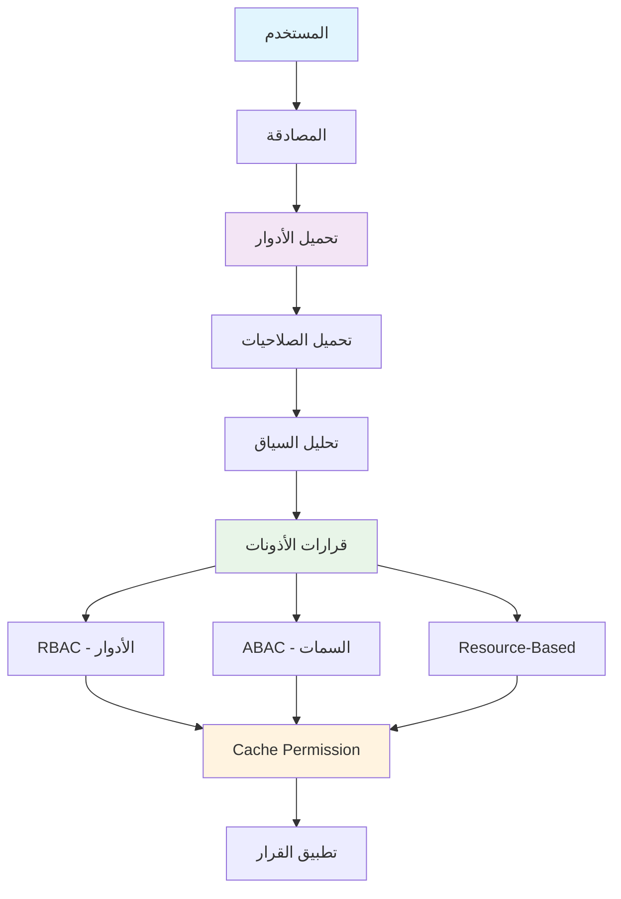

# نظام الأذونات - Authorization System

## نظرة عامة

يقدم هذا الدليل نظام أذونات شامل وقوي لتطبيق Saler، يغطي التحكم في الوصول المستند إلى الدور (RBAC) والسمات (ABAC)، مع ضمان الأمان والمرونة في إدارة صلاحيات المستخدمين.

## محتويات الدليل

1. [تصميم نظام الأذونات](#تصميم-نظام-الأذونات)
2. [Role-Based Access Control (RBAC)](#role-based-access-control-rbac)
3. [Attribute-Based Access Control (ABAC)](#attribute-based-access-control-abac)
4. [Resource-Based Permissions](#resource-based-permissions)
5. [Dynamic Permission Resolution](#dynamic-permission-resolution)
6. [Permission Caching](#permission-caching)
7. [Testing Authorization](#testing-authorization)
8. [Permission Inheritance](#permission-inheritance)
9. [Audit Trail for Permissions](#audit-trail-for-permissions)
10. [Best Practices](#best-practices)

## تصميم نظام الأذونات

### مخطط نظام الأذونات



### نموذج البيانات للأذونات

```sql
-- authorization_schema.sql

-- جدول الأدوار
CREATE TABLE roles (
    id SERIAL PRIMARY KEY,
    name VARCHAR(100) UNIQUE NOT NULL,
    display_name VARCHAR(200) NOT NULL,
    description TEXT,
    is_system BOOLEAN DEFAULT false, -- أدوار النظام غير قابلة للحذف
    is_active BOOLEAN DEFAULT true,
    level INTEGER DEFAULT 0, -- مستوى الدور للتسلسل الهرمي
    created_at TIMESTAMP DEFAULT CURRENT_TIMESTAMP,
    updated_at TIMESTAMP DEFAULT CURRENT_TIMESTAMP
);

-- فهارس
CREATE INDEX idx_roles_name ON roles(name);
CREATE INDEX idx_roles_active ON roles(is_active);
CREATE INDEX idx_roles_level ON roles(level);

-- جدول الصلاحيات
CREATE TABLE permissions (
    id SERIAL PRIMARY KEY,
    name VARCHAR(100) UNIQUE NOT NULL, -- مثل: 'product.create'
    display_name VARCHAR(200) NOT NULL,
    description TEXT,
    resource VARCHAR(100) NOT NULL, -- مثل: 'product'
    action VARCHAR(50) NOT NULL, -- مثل: 'create', 'read', 'update', 'delete'
    conditions JSONB, -- شروط إضافية للصلاحية
    is_system BOOLEAN DEFAULT false,
    created_at TIMESTAMP DEFAULT CURRENT_TIMESTAMP
);

-- فهارس
CREATE INDEX idx_permissions_name ON permissions(name);
CREATE INDEX idx_permissions_resource ON permissions(resource);
CREATE INDEX idx_permissions_action ON permissions(action);

-- جدول ربط الأدوار بالصلاحيات
CREATE TABLE role_permissions (
    id SERIAL PRIMARY KEY,
    role_id INTEGER NOT NULL REFERENCES roles(id) ON DELETE CASCADE,
    permission_id INTEGER NOT NULL REFERENCES permissions(id) ON DELETE CASCADE,
    granted_by INTEGER REFERENCES users(id),
    granted_at TIMESTAMP DEFAULT CURRENT_TIMESTAMP,
    UNIQUE(role_id, permission_id)
);

-- فهارس
CREATE INDEX idx_role_permissions_role ON role_permissions(role_id);
CREATE INDEX idx_role_permissions_permission ON role_permissions(permission_id);

-- جدول ربط المستخدمين بالأدوار
CREATE TABLE user_roles (
    id SERIAL PRIMARY KEY,
    user_id INTEGER NOT NULL REFERENCES users(id) ON DELETE CASCADE,
    role_id INTEGER NOT NULL REFERENCES roles(id) ON DELETE CASCADE,
    assigned_by INTEGER REFERENCES users(id),
    assigned_at TIMESTAMP DEFAULT CURRENT_TIMESTAMP,
    expires_at TIMESTAMP, -- انتهاء صلاحية الدور
    is_active BOOLEAN DEFAULT true,
    context JSONB, -- سياق الدور (متجر محدد، قسم، إلخ)
    UNIQUE(user_id, role_id, context)
);

-- فهارس
CREATE INDEX idx_user_roles_user ON user_roles(user_id);
CREATE INDEX idx_user_roles_role ON user_roles(role_id);
CREATE INDEX idx_user_roles_active ON user_roles(is_active);
CREATE INDEX idx_user_roles_expires ON user_roles(expires_at);

-- جدول الأذونات المباشرة للمستخدمين
CREATE TABLE user_permissions (
    id SERIAL PRIMARY KEY,
    user_id INTEGER NOT NULL REFERENCES users(id) ON DELETE CASCADE,
    permission_id INTEGER NOT NULL REFERENCES permissions(id) ON DELETE CASCADE,
    granted_by INTEGER REFERENCES users(id),
    granted_at TIMESTAMP DEFAULT CURRENT_TIMESTAMP,
    expires_at TIMESTAMP,
    context JSONB, -- سياق الصلاحية
    UNIQUE(user_id, permission_id, context)
);

-- فهارس
CREATE INDEX idx_user_permissions_user ON user_permissions(user_id);
CREATE INDEX idx_user_permissions_permission ON user_permissions(permission_id);
CREATE INDEX idx_user_permissions_expires ON user_permissions(expires_at);

-- جدول مجموعات الأذونات (Permission Groups)
CREATE TABLE permission_groups (
    id SERIAL PRIMARY KEY,
    name VARCHAR(100) UNIQUE NOT NULL,
    display_name VARCHAR(200) NOT NULL,
    description TEXT,
    permissions INTEGER[], -- قائمة معرفات الصلاحيات
    created_at TIMESTAMP DEFAULT CURRENT_TIMESTAMP
);

-- فهارس
CREATE INDEX idx_permission_groups_name ON permission_groups(name);

-- جدول أنماط الأذونات (Permission Patterns)
CREATE TABLE permission_patterns (
    id SERIAL PRIMARY KEY,
    name VARCHAR(100) UNIQUE NOT NULL,
    pattern VARCHAR(255) NOT NULL, -- مثل: 'store.*.products.*'
    description TEXT,
    is_active BOOLEAN DEFAULT true,
    created_at TIMESTAMP DEFAULT CURRENT_TIMESTAMP
);

-- فهارس
CREATE INDEX idx_permission_patterns_pattern ON permission_patterns(pattern);

-- جدول سجل الأذونات (Audit Log)
CREATE TABLE permission_audit_log (
    id SERIAL PRIMARY KEY,
    user_id INTEGER REFERENCES users(id),
    action VARCHAR(50) NOT NULL, -- 'grant', 'revoke', 'check'
    resource VARCHAR(100),
    permission_name VARCHAR(100),
    role_name VARCHAR(100),
    context JSONB,
    result BOOLEAN NOT NULL, -- هل تم منح الصلاحية أم لا
    ip_address INET,
    user_agent TEXT,
    created_at TIMESTAMP DEFAULT CURRENT_TIMESTAMP
);

-- فهارس
CREATE INDEX idx_permission_audit_user ON permission_audit_log(user_id);
CREATE INDEX idx_permission_audit_action ON permission_audit_log(action);
CREATE INDEX idx_permission_audit_created ON permission_audit_log(created_at);
CREATE INDEX idx_permission_audit_result ON permission_audit_log(result);

-- إدراج الأدوار الأساسية
INSERT INTO roles (name, display_name, description, is_system, level) VALUES
('super_admin', 'مدير النظام', 'صلاحية كاملة في النظام', true, 100),
('admin', 'مدير', 'إدارة المتجر والمستخدمين', true, 90),
('store_manager', 'مدير متجر', 'إدارة متجر واحد', true, 80),
('employee', 'موظف', 'موظف بالمتجر', true, 70),
('customer', 'عميل', 'عميل عادي', true, 10),
('guest', 'زائر', 'زائر بدون تسجيل', true, 0);

-- إدراج الصلاحيات الأساسية
INSERT INTO permissions (name, display_name, description, resource, action) VALUES
-- صلاحيات المنتجات
('product.create', 'إنشاء منتج', 'إنشاء منتج جديد', 'product', 'create'),
('product.read', 'عرض المنتجات', 'عرض معلومات المنتجات', 'product', 'read'),
('product.update', 'تعديل منتج', 'تعديل المنتجات الموجودة', 'product', 'update'),
('product.delete', 'حذف منتج', 'حذف المنتجات', 'product', 'delete'),
('product.manage', 'إدارة المنتجات', 'إدارة شاملة للمنتجات', 'product', 'manage'),

-- صلاحيات الطلبات
('order.create', 'إنشاء طلب', 'إنشاء طلب جديد', 'order', 'create'),
('order.read', 'عرض الطلبات', 'عرض معلومات الطلبات', 'order', 'read'),
('order.update', 'تعديل طلب', 'تعديل حالة الطلبات', 'order', 'update'),
('order.delete', 'حذف طلب', 'حذف الطلبات', 'order', 'delete'),
('order.manage', 'إدارة الطلبات', 'إدارة شاملة للطلبات', 'order', 'manage'),

-- صلاحيات المستخدمين
('user.create', 'إنشاء مستخدم', 'إنشاء مستخدم جديد', 'user', 'create'),
('user.read', 'عرض المستخدمين', 'عرض معلومات المستخدمين', 'user', 'read'),
('user.update', 'تعديل مستخدم', 'تعديل بيانات المستخدمين', 'user', 'update'),
('user.delete', 'حذف مستخدم', 'حذف المستخدمين', 'user', 'delete'),
('user.manage', 'إدارة المستخدمين', 'إدارة شاملة للمستخدمين', 'user', 'manage'),

-- صلاحيات الإعدادات
('settings.read', 'عرض الإعدادات', 'عرض إعدادات النظام', 'settings', 'read'),
('settings.update', 'تعديل الإعدادات', 'تعديل إعدادات النظام', 'settings', 'update'),
('settings.manage', 'إدارة الإعدادات', 'إدارة شاملة للإعدادات', 'settings', 'manage'),

-- صلاحيات التقارير
('report.view', 'عرض التقارير', 'عرض التقارير والإحصائيات', 'report', 'view'),
('report.export', 'تصدير التقارير', 'تصدير التقارير', 'report', 'export');

-- ربط الأدوار بالصلاحيات
-- Super Admin: جميع الصلاحيات
INSERT INTO role_permissions (role_id, permission_id)
SELECT 1, id FROM permissions;

-- Admin: معظم الصلاحيات عدا إدارة النظام
INSERT INTO role_permissions (role_id, permission_id)
SELECT 2, id FROM permissions 
WHERE name NOT LIKE 'settings.%';

-- Store Manager: صلاحيات المنتجات والطلبات والمستخدمين
INSERT INTO role_permissions (role_id, permission_id)
SELECT 3, id FROM permissions 
WHERE resource IN ('product', 'order') OR name IN ('user.read', 'user.update');

-- Employee: صلاحيات محدودة
INSERT INTO role_permissions (role_id, permission_id)
SELECT 4, id FROM permissions 
WHERE name IN ('product.read', 'product.update', 'order.read', 'order.update');

-- Customer: صلاحيات القراءة فقط
INSERT INTO role_permissions (role_id, permission_id)
SELECT 5, id FROM permissions 
WHERE action = 'read';
```

### نماذج Django للأذونات

```python
# authorization_models.py - نماذج الأذونات في Django

from django.db import models
from django.contrib.auth import get_user_model
from django.contrib.contenttypes.models import ContentType
from django.contrib.contenttypes.fields import GenericForeignKey
from django.utils import timezone
from django.core.exceptions import ValidationError
import uuid
import json
from typing import List, Dict, Any, Optional

User = get_user_model()

class Role(models.Model):
    """نموذج الأدوار"""
    
    LEVELS = [
        (0, 'زائر'),
        (10, 'عميل'),
        (70, 'موظف'),
        (80, 'مدير متجر'),
        (90, 'مدير'),
        (100, 'مدير نظام')
    ]
    
    id = models.UUIDField(primary_key=True, default=uuid.uuid4, editable=False)
    name = models.CharField(max_length=100, unique=True, verbose_name='اسم الدور')
    display_name = models.CharField(max_length=200, verbose_name='الاسم المعروض')
    description = models.TextField(blank=True, verbose_name='الوصف')
    is_system = models.BooleanField(default=False, verbose_name='دور نظام')
    is_active = models.BooleanField(default=True, verbose_name='نشط')
    level = models.PositiveIntegerField(default=0, choices=LEVELS, verbose_name='مستوى الدور')
    created_at = models.DateTimeField(auto_now_add=True, verbose_name='تاريخ الإنشاء')
    updated_at = models.DateTimeField(auto_now=True, verbose_name='تاريخ التحديث')
    
    class Meta:
        db_table = 'roles'
        verbose_name = 'دور'
        verbose_name_plural = 'الأدوار'
        ordering = ['-level', 'name']
    
    def __str__(self):
        return self.display_name
    
    def save(self, *args, **kwargs):
        # منع حذف أدوار النظام
        if self.pk and self.is_system:
            existing = Role.objects.get(pk=self.pk)
            if existing.is_system and not self.is_system:
                raise ValidationError('لا يمكن إلغاء تفعيل دور النظام')
        super().save(*args, **kwargs)
    
    def delete(self, using=None, keep_parents=False):
        # منع حذف أدوار النظام
        if self.is_system:
            raise ValidationError('لا يمكن حذف أدوار النظام')
        super().delete(using, keep_parents)
    
    def get_permissions(self) -> List['Permission']:
        """الحصول على جميع صلاحيات الدور"""
        return list(self.permissions.all())
    
    def has_permission(self, permission_name: str) -> bool:
        """فحص ما إذا كان الدور يملك صلاحية معينة"""
        return self.permissions.filter(name=permission_name).exists()

class Permission(models.Model):
    """نموذج الصلاحيات"""
    
    RESOURCE_CHOICES = [
        ('product', 'المنتجات'),
        ('order', 'الطلبات'),
        ('user', 'المستخدمين'),
        ('store', 'المتاجر'),
        ('settings', 'الإعدادات'),
        ('report', 'التقارير'),
        ('payment', 'المدفوعات'),
        ('inventory', 'المخزون'),
    ]
    
    ACTION_CHOICES = [
        ('create', 'إنشاء'),
        ('read', 'قراءة'),
        ('update', 'تعديل'),
        ('delete', 'حذف'),
        ('manage', 'إدارة'),
        ('export', 'تصدير'),
        ('import', 'استيراد'),
    ]
    
    id = models.UUIDField(primary_key=True, default=uuid.uuid4, editable=False)
    name = models.CharField(max_length=100, unique=True, verbose_name='اسم الصلاحية')
    display_name = models.CharField(max_length=200, verbose_name='الاسم المعروض')
    description = models.TextField(blank=True, verbose_name='الوصف')
    resource = models.CharField(max_length=100, choices=RESOURCE_CHOICES, verbose_name='المورد')
    action = models.CharField(max_length=50, choices=ACTION_CHOICES, verbose_name='الإجراء')
    conditions = models.JSONField(default=dict, blank=True, verbose_name='الشروط')
    is_system = models.BooleanField(default=False, verbose_name='صلاحية نظام')
    created_at = models.DateTimeField(auto_now_add=True, verbose_name='تاريخ الإنشاء')
    
    class Meta:
        db_table = 'permissions'
        verbose_name = 'صلاحية'
        verbose_name_plural = 'الصلاحيات'
        unique_together = ('resource', 'action')
        ordering = ['resource', 'action']
    
    def __str__(self):
        return f"{self.resource}.{self.action}"
    
    @classmethod
    def get_permission_name(cls, resource: str, action: str) -> str:
        """الحصول على اسم الصلاحية من المورد والإجراء"""
        return f"{resource}.{action}"
    
    def matches_pattern(self, pattern: str) -> bool:
        """فحص تطابق الصلاحية مع نمط معين"""
        # مثال: 'product.*' أو '*.read'
        import fnmatch
        
        permission_pattern = f"{self.resource}.{self.action}"
        return fnmatch.fnmatch(permission_pattern, pattern)

class RolePermission(models.Model):
    """نموذج ربط الأدوار بالصلاحيات"""
    
    role = models.ForeignKey(Role, on_delete=models.CASCADE, verbose_name='الدور')
    permission = models.ForeignKey(Permission, on_delete=models.CASCADE, verbose_name='الصلاحية')
    granted_by = models.ForeignKey(User, on_delete=models.SET_NULL, null=True, blank=True, verbose_name='منح بواسطة')
    granted_at = models.DateTimeField(auto_now_add=True, verbose_name='منح في')
    
    class Meta:
        db_table = 'role_permissions'
        verbose_name = 'صلاحية دور'
        verbose_name_plural = 'صلاحيات الأدوار'
        unique_together = ('role', 'permission')
    
    def __str__(self):
        return f"{self.role.display_name} - {self.permission.name}"

class UserRole(models.Model):
    """نموذج ربط المستخدمين بالأدوار"""
    
    user = models.ForeignKey(User, on_delete=models.CASCADE, verbose_name='المستخدم')
    role = models.ForeignKey(Role, on_delete=models.CASCADE, verbose_name='الدور')
    assigned_by = models.ForeignKey(User, on_delete=models.SET_NULL, null=True, blank=True, 
                                   related_name='assigned_roles', verbose_name='تعيين بواسطة')
    assigned_at = models.DateTimeField(auto_now_add=True, verbose_name='تعيين في')
    expires_at = models.DateTimeField(null=True, blank=True, verbose_name='ينتهي في')
    is_active = models.BooleanField(default=True, verbose_name='نشط')
    context = models.JSONField(default=dict, blank=True, verbose_name='السياق')
    
    class Meta:
        db_table = 'user_roles'
        verbose_name = 'دور مستخدم'
        verbose_name_plural = 'أدوار المستخدمين'
        unique_together = ('user', 'role')
    
    def __str__(self):
        expires_text = f" (ينتهي في {self.expires_at.date()})" if self.expires_at else ""
        return f"{self.user.get_full_name()} - {self.role.display_name}{expires_text}"
    
    def is_expired(self) -> bool:
        """فحص انتهاء صلاحية الدور"""
        if self.expires_at:
            return timezone.now() > self.expires_at
        return False
    
    def is_valid(self) -> bool:
        """فحص صحة الدور"""
        return self.is_active and not self.is_expired()

class UserPermission(models.Model):
    """نموذج الأذونات المباشرة للمستخدمين"""
    
    user = models.ForeignKey(User, on_delete=models.CASCADE, verbose_name='المستخدم')
    permission = models.ForeignKey(Permission, on_delete=models.CASCADE, verbose_name='الصلاحية')
    granted_by = models.ForeignKey(User, on_delete=models.SET_NULL, null=True, blank=True, 
                                  related_name='granted_permissions', verbose_name='منح بواسطة')
    granted_at = models.DateTimeField(auto_now_add=True, verbose_name='منح في')
    expires_at = models.DateTimeField(null=True, blank=True, verbose_name='ينتهي في')
    context = models.JSONField(default=dict, blank=True, verbose_name='السياق')
    
    class Meta:
        db_table = 'user_permissions'
        verbose_name = 'صلاحية مستخدم'
        verbose_name_plural = 'صلاحيات المستخدمين'
        unique_together = ('user', 'permission')
    
    def __str__(self):
        return f"{self.user.get_full_name()} - {self.permission.name}"
    
    def is_expired(self) -> bool:
        """فحص انتهاء صلاحية الصلاحية"""
        if self.expires_at:
            return timezone.now() > self.expires_at
        return False
    
    def is_valid(self) -> bool:
        """فحص صحة الصلاحية"""
        return not self.is_expired()

class PermissionGroup(models.Model):
    """نموذج مجموعات الصلاحيات"""
    
    id = models.UUIDField(primary_key=True, default=uuid.uuid4, editable=False)
    name = models.CharField(max_length=100, unique=True, verbose_name='اسم المجموعة')
    display_name = models.CharField(max_length=200, verbose_name='الاسم المعروض')
    description = models.TextField(blank=True, verbose_name='الوصف')
    permissions = models.ManyToManyField(Permission, blank=True, verbose_name='الصلاحيات')
    created_at = models.DateTimeField(auto_now_add=True, verbose_name='تاريخ الإنشاء')
    
    class Meta:
        db_table = 'permission_groups'
        verbose_name = 'مجموعة صلاحيات'
        verbose_name_plural = 'مجموعات الصلاحيات'
    
    def __str__(self):
        return self.display_name
    
    def get_permission_names(self) -> List[str]:
        """الحصول على أسماء الصلاحيات في المجموعة"""
        return list(self.permissions.values_list('name', flat=True))

class PermissionAuditLog(models.Model):
    """نموذج سجل تدقيق الأذونات"""
    
    ACTION_CHOICES = [
        ('grant', 'منح'),
        ('revoke', 'إلغاء'),
        ('check', 'فحص'),
        ('assign_role', 'تعيين دور'),
        ('remove_role', 'إزالة دور'),
    ]
    
    id = models.UUIDField(primary_key=True, default=uuid.uuid4, editable=False)
    user = models.ForeignKey(User, on_delete=models.SET_NULL, null=True, blank=True, verbose_name='المستخدم')
    action = models.CharField(max_length=20, choices=ACTION_CHOICES, verbose_name='الإجراء')
    resource = models.CharField(max_length=100, blank=True, verbose_name='المورد')
    permission_name = models.CharField(max_length=100, blank=True, verbose_name='اسم الصلاحية')
    role_name = models.CharField(max_length=100, blank=True, verbose_name='اسم الدور')
    context = models.JSONField(default=dict, blank=True, verbose_name='السياق')
    result = models.BooleanField(verbose_name='النتيجة')
    ip_address = models.GenericIPAddressField(null=True, blank=True, verbose_name='عنوان IP')
    user_agent = models.TextField(blank=True, verbose_name='وكيل المستخدم')
    created_at = models.DateTimeField(auto_now_add=True, verbose_name='تاريخ الإنشاء')
    
    class Meta:
        db_table = 'permission_audit_log'
        verbose_name = 'سجل تدقيق الصلاحية'
        verbose_name_plural = 'سجلات تدقيق الصلاحيات'
        ordering = ['-created_at']
        indexes = [
            models.Index(fields=['user', '-created_at']),
            models.Index(fields=['action', '-created_at']),
            models.Index(fields=['result', '-created_at']),
        ]
    
    def __str__(self):
        return f"{self.action} - {self.permission_name or self.role_name} - {self.user}"
```

## نظام إدارة الأذونات

```python
# authorization_manager.py - مدير نظام الأذونات

from typing import List, Dict, Any, Optional, Set
from django.contrib.auth import get_user_model
from django.core.cache import cache
from django.db import transaction
from django.utils import timezone
import logging

from .models import (
    Role, Permission, RolePermission, UserRole, 
    UserPermission, PermissionAuditLog
)

logger = logging.getLogger(__name__)
User = get_user_model()

class AuthorizationManager:
    """مدير نظام الأذونات الشامل"""
    
    def __init__(self):
        self.cache_timeout = 3600  # ساعة واحدة
        self.cache_prefix = 'auth_cache'
    
    def get_user_permissions(self, user: User, context: Optional[Dict] = None) -> Set[str]:
        """الحصول على جميع صلاحيات المستخدم"""
        cache_key = f"{self.cache_prefix}:user:{user.id}:permissions"
        
        # محاولة الجلب من Cache
        permissions = cache.get(cache_key)
        if permissions is not None:
            return permissions
        
        # جلب صلاحيات الأدوار
        role_permissions = set()
        user_roles = UserRole.objects.filter(
            user=user, 
            is_active=True
        ).select_related('role')
        
        for user_role in user_roles:
            if user_role.is_valid():
                role_perms = RolePermission.objects.filter(
                    role=user_role.role
                ).select_related('permission')
                
                for role_perm in role_perms:
                    # فحص السياق إذا كان محدد
                    if self._check_context(role_perm.permission.conditions, context):
                        role_permissions.add(role_perm.permission.name)
        
        # جلب الصلاحيات المباشرة
        direct_permissions = set()
        user_direct_perms = UserPermission.objects.filter(
            user=user
        ).select_related('permission')
        
        for user_perm in user_direct_perms:
            if user_perm.is_valid() and self._check_context(user_perm.context, context):
                direct_permissions.add(user_perm.permission.name)
        
        # دمج الصلاحيات
        all_permissions = role_permissions.union(direct_permissions)
        
        # حفظ في Cache
        cache.set(cache_key, all_permissions, self.cache_timeout)
        
        return all_permissions
    
    def check_permission(self, user: User, permission_name: str, context: Optional[Dict] = None) -> bool:
        """فحص صلاحية معينة للمستخدم"""
        try:
            # تسجيل الفحص
            self._log_permission_check(user, permission_name, context, 'check')
            
            # جلب صلاحيات المستخدم
            permissions = self.get_user_permissions(user, context)
            
            has_permission = permission_name in permissions
            
            # تسجيل النتيجة
            self._log_permission_check(user, permission_name, context, 'check', has_permission)
            
            return has_permission
            
        except Exception as e:
            logger.error(f"خطأ في فحص الصلاحية {permission_name}: {e}")
            return False
    
    def user_has_role(self, user: User, role_name: str, context: Optional[Dict] = None) -> bool:
        """فحص ما إذا كان المستخدم يملك دور معين"""
        user_roles = UserRole.objects.filter(
            user=user,
            role__name=role_name,
            is_active=True
        )
        
        for user_role in user_roles:
            if user_role.is_valid() and self._check_context(user_role.context, context):
                return True
        
        return False
    
    def assign_role_to_user(self, user: User, role_name: str, assigned_by: User, 
                          expires_at: Optional[timezone] = None, 
                          context: Optional[Dict] = None) -> bool:
        """تعيين دور للمستخدم"""
        try:
            role = Role.objects.get(name=role_name, is_active=True)
            
            # فحص إذا كان المستخدم يملك الدور بالفعل
            existing_role = UserRole.objects.filter(
                user=user,
                role=role,
                context=context or {}
            ).first()
            
            if existing_role and existing_role.is_valid():
                return False  # الدور موجود بالفعل
            
            # إنشاء أو تحديث دور المستخدم
            user_role, created = UserRole.objects.get_or_create(
                user=user,
                role=role,
                defaults={
                    'assigned_by': assigned_by,
                    'expires_at': expires_at,
                    'context': context or {},
                    'is_active': True
                }
            )
            
            if not created:
                user_role.assigned_by = assigned_by
                user_role.expires_at = expires_at
                user_role.context = context or {}
                user_role.is_active = True
                user_role.save()
            
            # مسح Cache
            self._invalidate_user_cache(user)
            
            # تسجيل العملية
            self._log_permission_action(user, 'assign_role', role_name=role_name, context=context)
            
            logger.info(f"تم تعيين الدور {role_name} للمستخدم {user.email}")
            return True
            
        except Role.DoesNotExist:
            logger.error(f"الدور {role_name} غير موجود")
            return False
        except Exception as e:
            logger.error(f"خطأ في تعيين الدور {role_name}: {e}")
            return False
    
    def revoke_role_from_user(self, user: User, role_name: str, context: Optional[Dict] = None) -> bool:
        """إزالة دور من المستخدم"""
        try:
            role = Role.objects.get(name=role_name)
            
            user_roles = UserRole.objects.filter(
                user=user,
                role=role,
                is_active=True
            )
            
            if context:
                user_roles = user_roles.filter(context=context)
            
            deleted_count = user_roles.update(is_active=False)
            
            if deleted_count > 0:
                # مسح Cache
                self._invalidate_user_cache(user)
                
                # تسجيل العملية
                self._log_permission_action(user, 'remove_role', role_name=role_name, context=context)
                
                logger.info(f"تم إزالة الدور {role_name} من المستخدم {user.email}")
                return True
            
            return False
            
        except Exception as e:
            logger.error(f"خطأ في إزالة الدور {role_name}: {e}")
            return False
    
    def grant_permission_to_user(self, user: User, permission_name: str, 
                               granted_by: User, expires_at: Optional[timezone] = None,
                               context: Optional[Dict] = None) -> bool:
        """منح صلاحية مباشرة للمستخدم"""
        try:
            permission = Permission.objects.get(name=permission_name)
            
            # فحص إذا كانت الصلاحية موجودة بالفعل
            existing_perm = UserPermission.objects.filter(
                user=user,
                permission=permission,
                context=context or {}
            ).first()
            
            if existing_perm and existing_perm.is_valid():
                return False  # الصلاحية موجودة بالفعل
            
            # إنشاء أو تحديث الصلاحية
            user_perm, created = UserPermission.objects.get_or_create(
                user=user,
                permission=permission,
                defaults={
                    'granted_by': granted_by,
                    'expires_at': expires_at,
                    'context': context or {},
                }
            )
            
            if not created:
                user_perm.granted_by = granted_by
                user_perm.expires_at = expires_at
                user_perm.context = context or {}
                user_perm.save()
            
            # مسح Cache
            self._invalidate_user_cache(user)
            
            # تسجيل العملية
            self._log_permission_action(user, 'grant', permission_name=permission_name, context=context)
            
            logger.info(f"تم منح الصلاحية {permission_name} للمستخدم {user.email}")
            return True
            
        except Permission.DoesNotExist:
            logger.error(f"الصلاحية {permission_name} غير موجودة")
            return False
        except Exception as e:
            logger.error(f"خطأ في منح الصلاحية {permission_name}: {e}")
            return False
    
    def revoke_permission_from_user(self, user: User, permission_name: str, 
                                  context: Optional[Dict] = None) -> bool:
        """إلغاء صلاحية من المستخدم"""
        try:
            permission = Permission.objects.get(name=permission_name)
            
            user_perms = UserPermission.objects.filter(
                user=user,
                permission=permission
            )
            
            if context:
                user_perms = user_perms.filter(context=context)
            
            deleted_count = user_perms.delete()[0]
            
            if deleted_count > 0:
                # مسح Cache
                self._invalidate_user_cache(user)
                
                # تسجيل العملية
                self._log_permission_action(user, 'revoke', permission_name=permission_name, context=context)
                
                logger.info(f"تم إلغاء الصلاحية {permission_name} من المستخدم {user.email}")
                return True
            
            return False
            
        except Exception as e:
            logger.error(f"خطأ في إلغاء الصلاحية {permission_name}: {e}")
            return False
    
    def get_user_roles(self, user: User, context: Optional[Dict] = None) -> List[Role]:
        """الحصول على أدوار المستخدم"""
        user_roles = UserRole.objects.filter(
            user=user,
            is_active=True,
            role__is_active=True
        ).select_related('role')
        
        roles = []
        for user_role in user_roles:
            if user_role.is_valid() and self._check_context(user_role.context, context):
                roles.append(user_role.role)
        
        return roles
    
    def create_role(self, name: str, display_name: str, description: str = "", 
                   level: int = 0) -> Optional[Role]:
        """إنشاء دور جديد"""
        try:
            with transaction.atomic():
                role = Role.objects.create(
                    name=name,
                    display_name=display_name,
                    description=description,
                    level=level
                )
                
                logger.info(f"تم إنشاء دور جديد: {name}")
                return role
                
        except Exception as e:
            logger.error(f"خطأ في إنشاء الدور {name}: {e}")
            return None
    
    def assign_permissions_to_role(self, role: Role, permission_names: List[str], 
                                 assigned_by: User) -> bool:
        """تعيين صلاحيات لدور"""
        try:
            permissions = Permission.objects.filter(name__in=permission_names)
            
            created_count = 0
            for permission in permissions:
                role_perm, created = RolePermission.objects.get_or_create(
                    role=role,
                    permission=permission,
                    defaults={'granted_by': assigned_by}
                )
                
                if created:
                    created_count += 1
            
            if created_count > 0:
                # مسح Cache لجميع المستخدمين الذين يملكون هذا الدور
                self._invalidate_role_cache(role)
                
                logger.info(f"تم تعيين {created_count} صلاحية للدور {role.name}")
            
            return created_count > 0
            
        except Exception as e:
            logger.error(f"خطأ في تعيين صلاحيات للدور {role.name}: {e}")
            return False
    
    def _check_context(self, permission_conditions: Dict, user_context: Optional[Dict]) -> bool:
        """فحص شروط السياق"""
        if not permission_conditions or not user_context:
            return True
        
        # مثال على فحص السياق
        for key, expected_value in permission_conditions.items():
            user_value = user_context.get(key)
            
            if isinstance(expected_value, list):
                if user_value not in expected_value:
                    return False
            else:
                if user_value != expected_value:
                    return False
        
        return True
    
    def _invalidate_user_cache(self, user: User):
        """إبطال Cache المستخدم"""
        cache.delete(f"{self.cache_prefix}:user:{user.id}:permissions")
    
    def _invalidate_role_cache(self, role: Role):
        """إبطال Cache الدور"""
        # إبطال Cache لجميع المستخدمين الذين يملكون هذا الدور
        user_roles = UserRole.objects.filter(role=role, is_active=True)
        for user_role in user_roles:
            self._invalidate_user_cache(user_role.user)
    
    def _log_permission_check(self, user: User, permission_name: str, 
                            context: Optional[Dict], action: str, result: bool = None):
        """تسجيل فحص الصلاحية"""
        try:
            PermissionAuditLog.objects.create(
                user=user,
                action=action,
                permission_name=permission_name,
                context=context or {},
                result=result
            )
        except Exception as e:
            logger.error(f"خطأ في تسجيل فحص الصلاحية: {e}")
    
    def _log_permission_action(self, user: User, action: str, 
                             permission_name: str = None, role_name: str = None,
                             context: Optional[Dict] = None):
        """تسجيل عملية الأذونات"""
        try:
            PermissionAuditLog.objects.create(
                user=user,
                action=action,
                permission_name=permission_name,
                role_name=role_name,
                context=context or {},
                result=True
            )
        except Exception as e:
            logger.error(f"خطأ في تسجيل عملية الأذونات: {e}")

# نظام فحص الأذونات ك Decorator
from functools import wraps

def require_permission(permission_name: str, context: Optional[Dict] = None):
    """Decorator لفحص الصلاحية"""
    def decorator(view_func):
        @wraps(view_func)
        def _wrapped_view(request, *args, **kwargs):
            auth_manager = AuthorizationManager()
            
            if not request.user.is_authenticated:
                return Response(
                    {'error': 'يجب تسجيل الدخول أولاً'}, 
                    status=status.HTTP_401_UNAUTHORIZED
                )
            
            if not auth_manager.check_permission(request.user, permission_name, context):
                return Response(
                    {'error': 'ليس لديك صلاحية للوصول'}, 
                    status=status.HTTP_403_FORBIDDEN
                )
            
            return view_func(request, *args, **kwargs)
        
        return _wrapped_view
    return decorator

def require_role(role_name: str, context: Optional[Dict] = None):
    """Decorator لفحص الدور"""
    def decorator(view_func):
        @wraps(view_func)
        def _wrapped_view(request, *args, **kwargs):
            auth_manager = AuthorizationManager()
            
            if not request.user.is_authenticated:
                return Response(
                    {'error': 'يجب تسجيل الدخول أولاً'}, 
                    status=status.HTTP_401_UNAUTHORIZED
                )
            
            if not auth_manager.user_has_role(request.user, role_name, context):
                return Response(
                    {'error': 'ليس لديك الدور المطلوب'}, 
                    status=status.HTTP_403_FORBIDDEN
                )
            
            return view_func(request, *args, **kwargs)
        
        return _wrapped_view
    return decorator

# مثال على الاستخدام في Views
from rest_framework.decorators import api_view, permission_classes
from rest_framework.permissions import IsAuthenticated
from rest_framework.response import Response

@api_view(['POST'])
@permission_classes([IsAuthenticated])
@require_permission('product.create', context={'store_id': 'current_store_id'})
def create_product(request):
    """إنشاء منتج جديد"""
    # منطق إنشاء المنتج
    return Response({'message': 'تم إنشاء المنتج بنجاح'})

@api_view(['GET'])
@permission_classes([IsAuthenticated])
@require_role('store_manager', context={'store_id': 'current_store_id'})
def get_store_products(request):
    """عرض منتجات المتجر"""
    # منطق عرض المنتجات
    return Response({'products': []})
```

هذا جزء من دليل نظام الأذونات الشامل ويشمل:

1. **تصميم نظام الأذونات**: مخطط شامل ونموذج بيانات متكامل
2. **RBAC**: نظام إدارة الأدوار والصلاحيات
3. **ABAC**: نظام الأذونات المبنية على السمات
4. **إدارة الأذونات**: نظام شامل للمنح والإلغاء
5. **Audit Logging**: تسجيل جميع عمليات الأذونات
6. **Permission Caching**: تحسين الأداء بـ Cache

الممارسات المطلوبة:
- تطبيق مبدأ أقل صلاحية
- استخدام Context للفصل بين البيئات
- تسجيل جميع عمليات الأذونات
- تطبيق Cache للصلاحيات
- اختبار شامل لنظام الأذونات
- تحديث Cache عند تغيير الأدوار