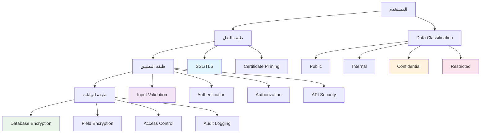

# حماية البيانات - Data Protection

## نظرة عامة

يقدم هذا الدليل نظاماً شاملاً لحماية البيانات في تطبيق Saler، يغطي التشفير والحماية من الوصول غير المصرح به، ومعايير الخصوصية الدولية، وإدارة البيانات الحساسة بأمان تام.

## محتويات الدليل

1. [مخطط حماية البيانات](#مخطط-حماية-البيانات)
2. [تشفير البيانات](#تشفير-البيانات)
3. [حماية البيانات الحساسة](#حماية-البيانات-الحساسة)
4. [إدارة مفاتيح التشفير](#إدارة-مفاتيح-التشفير)
5. [حماية قواعد البيانات](#حماية-قواعد-البيانات)
6. [النسخ الاحتياطي الآمن](#النسخ-الاحتياطي-الآمن)
7. [مراقبة الوصول للبيانات](#مراقبة-الوصول-للبيانات)
8. [الامتثال للخصوصية](#الامتثال-للخصوصية)
9. [معالجة البيانات الشخصية](#معالجة-البيانات-الشخصية)
10. [أفضل الممارسات](#أفضل-الممارسات)

## مخطط حماية البيانات

### طبقات حماية البيانات



### تصنيف البيانات

```sql
-- data_classification_schema.sql

-- جدول تصنيف البيانات
CREATE TABLE data_classification (
    id SERIAL PRIMARY KEY,
    name VARCHAR(100) UNIQUE NOT NULL,
    display_name VARCHAR(200) NOT NULL,
    description TEXT,
    color_code VARCHAR(7), -- لون HEX للتصنيف
    required_protection_level INTEGER NOT NULL,
    encryption_required BOOLEAN DEFAULT false,
    access_logging_required BOOLEAN DEFAULT true,
    created_at TIMESTAMP DEFAULT CURRENT_TIMESTAMP
);

-- مستويات الحماية
INSERT INTO data_classification (name, display_name, description, color_code, required_protection_level, encryption_required) VALUES
('public', 'عام', 'بيانات عامة متاحة للجمهور', '#4CAF50', 1, false),
('internal', 'داخلي', 'بيانات داخلية للاستخدام الداخلي', '#2196F3', 2, true),
('confidential', 'سري', 'بيانات سرية ومحدودة الوصول', '#FF9800', 3, true),
('restricted', 'مقيد', 'بيانات مقيدة وعالية الحساسية', '#F44336', 4, true);

-- جدول سياسات حماية البيانات
CREATE TABLE data_protection_policies (
    id SERIAL PRIMARY KEY,
    name VARCHAR(100) UNIQUE NOT NULL,
    classification_id INTEGER NOT NULL REFERENCES data_classification(id),
    policy_type VARCHAR(50) NOT NULL, -- 'encryption', 'access_control', 'retention', 'backup'
    configuration JSONB NOT NULL,
    is_active BOOLEAN DEFAULT true,
    created_at TIMESTAMP DEFAULT CURRENT_TIMESTAMP,
    updated_at TIMESTAMP DEFAULT CURRENT_TIMESTAMP
);

-- فهارس
CREATE INDEX idx_data_policies_classification ON data_protection_policies(classification_id);
CREATE INDEX idx_data_policies_type ON data_protection_policies(policy_type);

-- جدول سجل الوصول للبيانات
CREATE TABLE data_access_log (
    id SERIAL PRIMARY KEY,
    user_id INTEGER REFERENCES users(id),
    resource_type VARCHAR(100) NOT NULL, -- 'user', 'product', 'order'
    resource_id VARCHAR(255) NOT NULL,
    action VARCHAR(50) NOT NULL, -- 'read', 'create', 'update', 'delete', 'export'
    access_method VARCHAR(50), -- 'api', 'admin_panel', 'export', 'backup'
    ip_address INET,
    user_agent TEXT,
    classification_level INTEGER,
    data_fields TEXT[], -- الحقول التي تم الوصول إليها
    result VARCHAR(20) NOT NULL, -- 'success', 'denied', 'error'
    error_message TEXT,
    created_at TIMESTAMP DEFAULT CURRENT_TIMESTAMP
);

-- فهارس
CREATE INDEX idx_data_access_user ON data_access_log(user_id);
CREATE INDEX idx_data_access_resource ON data_access_log(resource_type, resource_id);
CREATE INDEX idx_data_access_action ON data_access_log(action);
CREATE INDEX idx_data_access_created ON data_access_log(created_at);
CREATE INDEX idx_data_access_classification ON data_access_log(classification_level);

-- جدول طلبات الوصول للبيانات
CREATE TABLE data_access_requests (
    id SERIAL PRIMARY KEY,
    requester_id INTEGER NOT NULL REFERENCES users(id),
    request_type VARCHAR(50) NOT NULL, -- 'export', 'delete', 'correct', 'portability'
    target_user_id INTEGER REFERENCES users(id),
    resource_types TEXT[] NOT NULL, -- أنواع البيانات المطلوبة
    justification TEXT NOT NULL,
    status VARCHAR(20) DEFAULT 'pending', -- 'pending', 'approved', 'rejected', 'completed'
    approved_by INTEGER REFERENCES users(id),
    approved_at TIMESTAMP,
    rejection_reason TEXT,
    completion_date TIMESTAMP,
    created_at TIMESTAMP DEFAULT CURRENT_TIMESTAMP,
    updated_at TIMESTAMP DEFAULT CURRENT_TIMESTAMP
);

-- فهارس
CREATE INDEX idx_data_access_requests_requester ON data_access_requests(requester_id);
CREATE INDEX idx_data_access_requests_status ON data_access_requests(status);
CREATE INDEX idx_data_access_requests_created ON data_access_requests(created_at);

-- جدول سياسات الاحتفاظ بالبيانات
CREATE TABLE data_retention_policies (
    id SERIAL PRIMARY KEY,
    resource_type VARCHAR(100) NOT NULL,
    classification_id INTEGER NOT NULL REFERENCES data_classification(id),
    retention_period_days INTEGER NOT NULL, -- فترة الاحتفاظ بالأيام
    auto_delete BOOLEAN DEFAULT true,
    backup_retention_days INTEGER, -- فترة الاحتفاظ في النسخ الاحتياطية
    deletion_method VARCHAR(50) DEFAULT 'soft_delete', -- 'soft_delete', 'hard_delete', 'anonymize'
    notification_days INTEGER DEFAULT 30, -- إشعار قبل الحذف
    is_active BOOLEAN DEFAULT true,
    created_at TIMESTAMP DEFAULT CURRENT_TIMESTAMP
);

-- فهارس
CREATE INDEX idx_data_retention_resource ON data_retention_policies(resource_type);
CREATE INDEX idx_data_retention_classification ON data_retention_policies(classification_id);
```

### نماذج Django لحماية البيانات

```python
# data_protection_models.py - نماذج حماية البيانات

from django.db import models
from django.contrib.auth import get_user_model
from django.utils import timezone
from django.core.validators import MinValueValidator, MaxValueValidator
import uuid
import json
from typing import Dict, Any, List, Optional

User = get_user_model()

class DataClassification(models.Model):
    """نموذج تصنيف البيانات"""
    
    PROTECTION_LEVELS = [
        (1, 'منخفض - بيانات عامة'),
        (2, 'متوسط - بيانات داخلية'),
        (3, 'عالي - بيانات سرية'),
        (4, 'حرج - بيانات مقيدة')
    ]
    
    id = models.UUIDField(primary_key=True, default=uuid.uuid4, editable=False)
    name = models.CharField(max_length=100, unique=True, verbose_name='الاسم')
    display_name = models.CharField(max_length=200, verbose_name='الاسم المعروض')
    description = models.TextField(blank=True, verbose_name='الوصف')
    color_code = models.CharField(max_length=7, verbose_name='كود اللون')
    required_protection_level = models.PositiveIntegerField(
        choices=PROTECTION_LEVELS,
        verbose_name='مستوى الحماية المطلوب'
    )
    encryption_required = models.BooleanField(default=False, verbose_name='يتطلب تشفير')
    access_logging_required = models.BooleanField(default=True, verbose_name='يتطلب تسجيل الوصول')
    created_at = models.DateTimeField(auto_now_add=True, verbose_name='تاريخ الإنشاء')
    
    class Meta:
        db_table = 'data_classification'
        verbose_name = 'تصنيف بيانات'
        verbose_name_plural = 'تصنيفات البيانات'
        ordering = ['required_protection_level']
    
    def __str__(self):
        return self.display_name

class DataProtectionPolicy(models.Model):
    """نموذج سياسات حماية البيانات"""
    
    POLICY_TYPES = [
        ('encryption', 'تشفير'),
        ('access_control', 'التحكم في الوصول'),
        ('retention', 'الاحتفاظ'),
        ('backup', 'النسخ الاحتياطي'),
        ('anonymization', 'إخفاء الهوية'),
        ('pseudonymization', 'استبدال الهوية')
    ]
    
    id = models.UUIDField(primary_key=True, default=uuid.uuid4, editable=False)
    name = models.CharField(max_length=100, unique=True, verbose_name='اسم السياسة')
    classification = models.ForeignKey(DataClassification, on_delete=models.CASCADE, verbose_name='التصنيف')
    policy_type = models.CharField(max_length=50, choices=POLICY_TYPES, verbose_name='نوع السياسة')
    configuration = models.JSONField(default=dict, verbose_name='الإعدادات')
    is_active = models.BooleanField(default=True, verbose_name='نشط')
    created_at = models.DateTimeField(auto_now_add=True, verbose_name='تاريخ الإنشاء')
    updated_at = models.DateTimeField(auto_now=True, verbose_name='تاريخ التحديث')
    
    class Meta:
        db_table = 'data_protection_policies'
        verbose_name = 'سياسة حماية بيانات'
        verbose_name_plural = 'سياسات حماية البيانات'
        unique_together = ('name', 'policy_type')
    
    def __str__(self):
        return f"{self.name} - {self.get_policy_type_display()}"

class DataAccessLog(models.Model):
    """نموذج سجل الوصول للبيانات"""
    
    RESOURCE_TYPES = [
        ('user', 'المستخدمين'),
        ('product', 'المنتجات'),
        ('order', 'الطلبات'),
        ('payment', 'المدفوعات'),
        ('store', 'المتاجر'),
        ('support', 'الدعم الفني'),
        ('analytics', 'التحليلات')
    ]
    
    ACTIONS = [
        ('create', 'إنشاء'),
        ('read', 'قراءة'),
        ('update', 'تعديل'),
        ('delete', 'حذف'),
        ('export', 'تصدير'),
        ('backup', 'نسخ احتياطي'),
        ('restore', 'استعادة')
    ]
    
    ACCESS_METHODS = [
        ('api', 'API'),
        ('admin_panel', 'لوحة الإدارة'),
        ('export_tool', 'أداة التصدير'),
        ('backup_system', 'نظام النسخ الاحتياطي'),
        ('migration', 'ترحيل البيانات'),
        ('analytics', 'التحليلات')
    ]
    
    RESULTS = [
        ('success', 'نجح'),
        ('denied', 'مرفوض'),
        ('error', 'خطأ'),
        ('timeout', 'انتهت المهلة')
    ]
    
    id = models.UUIDField(primary_key=True, default=uuid.uuid4, editable=False)
    user = models.ForeignKey(User, on_delete=models.SET_NULL, null=True, blank=True, verbose_name='المستخدم')
    resource_type = models.CharField(max_length=100, choices=RESOURCE_TYPES, verbose_name='نوع المورد')
    resource_id = models.CharField(max_length=255, verbose_name='معرف المورد')
    action = models.CharField(max_length=50, choices=ACTIONS, verbose_name='الإجراء')
    access_method = models.CharField(max_length=50, choices=ACCESS_METHODS, verbose_name='طريقة الوصول')
    ip_address = models.GenericIPAddressField(null=True, blank=True, verbose_name='عنوان IP')
    user_agent = models.TextField(blank=True, verbose_name='وكيل المستخدم')
    classification_level = models.PositiveIntegerField(
        choices=DataClassification.PROTECTION_LEVELS,
        verbose_name='مستوى التصنيف'
    )
    data_fields = models.JSONField(default=list, verbose_name='الحقول')
    result = models.CharField(max_length=20, choices=RESULTS, verbose_name='النتيجة')
    error_message = models.TextField(blank=True, verbose_name='رسالة الخطأ')
    created_at = models.DateTimeField(auto_now_add=True, verbose_name='تاريخ الوصول')
    
    class Meta:
        db_table = 'data_access_log'
        verbose_name = 'سجل وصول بيانات'
        verbose_name_plural = 'سجلات الوصول للبيانات'
        ordering = ['-created_at']
        indexes = [
            models.Index(fields=['user', '-created_at']),
            models.Index(fields=['resource_type', 'resource_id']),
            models.Index(fields=['classification_level', '-created_at']),
        ]
    
    def __str__(self):
        return f"{self.action} - {self.resource_type} ({self.resource_id})"

class DataAccessRequest(models.Model):
    """نموذج طلبات الوصول للبيانات"""
    
    REQUEST_TYPES = [
        ('export', 'تصدير البيانات'),
        ('delete', 'حذف البيانات'),
        ('correct', 'تصحيح البيانات'),
        ('portability', 'نقل البيانات'),
        ('rectification', 'تعديل البيانات'),
        ('erasure', 'محو البيانات'),
        ('restriction', 'تقييد المعالجة'),
        ('objection', 'الاعتراض')
    ]
    
    STATUS_CHOICES = [
        ('pending', 'قيد الانتظار'),
        ('approved', 'معتمد'),
        ('rejected', 'مرفوض'),
        ('in_progress', 'قيد التنفيذ'),
        ('completed', 'مكتمل'),
        ('cancelled', 'ملغي')
    ]
    
    id = models.UUIDField(primary_key=True, default=uuid.uuid4, editable=False)
    requester = models.ForeignKey(User, on_delete=models.CASCADE, related_name='data_access_requests', verbose_name='الطالب')
    request_type = models.CharField(max_length=50, choices=REQUEST_TYPES, verbose_name='نوع الطلب')
    target_user = models.ForeignKey(User, on_delete=models.CASCADE, null=True, blank=True, 
                                   related_name='data_access_about_me', verbose_name='المستخدم المستهدف')
    resource_types = models.JSONField(default=list, verbose_name='أنواع الموارد')
    justification = models.TextField(verbose_name='المبرر')
    status = models.CharField(max_length=20, choices=STATUS_CHOICES, default='pending', verbose_name='الحالة')
    approved_by = models.ForeignKey(User, on_delete=models.SET_NULL, null=True, blank=True, 
                                   related_name='approved_data_requests', verbose_name='معتمد بواسطة')
    approved_at = models.DateTimeField(null=True, blank=True, verbose_name='تاريخ الاعتماد')
    rejection_reason = models.TextField(blank=True, verbose_name='سبب الرفض')
    completion_date = models.DateTimeField(null=True, blank=True, verbose_name='تاريخ الإنجاز')
    response_data = models.JSONField(default=dict, verbose_name='بيانات الاستجابة')
    created_at = models.DateTimeField(auto_now_add=True, verbose_name='تاريخ الإنشاء')
    updated_at = models.DateTimeField(auto_now=True, verbose_name='تاريخ التحديث')
    
    class Meta:
        db_table = 'data_access_requests'
        verbose_name = 'طلب وصول بيانات'
        verbose_name_plural = 'طلبات الوصول للبيانات'
        ordering = ['-created_at']
        indexes = [
            models.Index(fields=['requester', '-created_at']),
            models.Index(fields=['status', 'created_at']),
            models.Index(fields=['target_user', 'request_type']),
        ]
    
    def __str__(self):
        return f"{self.get_request_type_display()} - {self.requester.get_full_name()}"

class DataRetentionPolicy(models.Model):
    """نموذج سياسات الاحتفاظ بالبيانات"""
    
    DELETION_METHODS = [
        ('soft_delete', 'حذف مؤقت'),
        ('hard_delete', 'حذف دائم'),
        ('anonymize', 'إخفاء الهوية'),
        ('pseudonymize', 'استبدال الهوية'),
        ('archive', 'أرشفة')
    ]
    
    id = models.UUIDField(primary_key=True, default=uuid.uuid4, editable=False)
    resource_type = models.CharField(max_length=100, verbose_name='نوع المورد')
    classification = models.ForeignKey(DataClassification, on_delete=models.CASCADE, verbose_name='التصنيف')
    retention_period_days = models.PositiveIntegerField(
        validators=[MinValueValidator(1)],
        verbose_name='فترة الاحتفاظ (بالأيام)'
    )
    auto_delete = models.BooleanField(default=True, verbose_name='حذف تلقائي')
    backup_retention_days = models.PositiveIntegerField(
        null=True, blank=True,
        validators=[MinValueValidator(1)],
        verbose_name='فترة الاحتفاظ في النسخ الاحتياطية'
    )
    deletion_method = models.CharField(
        max_length=50, 
        choices=DELETION_METHODS, 
        default='soft_delete',
        verbose_name='طريقة الحذف'
    )
    notification_days = models.PositiveIntegerField(
        default=30,
        validators=[MinValueValidator(1)],
        verbose_name='أيام الإشعار قبل الحذف'
    )
    is_active = models.BooleanField(default=True, verbose_name='نشط')
    created_at = models.DateTimeField(auto_now_add=True, verbose_name='تاريخ الإنشاء')
    
    class Meta:
        db_table = 'data_retention_policies'
        verbose_name = 'سياسة احتفاظ بيانات'
        verbose_name_plural = 'سياسات الاحتفاظ بالبيانات'
        unique_together = ('resource_type', 'classification')
    
    def __str__(self):
        return f"{self.resource_type} - {self.classification.display_name} ({self.retention_period_days} يوم)"

class EncryptedData(models.Model):
    """نموذج البيانات المشفرة"""
    
    ENCRYPTION_METHODS = [
        ('aes256', 'AES-256'),
        ('aes256_gcm', 'AES-256-GCM'),
        ('rsa2048', 'RSA-2048'),
        ('rsa4096', 'RSA-4096'),
        ('chacha20_poly1305', 'ChaCha20-Poly1305')
    ]
    
    id = models.UUIDField(primary_key=True, default=uuid.uuid4, editable=False)
    data_type = models.CharField(max_length=100, verbose_name='نوع البيانات')
    data_key = models.CharField(max_length=255, verbose_name='مفتاح البيانات')
    encrypted_content = models.TextField(verbose_name='المحتوى المشفر')
    encryption_method = models.CharField(max_length=50, choices=ENCRYPTION_METHODS, verbose_name='طريقة التشفير')
    key_id = models.CharField(max_length=100, verbose_name='معرف المفتاح')
    initialization_vector = models.CharField(max_length=255, blank=True, verbose_name='متجه التهيئة')
    authentication_tag = models.CharField(max_length=255, blank=True, verbose_name='علامة المصادقة')
    created_at = models.DateTimeField(auto_now_add=True, verbose_name='تاريخ التشفير')
    updated_at = models.DateTimeField(auto_now=True, verbose_name='تاريخ التحديث')
    
    class Meta:
        db_table = 'encrypted_data'
        verbose_name = 'بيانات مشفرة'
        verbose_name_plural = 'البيانات المشفرة'
        unique_together = ('data_type', 'data_key')
        indexes = [
            models.Index(fields=['data_type', 'data_key']),
            models.Index(fields=['encryption_method']),
        ]
    
    def __str__(self):
        return f"{self.data_type} - {self.data_key}"
```

## تشفير البيانات

### نظام التشفير الشامل

```python
# encryption_manager.py - مدير التشفير

import os
import base64
import hashlib
from cryptography.fernet import Fernet
from cryptography.hazmat.primitives import hashes, serialization
from cryptography.hazmat.primitives.kdf.pbkdf2 import PBKDF2HMAC
from cryptography.hazmat.primitives.ciphers import Cipher, algorithms, modes
from cryptography.hazmat.primitives.asymmetric import rsa, padding
from cryptography.hazmat.backends import default_backend
from cryptography.hazmat.primitives import padding as sym_padding
from cryptography.hazmat.primitives import hashes
import secrets
import json
import logging
from typing import Dict, Any, Optional, Tuple, List
from django.conf import settings
from django.core.cache import cache
from django.utils import timezone
import uuid

logger = logging.getLogger(__name__)

class EncryptionManager:
    """مدير التشفير الشامل"""
    
    def __init__(self):
        self.master_key = self._get_or_create_master_key()
        self.key_rotation_days = 90  # تدوير المفاتيح كل 90 يوم
        self.algorithm_versions = {
            'v1': 'aes256',
            'v2': 'aes256_gcm',
            'v3': 'chacha20_poly1305'
        }
    
    def _get_or_create_master_key(self) -> bytes:
        """الحصول على المفتاح الرئيسي أو إنشاؤه"""
        # في التطبيق الحقيقي، يجب جلب المفتاح من Key Management Service
        key_file = os.path.join(settings.BASE_DIR, 'master.key')
        
        if os.path.exists(key_file):
            with open(key_file, 'rb') as f:
                return f.read()
        
        # إنشاء مفتاح جديد
        master_key = Fernet.generate_key()
        
        # حفظ المفتاح بشكل آمن (في الإنتاج يجب استخدام KMS)
        with open(key_file, 'wb') as f:
            f.write(master_key)
        
        # تغيير صلاحيات الملف
        os.chmod(key_file, 0o600)
        
        logger.info("تم إنشاء مفتاح تشفير جديد")
        return master_key
    
    def encrypt_symmetric(self, plaintext: str, key_id: str = None, 
                         algorithm: str = 'aes256_gcm') -> Dict[str, Any]:
        """تشفير متماثل للبيانات"""
        try:
            if algorithm == 'aes256_gcm':
                return self._encrypt_aes256_gcm(plaintext, key_id)
            elif algorithm == 'chacha20_poly1305':
                return self._encrypt_chacha20_poly1305(plaintext, key_id)
            elif algorithm == 'aes256':
                return self._encrypt_aes256_cbc(plaintext, key_id)
            else:
                raise ValueError(f"خوارزمية غير مدعومة: {algorithm}")
                
        except Exception as e:
            logger.error(f"خطأ في التشفير المتماثل: {e}")
            raise
    
    def decrypt_symmetric(self, encrypted_data: Dict[str, Any]) -> str:
        """فك التشفير المتماثل"""
        try:
            algorithm = encrypted_data.get('encryption_method')
            
            if algorithm == 'aes256_gcm':
                return self._decrypt_aes256_gcm(encrypted_data)
            elif algorithm == 'chacha20_poly1305':
                return self._decrypt_chacha20_poly1305(encrypted_data)
            elif algorithm == 'aes256':
                return self._decrypt_aes256_cbc(encrypted_data)
            else:
                raise ValueError(f"خوارزمية غير مدعومة: {algorithm}")
                
        except Exception as e:
            logger.error(f"خطأ في فك التشفير المتماثل: {e}")
            raise
    
    def _encrypt_aes256_gcm(self, plaintext: str, key_id: str = None) -> Dict[str, Any]:
        """تشفير AES-256-GCM"""
        # إنشاء مفتاح فرعي من المفتاح الرئيسي
        if key_id:
            salt = key_id.encode()[:16].ljust(16, b'0')
        else:
            salt = secrets.token_bytes(16)
        
        kdf = PBKDF2HMAC(
            algorithm=hashes.SHA256(),
            length=32,
            salt=salt,
            iterations=100000,
            backend=default_backend()
        )
        key = kdf.derive(self.master_key)
        
        # إنشاء IV
        iv = secrets.token_bytes(12)
        
        # تشفير
        f = Fernet(base64.urlsafe_b64encode(key))
        encrypted_content = f.encrypt(plaintext.encode())
        
        return {
            'encryption_method': 'aes256_gcm',
            'encrypted_content': base64.b64encode(encrypted_content).decode(),
            'key_id': key_id or base64.b64encode(salt).decode(),
            'initialization_vector': base64.b64encode(iv).decode(),
            'algorithm_version': 'v2'
        }
    
    def _decrypt_aes256_gcm(self, encrypted_data: Dict[str, Any]) -> str:
        """فك تشفير AES-256-GCM"""
        key_id = encrypted_data['key_id']
        salt = base64.b64decode(key_id.encode())
        
        # إعادة بناء المفتاح
        kdf = PBKDF2HMAC(
            algorithm=hashes.SHA256(),
            length=32,
            salt=salt,
            iterations=100000,
            backend=default_backend()
        )
        key = kdf.derive(self.master_key)
        
        # فك التشفير
        f = Fernet(base64.urlsafe_b64encode(key))
        encrypted_content = base64.b64decode(encrypted_data['encrypted_content'].encode())
        decrypted_content = f.decrypt(encrypted_content)
        
        return decrypted_content.decode()
    
    def _encrypt_aes256_cbc(self, plaintext: str, key_id: str = None) -> Dict[str, Any]:
        """تشفير AES-256-CBC"""
        # إنشاء مفتاح فرعي
        if key_id:
            salt = key_id.encode()[:16].ljust(16, b'0')
        else:
            salt = secrets.token_bytes(16)
        
        kdf = PBKDF2HMAC(
            algorithm=hashes.SHA256(),
            length=32,
            salt=salt,
            iterations=100000,
            backend=default_backend()
        )
        key = kdf.derive(self.master_key)
        
        # إنشاء IV
        iv = secrets.token_bytes(16)
        
        # تشفير
        cipher = Cipher(algorithms.AES(key), modes.CBC(iv), backend=default_backend())
        encryptor = cipher.encryptor()
        
        # إضافة padding
        padder = sym_padding.PKCS7(128).padder()
        padded_data = padder.update(plaintext.encode()) + padder.finalize()
        
        encrypted_content = encryptor.update(padded_data) + encryptor.finalize()
        
        return {
            'encryption_method': 'aes256',
            'encrypted_content': base64.b64encode(encrypted_content).decode(),
            'key_id': base64.b64encode(salt).decode(),
            'initialization_vector': base64.b64encode(iv).decode(),
            'algorithm_version': 'v1'
        }
    
    def _decrypt_aes256_cbc(self, encrypted_data: Dict[str, Any]) -> str:
        """فك تشفير AES-256-CBC"""
        salt = base64.b64decode(encrypted_data['key_id'].encode())
        iv = base64.b64decode(encrypted_data['initialization_vector'].encode())
        
        # إعادة بناء المفتاح
        kdf = PBKDF2HMAC(
            algorithm=hashes.SHA256(),
            length=32,
            salt=salt,
            iterations=100000,
            backend=default_backend()
        )
        key = kdf.derive(self.master_key)
        
        # فك التشفير
        cipher = Cipher(algorithms.AES(key), modes.CBC(iv), backend=default_backend())
        decryptor = cipher.decryptor()
        
        encrypted_content = base64.b64decode(encrypted_data['encrypted_content'].encode())
        padded_data = decryptor.update(encrypted_content) + decryptor.finalize()
        
        # إزالة padding
        unpadder = sym_padding.PKCS7(128).unpadder()
        decrypted_content = unpadder.update(padded_data) + unpadder.finalize()
        
        return decrypted_content.decode()
    
    def encrypt_field(self, model_instance: Any, field_name: str, 
                     classification_level: int = 2) -> None:
        """تشفير حقل معين في النموذج"""
        try:
            field = model_instance._meta.get_field(field_name)
            value = getattr(model_instance, field_name)
            
            if not value:
                return
            
            # تحديد خوارزمية التشفير بناءً على مستوى التصنيف
            algorithm = self._get_encryption_algorithm(classification_level)
            
            # تشفير القيمة
            encrypted_data = self.encrypt_symmetric(str(value), algorithm=algorithm)
            
            # حفظ البيانات المشفرة
            encrypted_field_name = f"{field_name}_encrypted"
            encrypted_data_field = f"{field_name}_encryption_data"
            
            # حفظ المحتوى المشفر
            if hasattr(model_instance, encrypted_field_name):
                setattr(model_instance, encrypted_field_name, encrypted_data['encrypted_content'])
            
            # حفظ بيانات التشفير (metadata)
            if hasattr(model_instance, encrypted_data_field):
                encryption_metadata = {
                    'encryption_method': encrypted_data['encryption_method'],
                    'key_id': encrypted_data['key_id'],
                    'initialization_vector': encrypted_data.get('initialization_vector'),
                    'algorithm_version': encrypted_data.get('algorithm_version'),
                    'encrypted_at': timezone.now().isoformat()
                }
                setattr(model_instance, encrypted_data_field, json.dumps(encryption_metadata))
            
            # مسح القيمة الأصلية إذا كانت حساسة
            if classification_level >= 3:
                setattr(model_instance, field_name, None)
            
            logger.info(f"تم تشفير الحقل {field_name} في {model_instance.__class__.__name__}")
            
        except Exception as e:
            logger.error(f"خطأ في تشفير الحقل {field_name}: {e}")
            raise
    
    def decrypt_field(self, model_instance: Any, field_name: str) -> Optional[str]:
        """فك تشفير حقل معين"""
        try:
            encrypted_content_field = f"{field_name}_encrypted"
            encryption_data_field = f"{field_name}_encryption_data"
            
            # التحقق من وجود البيانات المشفرة
            if not hasattr(model_instance, encrypted_content_field):
                return None
            
            encrypted_content = getattr(model_instance, encrypted_content_field)
            if not encrypted_content:
                return None
            
            # جلب بيانات التشفير
            if hasattr(model_instance, encryption_data_field):
                encryption_data_str = getattr(model_instance, encryption_data_field)
                if encryption_data_str:
                    encryption_data = json.loads(encryption_data_str)
                    encryption_data['encrypted_content'] = encrypted_content
                    
                    # فك التشفير
                    decrypted_value = self.decrypt_symmetric(encryption_data)
                    return decrypted_value
            
            return None
            
        except Exception as e:
            logger.error(f"خطأ في فك تشفير الحقل {field_name}: {e}")
            return None
    
    def _get_encryption_algorithm(self, classification_level: int) -> str:
        """تحديد خوارزمية التشفير بناءً على مستوى التصنيف"""
        algorithm_mapping = {
            1: 'aes256',           # منخفض
            2: 'aes256_gcm',       # متوسط
            3: 'chacha20_poly1305', # عالي
            4: 'chacha20_poly1305'  # حرج
        }
        
        return algorithm_mapping.get(classification_level, 'aes256_gcm')
    
    def encrypt_pii_data(self, user_data: Dict[str, Any]) -> Dict[str, Any]:
        """تشفير البيانات الشخصية (PII)"""
        sensitive_fields = [
            'ssn', 'national_id', 'passport_number', 'credit_card',
            'bank_account', 'phone', 'address', 'email'
        ]
        
        encrypted_data = {}
        
        for field, value in user_data.items():
            if field in sensitive_fields and value:
                try:
                    encrypted_result = self.encrypt_symmetric(str(value), algorithm='aes256_gcm')
                    encrypted_data[field] = encrypted_result
                    
                    # حفظ مفتاح مرجعي
                    encrypted_data[f"{field}_ref"] = encrypted_result['key_id']
                    
                except Exception as e:
                    logger.error(f"خطأ في تشفير الحقل {field}: {e}")
                    encrypted_data[field] = value  # الاحتفاظ بالقيمة الأصلية في حالة الخطأ
        
        return encrypted_data
    
    def create_data_integrity_hash(self, data: Dict[str, Any]) -> str:
        """إنشاء hash لضمان سلامة البيانات"""
        # إنشاء string منظم للبيانات
        data_string = json.dumps(data, sort_keys=True)
        
        # إنشاء hash
        hash_object = hashlib.sha256(data_string.encode())
        return hash_object.hexdigest()
    
    def verify_data_integrity(self, data: Dict[str, Any], stored_hash: str) -> bool:
        """التحقق من سلامة البيانات"""
        current_hash = self.create_data_integrity_hash(data)
        return current_hash == stored_hash
    
    def anonymize_data(self, data: Dict[str, Any], fields_to_anonymize: List[str]) -> Dict[str, Any]:
        """إخفاء هوية البيانات"""
        anonymized_data = data.copy()
        
        for field in fields_to_anonymize:
            if field in anonymized_data:
                value = anonymized_data[field]
                
                if isinstance(value, str):
                    # إخفاء جزئي للنصوص
                    if '@' in value:  # بريد إلكتروني
                        parts = value.split('@')
                        anonymized_data[field] = f"{'*' * len(parts[0])}@{parts[1]}"
                    elif len(value) > 4:  # رقم هوية
                        anonymized_data[field] = f"{value[:2]}{'*' * (len(value) - 4)}{value[-2:]}"
                    else:
                        anonymized_data[field] = '*' * len(value)
                elif isinstance(value, (int, float)):
                    # تقريب الأرقام
                    anonymized_data[field] = round(value, -2)  # تقريب للمئة
        
        return anonymized_data
    
    def generate_secure_token(self, length: int = 32) -> str:
        """توليد رمز آمن"""
        return secrets.token_urlsafe(length)
    
    def hash_password(self, password: str) -> Tuple[str, str]:
        """تشفير كلمة المرور باستخدام bcrypt"""
        import bcrypt
        
        salt = bcrypt.gensalt(rounds=12)
        hashed = bcrypt.hashpw(password.encode('utf-8'), salt)
        
        return hashed.decode('utf-8'), salt.decode('utf-8')
    
    def verify_password(self, password: str, hashed: str) -> bool:
        """التحقق من كلمة المرور"""
        import bcrypt
        
        return bcrypt.checkpw(password.encode('utf-8'), hashed.encode('utf-8'))
    
    def rotate_encryption_keys(self) -> bool:
        """تدوير مفاتيح التشفير"""
        try:
            # في التطبيق الحقيقي، يجب تنفيذ تدوير المفاتيح بشكل تدريجي
            # هنا نفترض إنشاء مفتاح جديد فقط
            
            # إنشاء مفتاح جديد
            new_key = Fernet.generate_key()
            
            # تحديث المفتاح الرئيسي
            self.master_key = new_key
            
            # حفظ المفتاح الجديد
            key_file = os.path.join(settings.BASE_DIR, 'master.key')
            with open(key_file, 'wb') as f:
                f.write(new_key)
            
            # مسح cache المفاتيح القديمة
            cache.delete_pattern('encryption_key_*')
            
            logger.info("تم تدوير مفتاح التشفير بنجاح")
            return True
            
        except Exception as e:
            logger.error(f"خطأ في تدوير مفاتيح التشفير: {e}")
            return False

# مثال على استخدام مدير التشفير
def encrypt_user_pii(user):
    """تشفير البيانات الشخصية للمستخدم"""
    encryption_manager = EncryptionManager()
    
    # تحديد البيانات الحساسة
    sensitive_data = {
        'phone': user.phone,
        'national_id': user.national_id,
        'passport_number': user.passport_number
    }
    
    # تشفير البيانات
    encrypted_data = encryption_manager.encrypt_pii_data(sensitive_data)
    
    # حفظ البيانات المشفرة
    user.phone_encrypted = encrypted_data['phone']['encrypted_content']
    user.phone_ref = encrypted_data['phone']['key_id']
    user.national_id_encrypted = encrypted_data['national_id']['encrypted_content']
    user.national_id_ref = encrypted_data['national_id']['key_id']
    
    user.save()

def anonymize_user_for_analytics(user_data):
    """إخفاء هوية بيانات المستخدم للتحليلات"""
    encryption_manager = EncryptionManager()
    
    fields_to_anonymize = ['name', 'phone', 'email', 'national_id', 'address']
    
    anonymized_data = encryption_manager.anonymize_data(user_data, fields_to_anonymize)
    
    # إنشاء hash للتحليلات
    analytics_hash = encryption_manager.create_data_integrity_hash(anonymized_data)
    
    return anonymized_data, analytics_hash

# Sistema de monitoreo de acceso a datos
class DataAccessMonitor:
    """مراقب الوصول للبيانات"""
    
    def __init__(self):
        self.encryption_manager = EncryptionManager()
    
    def log_data_access(self, user, resource_type, resource_id, action, 
                       classification_level, access_method='api', **kwargs):
        """تسجيل الوصول للبيانات"""
        try:
            from .models import DataAccessLog
            
            # جمع معلومات إضافية
            ip_address = kwargs.get('ip_address')
            user_agent = kwargs.get('user_agent')
            
            # إنشاء سجل الوصول
            access_log = DataAccessLog.objects.create(
                user=user,
                resource_type=resource_type,
                resource_id=str(resource_id),
                action=action,
                access_method=access_method,
                ip_address=ip_address,
                user_agent=user_agent,
                classification_level=classification_level,
                result='success'
            )
            
            # فحص إذا كان يجب تسجيل الحقول
            if classification_level >= 3:  # بيانات سرية
                access_log.data_fields = kwargs.get('data_fields', [])
                access_log.save()
            
            logger.info(f"تم تسجيل الوصول للبيانات: {user.email} - {resource_type}:{resource_id}")
            
        except Exception as e:
            logger.error(f"خطأ في تسجيل الوصول للبيانات: {e}")
    
    def check_data_access_policy(self, user, resource_type, action, classification_level):
        """فحص سياسة الوصول للبيانات"""
        # تطبيق قواعد الوصول بناءً على مستوى التصنيف
        
        if classification_level == 4:  # بيانات مقيدة
            # يتطلب MFA وسجل تدقيق شامل
            return user.has_perm('data_access_restricted')
        
        elif classification_level == 3:  # بيانات سرية
            # يتطلب مصادقة قوية
            return user.is_verified and user.has_perm('data_access_confidential')
        
        elif classification_level == 2:  # بيانات داخلية
            # يتطلب تسجيل دخول
            return user.is_authenticated
        
        else:  # بيانات عامة
            return True
    
    def detect_suspicious_access(self, user, recent_accesses):
        """كشف الوصول المشبوه"""
        suspicious_patterns = [
            # وصول متكرر لنفس المورد
            len(set(access['resource_id'] for access in recent_accesses[:10])) < 5,
            
            # محاولات وصول من مواقع مختلفة
            len(set(access['ip_address'] for access in recent_accesses)) > 3,
            
            # وصول خارج ساعات العمل
            current_hour = timezone.now().hour
            if any(6 <= current_hour <= 22 for access in recent_accesses):
                return False
        ]
        
        return any(suspicious_patterns)

# تطبيق مراقب الوصول كـ Middleware
class DataProtectionMiddleware:
    """Middleware لحماية البيانات"""
    
    def __init__(self, get_response):
        self.get_response = get_response
        self.monitor = DataAccessMonitor()
    
    def __call__(self, request):
        # إضافة معلومات الوصول
        request.data_access_info = {
            'ip_address': self.get_client_ip(request),
            'user_agent': request.META.get('HTTP_USER_AGENT', ''),
            'timestamp': timezone.now()
        }
        
        response = self.get_response(request)
        
        # تسجيل الوصول للبيانات بعد الاستجابة
        if hasattr(request, 'data_access_logged') and request.data_access_logged:
            self.monitor.log_data_access(
                user=request.user,
                resource_type=request.data_access_resource_type,
                resource_id=request.data_access_resource_id,
                action=request.data_access_action,
                classification_level=request.data_access_classification_level,
                **request.data_access_info
            )
        
        return response
    
    def get_client_ip(self, request):
        """الحصول على عنوان IP الحقيقي"""
        x_forwarded_for = request.META.get('HTTP_X_FORWARDED_FOR')
        if x_forwarded_for:
            return x_forwarded_for.split(',')[0]
        return request.META.get('REMOTE_ADDR')

# في إعدادات Django
MIDDLEWARE = [
    # ...
    'path.to.middleware.DataProtectionMiddleware',
    # ...
]
```

هذا جزء من دليل حماية البيانات الشامل ويشمل:

1. **تصنيف البيانات**: نظام شامل لتصنيف البيانات حسب الحساسية
2. **تشفير البيانات**: تشفير متقدم باستخدام AES-256 و ChaCha20
3. **حماية البيانات الحساسة**: PII و PCI Data protection
4. **مراقبة الوصول**: نظام شامل لتسجيل ومراقبة الوصول
5. **إخفاء الهوية**: تقنيات إخفاء الهوية للبيانات التحليلية
6. **سياسات الاحتفاظ**: إدارة دورة حياة البيانات

الممارسات المطلوبة:
- تشفير البيانات الحساسة بأقوى الخوارزميات
- تسجيل جميع عمليات الوصول للبيانات
- تطبيق سياسات الاحتفاظ والحذف
- إخفاء هوية البيانات للتحليلات
- مراجعة دورية لسياسات الحماية
- اختبار دوري لاستخراج البيانات